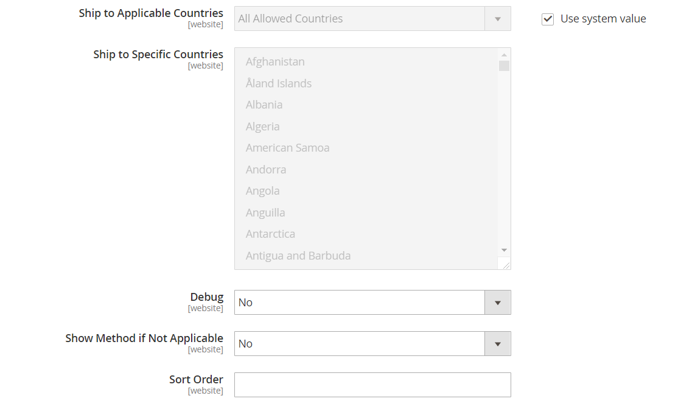
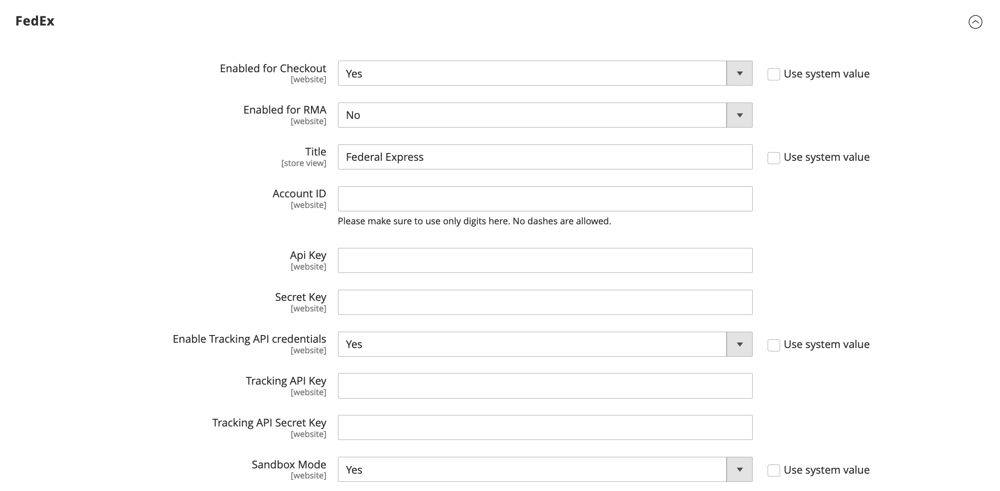

# [!UICONTROL Sales] > [!UICONTROL Delivery Methods]

{{config}}

## [!UICONTROL Basic Delivery Methods]

### [!UICONTROL Flat Rate]

<!-- zoom -->

<!-- [Flat Rate](https://docs.magento.com/user-guide/shipping/shipping-flat-rate.html) -->

|Field|[Scope](../../getting-started/websites-stores-views.md#scope-settings)|Description|
|--- |--- |--- |
|[!UICONTROL Enabled]|Website|When enabled, Flat Rate appears as an option in the _Estimate Shipping and Tax_ section of the shopping cart, and in the _Shipping_ section during checkout. Options: `Yes` / `No`|
|[!UICONTROL Title]|Store View|The name that is used for this  shipping method during checkout.|
|[!UICONTROL Method Name]|Store View|A name that describes the method of calculation that is used to produce a shipping estimate. The method name appears next to the calculated estimated rate in the shopping cart. The default value is `Fixed`.|
|[!UICONTROL Type]|Website|Describes the type of calculation used to determine the flat rate. Options:  **`None`** - No calculation is used. Sets Flat Rate to zero, which is the equivalent of free shipping.  **`Per Order`** - Charges a single flat rate for the entire order.  **`Per Item`** - Charges a separate flat rate for each item in the cart. The rate is multiplied by the number of items in the cart, even if the total quantity includes a combination of different items.|
|[!UICONTROL Price]|Website|The price you charge the customer for flat rate shipping.|
|[!UICONTROL Calculate Handling Fee]|Website|Determines how the handling fee is calculated, if included. Options: `Fixed` / `Percent`|
|[!UICONTROL Handling Fee]|Website|Enter the amount to be charged for a handling fee, based on the method you have chosen to calculate the amount. For example, if the charge is based on a fixed fee, enter the amount as a decimal, such as 4.90. However, if the handling fee is based on a percentage of the order, enter the amount as a percentage. For example, if you are charging six percent of the order, enter the value as `.06`.|
|[!UICONTROL Displayed Error Message]|Store View|A message that appears if a customer chooses Flat Rate, but for some reason the method is  not available.|
|[!UICONTROL Ship to Applicable Countries]|Website|Identifies the countries where you offer Flat Rate shipping. Options:  **`All Allowed Countries`** - Customers from any country specified in the store configuration can use Flat Rate shipping.  **`Specific Countries`** - Customers from only specific countries can use Flat Rate shipping.|
|[!UICONTROL Ship to Specific Countries]|Website|Identifies each country where customers can use Flat Rate shipping.|
|[!UICONTROL Show Method if Not Applicable]|Website|Determines if Flat Rate appears as an option during checkout if the method does not apply to the purchase. Options: `Yes` / `No`|
|[!UICONTROL Sort Order]|Website|A number that determines the order that Flat Rate appears when listed with other delivery methods during checkout.|

{:style="table-layout:auto"}

### [!UICONTROL Free Shipping]

<!-- zoom -->

<!-- [Free Shipping](https://docs.magento.com/user-guide/shipping/shipping-free.html) -->

|Field|[Scope](../../getting-started/websites-stores-views.md#scope-settings)|Description|
|--- |--- |--- |
|[!UICONTROL Enabled]|Website|When enabled, Free Shipping appears as an option in the Shipping section during checkout. Options: `Yes` / `No`|
|[!UICONTROL Title]|Store View|The name that is used for this  shipping method during checkout.|
|Method Name|Store View|A name that describes the method of calculation that is used to produce a shipping estimate. The method name appears next to the calculated estimated rate in the shopping cart. The default value is `Free`.|
|Minimum Order Amount|Website|The minimum purchase that is required to apply Free Shipping to an order.|
|Include Tax to Amount|Website|Determines if tax is included in the Minimum Order Amount calculation. Options:  **Yes** – Tax is included when calculating the Minimum Order amount (Subtotal + Tax - Discount). **No** – Tax is not included tax when calculating the Minimum Order amount (Subtotal - Discount).|
|Displayed Error Message|Store View|A message that appears if a customer chooses Free Shipping, but for some reason the method is not available.|
|Ship to Applicable Countries|Website|Identifies the countries where you offer Free Shipping. Options:  **All Allowed Countries** - Customers from any country specified in the store configuration can use Free Shipping.  **Specific Countries** - Customers from only specific countries can use Free Shipping.|
|Ship to Specific Countries|Website|Identifies each country where customers can use Free Shipping.|
|Show Method if Not Applicable|Website|Determines if Free Shipping appears as an  option during checkout if the method does not apply to the purchase. Options: `Yes` / `No`|
|[!UICONTROL Sort Order]|Website|A number that determines the order that  Free Shipping appears when listed with other delivery methods during checkout.|

{:style="table-layout:auto"}

### [!UICONTROL Table Rates]

<!-- zoom -->

<!-- [Table Rates](https://docs.magento.com/user-guide/shipping/shipping-table-rate.html) -->

|Field|[Scope](../../getting-started/websites-stores-views.md#scope-settings)|Description|
|--- |--- |--- |
|[!UICONTROL Enabled]|Website|When enabled, Table Rates appears as an option in the Estimate Shipping and Tax section of the shopping cart, and in the Shipping section during checkout. Options: `Yes` / `No`|
|[!UICONTROL Title]|Store View|The name that is used for this  shipping method during checkout.|
|Method Name|Store View|A name that describes the method of calculation that is used to produce a shipping estimate. The method name appears next to the calculated estimated rate in the shopping cart. The default value is `Table Rate`.|
|[!UICONTROL Condition]|Website|Determines the condition upon which the calculation is based. The format of the CSV file that is uploaded is specific to each condition. Options: `Weight vs. Destination` / `Price vs. Destination` / `# of Items vs. Destination`|
|[!UICONTROL Include Virtual Products in Price Calculation]|Website|Determines if virtual products, which do not require shipping, are included in Table Rate price calculations.|
|[!UICONTROL Calculate Handling Fee]|Website|Determines how the handling fee is calculated, if included. Options: `Fixed` / `Percent`|
|[!UICONTROL Handling Fee]|Website|The amount of any fee that is added to the  shipping charge to cover the expense of handling the shipment. Enter the value as a decimal. For example, if the fee is based on a percentage, enter 0.06 rather than 6 %. For a fixed amount, enter `6.00`.|
|[!UICONTROL Displayed Error Message]|Store View|A message that appears if a customer chooses Table Rates, but for some reason the method is not available.|
|[!UICONTROL Ship to Applicable Countries]|Website|Identifies the countries where you offer Table Rate shipping. Options:  **`All Allowed Countries`** - Customers from any country specified in the store configuration can use Table Rate shipping.  **`Specific Countries`** - Customers from only specific countries can use Table Rate shipping.|
|[!UICONTROL Ship to Specific Countries]|Website|Identifies each country where customers can use Table Rate  shipping.|
|[!UICONTROL Show Method if Not Applicable]|Website|Determines if Table Rates appears as an  option during checkout if the method does not apply to the purchase. Options: `Yes` / `No`|
|[!UICONTROL Sort Order]|Website|A number that determines the order that Table Rates appears when listed with other delivery methods during checkout.|

{:style="table-layout:auto"}

### [!UICONTROL In-Store Delivery]

<!-- zoom -->

<!-- [In-Store Delivery](https://docs.magento.com/user-guide/shipping/shipping-in-store-delivery.html) -->

|Field|[Scope](../../getting-started/websites-stores-views.md#scope-settings)|Description|
|--- |--- |--- |
|[!UICONTROL Enabled]|Website|When enabled, in-store delivery can appear as an option in the _Estimate Shipping and Tax_ section of the shopping cart, and in the _Shipping_ section during checkout. Options: `Yes` / `No`|
|[!UICONTROL Method Name]|Store View|A name that identifies the in-store pickup feature as a shipping method. This value is displayed as the label of a tab at the top of the Shipping checkout page and in the table of available shipping methods at the bottom of the same page. The default value is `In-store Delivery`.|
|[!UICONTROL Title]|Store View|The name that is used for this shipping method during checkout.|
|[!UICONTROL Price]|Website|The price you charge the customer for an in-store pickup.|
|[!UICONTROL Search Radius]|Website| The radius, in km, to use when searching for pickup locations.|
|[!UICONTROL Displayed Error Message]|Store View|A message that displays when a customer selects in-store pickup, but the delivery method is not available.|

{:style="table-layout:auto"}

## [!UICONTROL Carriers]

### [!UICONTROL UPS]

<!-- zoom -->

<!-- [UPS XML Account Settings](https://docs.magento.com/user-guide/shipping/ups.html) -->

|Field|[Scope](../../getting-started/websites-stores-views.md#scope-settings)|Description|
|--- |--- |--- |
|[!UICONTROL Enabled for Checkout]|Website|Determines if UPS is available to customers as a shipping method during checkout. Options: `Yes` / `No`|
|[!UICONTROL Enabled for RMA]|Website|Determines if UPS is available to customers as a shipping method for an RMA. Options: `Yes` / `No`|
|[!UICONTROL UPS Type]|Store View|Specifies the  method used to connect to the UPS shipping system. Options:  **`United Parcel Service XML`** - (Default) Your store sends an XML file with data to UPS as a request.  **`United Parcel Service`** - Your store sends key-value pairs to UPS as a request.   **_Note:_** The standard United Parcel Service type is scheduled for deprecation in Commerce. For new configurations, you should use the [!UICONTROL United Parcel Service XML] type.|
|_[!UICONTROL UPS Account Settings]_|||
|[!UICONTROL Live Account]|Store View|Specifies that the United Parcel Service account is live. Options: `Yes` / `No`|
|[!UICONTROL Gateway URL]|Website|The URL that connects to the UPS system to retrieve dynamic shipping rates. UPS is discontinuing support of HTTP. Default value: `https://www.ups.com/using/services/rave/qcostcgi.cgi`|
|[!UICONTROL Title]|Store View|The name that is used for this shipping method during checkout.|
|_[!UICONTROL UPS XML Account Settings]_|||
|[!UICONTROL Access License Number]|Website|Your UPS shipper account access license number.|
|[!UICONTROL Gateway XML URL]|Website|For UPS XML service, displays the following URLs that are required to transmit XML data: Gateway XML URL, Tracking XML URL, Shipping Confirm XML URL, Shipping Accept XML URL|
|[!UICONTROL Mode]|Website|Determines the mode of transmission used for data sent to the UPS system. Options:  **`Development`** - UPS does not verify that data received from the Commerce server is sent over SSL.  **`Live`** - UPS verifies that data received from the Commerce server is sent over a secure socket layer (SSL).|
|User ID|Website|Your UPS shipper account user ID.|
|[!UICONTROL Origin of the Shipment]|Website|(UPS XML Only) The country or region where the product shipment originates.|
|[!UICONTROL Password]|Store View|Your UPS shipper account password.|

{:style="table-layout:auto"}

<!-- zoom -->

<!-- [UPS Package Information](https://docs.magento.com/user-guide/shipping/ups.html) -->

|Field|[Scope](../../getting-started/websites-stores-views.md#scope-settings)|Description|
|--- |--- |--- |
|_[!UICONTROL UPS Negotiated Rate Settings]_|||
|[!UICONTROL Enable Negotiated Rates]|Website|(UPS XML  Only) Enables / disables special rates, according to your agreement with UPS. Options: `Yes` / `No`|
|[!UICONTROL Packages Request Type]|Website|Determines how weight is calculated for shipments with multiple packages. Options: `Divide to equal weight (one request)` / `Use origin weight (multiple requests)`|
|[!UICONTROL Shipper Number]|Website|(UPS XML  Only) The six-character UPS Shipper Number is required for reference to use negotiated rates.|
|[!UICONTROL Container]|Website|Sets the container type used to package order shipments. Options: `Customer Packaging` / `UPS Letter Envelope` / `Customer Packaging` / `UPS Letter Envelope` / `UPS Tube` / `UPS Express Box` / `UPS Worldwide 25 kilo` / `UPS Worldwide 10 kilo`|
|[!UICONTROL Weight Unit]|Website|Sets the default unit of measurement for product weight in your store. See [Dimensional weight](../../stores-purchase/carriers.md#dimensional-weight) for additional information.|
|[!UICONTROL Tracking XML URL]|Website|(UPS XML  Only) The UPS URL that is used to track packages.|
|[!UICONTROL Destination Type]|Website|Sets the default shipment destination type. Options: `Business` / `Residential`|
|[!UICONTROL Maximum Package Weight]|Website|Sets the maximum weight that a package can be as specified by UPS. If the products ordered exceeds the maximum package weight, this shipping option is not available. According to [UPS.com](https://www.ups.com/us/en/global.page), packages cannot exceed 150 lbs (70 kg) Check with your shipping carrier to verify the maximum  weight.|
|[!UICONTROL Pickup Method]|Website|Sets the UPS pickup method. Options: `Regular Daily Pickup` / `On Call Air` / `One Time Pickup` / `Letter Center` / `Customer Counter`|
|[!UICONTROL Minimum Package Weight]|Website|Sets the minimum weight that a package can be as specified by UPS. If the products ordered weigh less than the minimum package weight, this shipping option is not available. To verify the minimum weight, check with your shipping carrier.|
|[!UICONTROL Calculate Handling Fee]|Website|Sets the handling fee calculation method for table rate shipping. Options:  **`Fixed`** - Handling fee is a fixed rate.  **`Percent`** - Handling fee is applied as a percentage of the order amount.|
|[!UICONTROL Handling Applied]|Website|Specifies whether handling fee is applied to each order or to each package within an order.|
|[!UICONTROL Handling Fee]|Website|Sets the handling that is included with the shipping rate price. Handling fee can be set as a fixed amount or a percentage.   **_Note:_** If typing a percentage amount, use the decimal format `0.25` for 25%.|

{:style="table-layout:auto"}

<!-- zoom -->

<!-- [UPS Allowed Methods](https://docs.magento.com/user-guide/shipping/ups.html) -->

|Field|[Scope](../../getting-started/websites-stores-views.md#scope-settings)|Description|
|--- |--- |--- |
|_[!UICONTROL UPS allowed methods]_|||
|[!UICONTROL Allowed Methods]|Website|Specifies the allowed methods of UPS shipping that are offered to customers. Shipping rates are calculated based on the selected shipping method.|
|[!UICONTROL Free Method]|Website|Identifies the method that is used for free shipping method through UPS. To disable free shipping, choose "None".   **_Note:_** This method is similar to basic [Free Shipping](../../stores-purchase/shipping-free.md), however it appears as a UPS shipping option during checkout.|
|[!UICONTROL Free Shipping Amount Threshold]|Website|Determines if free shipping is applied when the order amount meets the free shipping threshold. Options: `Enable` / `Disable`|
|[!UICONTROL Free Shipping Amount Threshold]|Website|Sets the minimum total amount that an order must reach to qualify for free shipping.|
|[!UICONTROL Displayed Error Message]|Store View|The error message that is displayed when this shipping method is unavailable for any reason.|

{:style="table-layout:auto"}

<!-- zoom -->

<!-- [UPS Applicable Countries and Other Settings](https://docs.magento.com/user-guide/shipping/ups.html) -->

|Field|[Scope](../../getting-started/websites-stores-views.md#scope-settings)|Description|
|--- |--- |--- |
|_[!UICONTROL UPS Applicable countries and other Settings]_|||
|[!UICONTROL Ship to Applicable Countries]|Website|Specifies which country customers are allowed to use this shipping method. Options:  **`All Allowed Countries`** - Customers from all [countries](../../getting-started/store-details.md#country-options) specified in your store configuration can use this shipping method.  **`Specific Countries`** - After choosing this option, the [!UICONTROL Ship to Specific Countries] list appears. Select each country in the list where this shipping method can be used.|
|[!UICONTROL Show Method if Not Applicable]|Website|Determines if UPS always appears as a shipping option during checkout. Options:  **`Yes`** - UPS always appears as a shipping option during checkout, even if not applicable to the order.  **`No`** - UPS appears as a shipping option during checkout only if applicable to the order. (For example, if the order weight exceeds the maximum weight amount.)|
|[!UICONTROL Debug]|Website|Specifies if data transmissions between your store and UPS are logged in the system for debugging. Unless there is an issue that must be tracked and logged, this option should be set to `No`.|
|[!UICONTROL Sort Order]|Website|A number that determines the order that UPS appears when listed with other delivery methods during checkout. Enter `0` for the top of the list.|

{:style="table-layout:auto"}

### [!UICONTROL USPS]

{{ups-api}}

|Field|[Scope](../../getting-started/websites-stores-views.md#scope-settings)|Description|
|--- |--- |--- |
|Enabled for Checkout|Website|Determines if USPS is available to customers as a shipping method during checkout. Options: `Yes` / `No`|
|_[!UICONTROL USPS Account Settings]_|||
|[!UICONTROL Gateway URL]|Website|The URL that is used to connect to the USPS system to dynamically retrieve shipping rates.|
|[!UICONTROL Secure Gateway URL]|Website|The secure URL that is used to connect to the USPS system over a secure socket layer (SSL) to dynamically retrieve shipping rates.|
|[!UICONTROL Title]|Store View|The title of this shipping option as it appears in the shopping cart checkout.|
|[!UICONTROL User ID]|Website|Your USPS shipper account user ID.|
|[!UICONTROL Password]|Website|Your USPS shipper account password.|
|[!UICONTROL Mode]|Website|Determines the mode of transmission used for data sent to the USPS system. Options include:  **`Development`** - USPS does not verify that data received from the Commerce server is sent over SSL.  **`Live`** - USPS verifies that data received from the Commerce server is sent over a secure socket layer (SSL).|

{:style="table-layout:auto"}

<!-- zoom -->

<!-- [USPS Packaging Settings](https://docs.magento.com/user-guide/shipping/usps.html) -->

|Field|[Scope](../../getting-started/websites-stores-views.md#scope-settings)|Description|
|--- |--- |--- |
|_[!UICONTROL USPS packaging Settings]_|||
|[!UICONTROL Packages Request Type]|Website|Determines how weight is calculated for shipments with multiple packages. Options: `Divide to equal weight (one request)` / `Use origin weight (multiple requests)`|
|[!UICONTROL Container]|Website|Sets the container type used to package order shipments. Options: `Variable` / `Flat Rate Box` / `Flat Rate Envelope` / `Rectangular` / Non-rectangular|
|[!UICONTROL Size]|Website|Sets the Size option to the typical shipment package size. This option affects the calculation of the shipping rate. Options: `Regular` / `Large` / `Oversize`|
|[!UICONTROL Machinable]|Website|Specifies whether the package can be processed by machine. This option affects the calculation of the shipping rate.|
|[!UICONTROL Maximum Package Weight]|Website|Sets the maximum weight that a package can be as specified by USPS. If the products ordered exceeds the maximum package weight, this shipping option is not available.|

{:style="table-layout:auto"}

<!-- zoom -->

<!-- [USPS Handling Fee Settings](https://docs.magento.com/user-guide/shipping/usps.html) -->

|Field|[Scope](../../getting-started/websites-stores-views.md#scope-settings)|Description|
|--- |--- |--- |
|_[!UICONTROL USPS Handling Fee settings]_|||
|[!UICONTROL Calculate Handling Fee]|Website|Sets the handling fee calculation method for table rate shipping. Options:  **`Fixed`** - Handling fee is a fixed rate.  **`Percent`** - Handling fee is applied as a percentage of the order amount.|
|[!UICONTROL Handling Applied]|Website|Specifies whether handling fee is applied to each order or to each package within an order.|
|[!UICONTROL Handling Fee]|Website|Sets the handling that is included with the shipping rate price. Handling fee can be set as a fixed amount or a percentage.   **_Note:_** When typing a percentage amount, use the decimal format `0.25` for 25%.|

{:style="table-layout:auto"}

<!-- zoom -->

<!-- [USPS Allowed Methods](https://docs.magento.com/user-guide/shipping/usps.html) -->

|Field|[Scope](../../getting-started/websites-stores-views.md#scope-settings)|Description|
|--- |--- |--- |
|_[!UICONTROL USPS Allowed Methods]_|||
|[!UICONTROL Allowed Methods]|Website|Specifies the allowed methods of USPS shipping that is offered to customers. Shipping rates are calculated based on the selected shipping method.|
|[!UICONTROL Free Method]|Website|Sets the free shipping method through USPS, or can be disabled by selecting `None`.   **_Note:_** This shipping method is similar to your store's Free Shipping method, however it is listed as a USPS shipping option and identified as USPS shipping.|
|[!UICONTROL Minimum Order Amount for Free Shipping]|Website|Sets the minimum order amount that must be met to qualify for free shipping.|
|[!UICONTROL Displayed Error Message]|Store View|The error message that appears when USPS is unavailable for any reason.|

{:style="table-layout:auto"}

<!-- zoom -->

<!-- [USPS Applicable Countries](https://docs.magento.com/user-guide/shipping/usps.html) -->

|Field|[Scope](../../getting-started/websites-stores-views.md#scope-settings)|Description|
|--- |--- |--- |
|_[!UICONTROL USPS Applicable Countries]_|||
|[!UICONTROL Ship to Applicable Countries]|Website|Specifies the countries where orders can be shipped. Options:  **`All Allowed Countries`** - Customers from all [countries](../../getting-started/store-details.md#country-options) specified in your store configuration can use this shipping method.  **`Specific Countries`** - After choosing this option, the [!UICONTROL Ship to Specific Countries] list appears. Select each country in the list where this shipping method can be used.|
|[!UICONTROL Show Method if Not Applicable]|Website|Controls the display of USPS shipping during checkout. Options:  **`Yes`** - USPS always appears as a shipping option during checkout, even if not applicable to the order.  **`No`** - USPS appears as a shipping option during checkout only if applicable to the order (that is, the order weight exceeds the maximum weight amount).|
|[!UICONTROL Debug]|Website|Determines if a log of data transmissions between your store and USPS is maintained by the system for debugging. Unless there is an issue that must be tracked and logged, this option should be set to `No`.|
|[!UICONTROL Sort Order]|Website|A number that determines the order that USPS appears when listed with other delivery methods during checkout. Enter `0` for the top of the list.|

{:style="table-layout:auto"}

### [!UICONTROL FedEx]

<!-- zoom -->

<!-- [FedEx Account Settings](https://docs.magento.com/user-guide/shipping/fedex.html) -->

|Field|[Scope](../../getting-started/websites-stores-views.md#scope-settings)|Description|
|--- |--- |--- |
|_[!UICONTROL FedEx Account Settings]_|||
|[!UICONTROL Enabled for Checkout]|Website|Determines if FedEx is available to customers as a shipping method during checkout. Options: `Yes` / `No`|
|[!UICONTROL Title]|Store View|The title of this shipping option as it appears in the shopping cart checkout.|
|[!UICONTROL Account ID]|Website|Your FedEx account ID.|
|[!UICONTROL Meter Number]|Website|Your FedEx meter number.|
|[!UICONTROL Key]|Website|Your FedEx account key.|
|[!UICONTROL Password]|Website|Your FedEx account password.|
|[!UICONTROL Sandbox Mode]|Website|To run FedEx transactions in a test environment, set Sandbox Mode to `Yes`. Options: `Yes` / `No`.|
|[!UICONTROL Web-Services URL]|Website|The URL that is required depends on the Sandbox Mode setting. Options:  **`Production`** - The URL to access FedEx web services when the store is live.  **`Sandbox`** - The URL to access the  testing environment for FedEx web services.|

{:style="table-layout:auto"}

<!-- zoom -->

<!-- [FedEx Packaging](https://docs.magento.com/user-guide/shipping/fedex.html) -->

|Field|[Scope](../../getting-started/websites-stores-views.md#scope-settings)|Description|
|--- |--- |--- |
|_[!UICONTROL FedEx Packaging Settings]_|||
|[!UICONTROL Packages Request Type]|Website|Determines how weight is calculated for shipments with multiple packages. Options: `Divide to equal weight (one request)` / `Use origin weight (multiple requests)`|
|[!UICONTROL Packaging]|Website|From the list, select the container type that you typically use to package products ordered from your store.|
|[!UICONTROL Dropoff]|Website|From the list, select the pick-up method:  **`Regular Pickup`** - (Default) If you have a high volume of shipments, it can be cost effective to arrange regular pickups.  **`Request Courier`** - You must call and request a FedEx courier to pick up shipments.  **`Drop Box`** - You must drop off shipments at your local FedEx drop off box.  **`Business Service Center`** - You must drop off shipments at your local FedEx business service center.  **`Station`** - You must drop off shipments at your local FedEx station.|
|[!UICONTROL Maximum Package Weight]|Website|The default for FedEx is 150 pounds. Consult your shipping carrier for maximum supported weight. Using the default value is recommended unless you have special arrangements with FedEx.|

{:style="table-layout:auto"}

<!-- zoom -->

<!-- [FedEx Handling Fee](https://docs.magento.com/user-guide/shipping/fedex.html) -->

|Field|[Scope](../../getting-started/websites-stores-views.md#scope-settings)|Description|
|--- |--- |--- |
|_[!UICONTROL FedEx Handling Fee Settings]_|||
|[!UICONTROL Calculate Handling Fee]|Website|Determines the method used to calculate handling fees. Options: `Fixed Fee` / `Percentage`   **_Note:_** The handling fee is optional, and appears as an extra charge that is added to the FedEx shipping cost.|
|[!UICONTROL Handling Applied]|Website|Determines how handling fees are applied. Options: `Per Order` / `Per Package`|
|[!UICONTROL Handling Fee]|Website|Specifies the amount charged as a handling fee, based on the method used to calculate the amount. If the charge is based on a fixed fee, enter the amount as a decimal, such as `4.90`. If the handling fee is based on a percentage of the order, enter the amount as a percentage. For example, to charge six percent of the order, enter the value as `.06`.|

{:style="table-layout:auto"}

<!-- zoom -->

<!-- [FedEx Delivery Methods](https://docs.magento.com/user-guide/shipping/fedex.html) -->

|Field|[Scope](../../getting-started/websites-stores-views.md#scope-settings)|Description|
|--- |--- |--- |
|_[!UICONTROL FedEx delivery methods]_|||
|[!UICONTROL Residential Delivery]|Website|Set to one of the following, depending on whether you sell Business-to-Consumer (B2C) or Business-to-Business (B2B):  **`Yes`** - For B2C deliveries  **`No`** - For B2B deliveries|
|[!UICONTROL Allowed Methods]|Website|From the list, select the methods of shipment that you support. The methods depend on your FedEx account, the frequency and size of your shipments, and whether you allow international shipments. As the merchant, you might decide to offer ground shipping only.|
|[!UICONTROL Hub ID]|Website|An ID provided by FedEx that is used with the [!DNL Smart Post] method.|
|[!UICONTROL Free Method]|Website|From the list, select the shipping method you prefer to use for offers of free shipping.   **_Note:_** This shipping method is similar to the regular Free Shipping method, however it is listed within the FedEx shipping options and is identified as FedEx shipping.|
|[!UICONTROL Free Shipping Amount Threshold]|Website|Determines if a minimum order amount is required for free shipping. Options:  **`Enable`** - Enables free FedEx shipping for orders that meet the minimum amount.  **`Disable`** - Disables free FedEx shipping with minimum order.|
|[!UICONTROL Free Shipping Amount Threshold]|Website|Specifies the minimum order amount that is required for free shipping.|
|[!UICONTROL Displayed Error Message]|Store View|The message that appears when FedEx is unavailable for any reason. You can use the default message or enter another.|

{:style="table-layout:auto"}

<!-- zoom -->

<!-- [FedEx Applicable Countries](https://docs.magento.com/user-guide/shipping/fedex.html) -->

|Field|[Scope](../../getting-started/websites-stores-views.md#scope-settings)|Description|
|--- |--- |--- |
|_[!UICONTROL FedEx Applicable Countries]_|||
|[!UICONTROL Ship to Applicable Countries]|Website|Indicates the countries where your customers can ship by FedEx. Options:  **`All Allowed Countries`** - Customers from all [countries](../../getting-started/store-details.md#country-options) specified in your store configuration  can use this shipping method.  **`Specific Countries`** - After choosing this option, the [!UICONTROL Ship to Specific Countries] list appears. Select each country in the list where this shipping method can be used.|
|[!UICONTROL Ship to Specific Countries]|Website|Indicates the specific countries where your customers can ship by FedEx.|
|[!UICONTROL Debug]|Website|Determines if a log of data transmissions between your store and FedEx is maintained by the system for debugging. Unless there is an issue that must be tracked and logged, this option should be set to `No`.|
|[!UICONTROL Show Method if Not Applicable]|Website|Determines when FedEx appears as a shipping method during checkout. Options:  **`Yes`** - The FedEx shipping option is displayed in the delivery methods list, regardless of whether the order qualifies to use it.  **`No`** - The FedEx shipping option is not displayed in the delivery methods list if it is not applicable to the order (for example, if the order weight exceeds the maximum weight amount).|
|[!UICONTROL Sort Order]|Website|A number that determines the order that FedEx appears when listed with other delivery methods during checkout. Enter `0` for the top of the list.|

{:style="table-layout:auto"}

### [!UICONTROL DHL]

<!-- zoom -->

<!-- [DHL Account Settings](https://docs.magento.com/user-guide/shipping/dhl.html) -->

|Field|[Scope](../../getting-started/websites-stores-views.md#scope-settings)|Description|
|--- |--- |--- |
|_[!UICONTROL DHL Account Settings]_|||
|[!UICONTROL Enabled for Checkout]|Website|Determines if DHL is available to customers as a shipping method during checkout. Options: `Yes` / `No`|
|[!UICONTROL Title]|Store View|The title of this shipping method as it appears during checkout.|
|[!UICONTROL Gateway URL]|Website|Usually, you can accept the default Gateway URL. However, if DHL has given you an alternate URL, enter the value in this field.|
|[!UICONTROL Access ID]|Website|Your DHL shipper account access ID.|
|[!UICONTROL Password]|Website|Your DHL shipper account password.|
|[!UICONTROL Account Number]|Website|Your DHL shipper account number.|

{:style="table-layout:auto"}

<!-- zoom -->

<!-- [DHL Package Settings](https://docs.magento.com/user-guide/shipping/dhl.html) -->

|Field|[Scope](../../getting-started/websites-stores-views.md#scope-settings)|Description|
|--- |--- |--- |
|_[!UICONTROL DHL Package Settings]_|||
|[!UICONTROL Calculate Handling Fee]|Website|The handling fee is optional and appears as an extra charge added to the DHL shipping cost. From the list, select the method that you want to use to calculate handling fees. Options: Fixed Fee / Percentage.|
|[!UICONTROL Handling Applied]|Website|From the list, select how you want the handling fees applied. Options: `Per Order` / `Per Package`|
|Handling Fee|Website|Enter the amount to be charged for a handling fee, based on the method you have chosen to calculate the amount. For example, if the charge is based on a fixed fee, enter the amount as a decimal, such as `4.90`. However, if the handling fee is based on a percentage of the order, enter the amount as a percentage. For example, if you are charging six percent of the order, enter the value as `.06`.|
|[!UICONTROL Divide Order Weight]|Store View|Determines if the weight of an order over 70 kg can be divided into smaller units to ensure an accurate shipping charge. Options: `Yes` / `No`|
|[!UICONTROL Weight Unit]|Store View|Determines the unit of measurement for weight that is used in shipping calculations. Options: `Pounds` / `Kilograms`|
|[!UICONTROL Size]|Store View|Determines the size of the package. Options:  **`Regular`** - Packages shipped conform to of DHL standard packaging methods. In the [!UICONTROL Allowed Methods] list, select each packaging method used to ship products from your store.  **`Specific`** - If packages shipped have custom dimensions, complete the following: [!UICONTROL Height (cm)] / [!UICONTROL Depth (cm)] / [!UICONTROL Width (cm)]|

{:style="table-layout:auto"}

<!-- zoom -->

<!-- DHL Allowed Methods](https://docs.magento.com/user-guide/shipping/dhl.html) -->

|Field|[Scope](../../getting-started/websites-stores-views.md#scope-settings)|Description|
|--- |--- |--- |
|_[!UICONTROL DHL allowed methods]_|||
|[!UICONTROL Allowed Methods]|Website|In the list, select each shipment method that you support.|
|[!UICONTROL Ready Time]|Website|Specifies when the package will be ready for pickup, in hours, after an order is submitted.|
|[!UICONTROL Displayed Error Message]|Store View|This message appears when DHL becomes unavailable for any reason. You can use the default message or enter a message of your own.|
|[!UICONTROL Free Method]||This shipping method is similar to the regular Free Shipping method, however it is listed within the DHL shipping options and is identified as DHL shipping. In the list, select the shipping method you prefer to use for offers of free shipping.|
|[!UICONTROL Free Shipping with Minimum Order Amount]|Website|Set to one of the following:  **`Enable`** - To allow free DHL shipping for orders that meet the minimum amount.  **`Disable`** - To not offer free DHL shipping with minimum order.|
|[!UICONTROL Minimum Order Amount for Free Shipping]|Website|If you enable [!UICONTROL Free Shipping with Minimum Order], enter the minimum order amount value in the field.|

{:style="table-layout:auto"}

<!-- zoom -->

<!-- [DHL Applicable Countries](https://docs.magento.com/user-guide/shipping/dhl.html) -->

|Field|[Scope](../../getting-started/websites-stores-views.md#scope-settings)|Description|
|--- |--- |--- |
|_[!UICONTROL DHL applicable countries]_|||
|[!UICONTROL Ship to Applicable Countries]|Website|Specifies which country customers are allowed to use this shipping method. Options:  **All Allowed Countries** - All allowed countries are applicable to use the free shipping method. The Allowed Countries are specified in the [!UICONTROL General] configuration page.  **Specific Countries** - Limits this shipping option to the countries specified in the Ship to Specific Countries list.|
|[!UICONTROL Ship to Specific Countries]|Website|Specifies the countries where DHL shipments can be sent. This selected countries list is used if `Specific Countries` is selected in the [!UICONTROL Ship to Applicable Countries] option.|
|[!UICONTROL Show Method if Not Applicable]|Website|Determines when DHL appears as a shipping method during checkout. Options:  **`Yes`** - DHL always appears as a shipping option during checkout, even if not applicable to the order.  **`No`** - DHL appears as a shipping option during checkout only if applicable to the order (that is, order weight exceeds the maximum weight amount).|
|[!UICONTROL Debug]|Website|Creates a log file with error information.|
|[!UICONTROL Sort Order]|Website|A number that determines the order in which DHL appears when listed with other delivery methods during checkout. To place it at the top of the list, enter `0`.|

{:style="table-layout:auto"}
