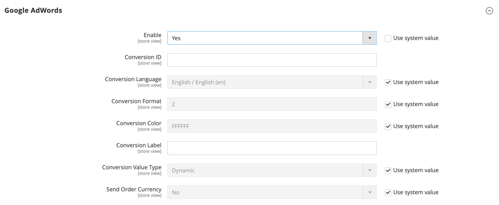

# [!UICONTROL Sales] > [!UICONTROL Google API]

{{config}}

## [!UICONTROL Google Analytics]

<!-- zoom -->

<!-- [Google Analytics](https://docs.magento.com/user-guide/marketing/google-universal-analytics.html) -->

| Field | [Scope](../../getting-started/websites-stores-views.md#scope-settings) | Description |
| ----- | ------------------------------------------ | ----------- |
| [!UICONTROL Enable] | Store View | Enables [!DNL Google Analytics] for your store. Options: `Yes` / `No` |
| [!UICONTROL Account Type] | Store View |  (Adobe Commerce only) Determines the configuration options according to your Google Analytics account type. Options: Universal Analytics (default) / Google Tag Manager |
| [!UICONTROL Account Number] | Store View | The account number, or tracking code, that was assigned when you created your [!DNL Google Analytics] account. |
| [!UICONTROL Anonymize IP] | Store View | Determines if identifying information is removed from IP addresses that appear in [!DNL Google Analytics] results. |
| [!UICONTROL Enable Content Experiments] | Store View | Activates [Google Content Experiments](https://support.google.com/analytics/answer/9366791?hl=en&ref_topic=1745207), which can be used to test up to ten different versions of the same page. Options: `Yes` / `No` |

{:style="table-layout:auto"}

## [!UICONTROL Google Analytics - Google Tag Manager]

{{ee-feature}}

<!-- zoom -->

When **[!UICONTROL Account Type]** is set to `Google Tag Manager`, there are additional fields displayed.

| Field | [Scope](../../getting-started/websites-stores-views.md#scope-settings) | Description |
| ----- | ------------------------------------------ | ----------- |
| [!UICONTROL Container ID] | Store View | The unique ID for the [!DNL Google Tag Manager] container. This value typically starts with `GTM-`. This ID is in your [!DNL Google Tag Manager] account. If [!DNL Google Tag Manager] is already installed and configured for your store, the Container ID appears automatically in this field. |
| [!UICONTROL List property for the catalog page] | Store View | Identifies the [!DNL Google Tag Manager] property associated with the catalog page. Default value: `Catalog Page` |
| [!UICONTROL List property for the cross-sell block] | Store View | Identifies the [!DNL Google Tag Manager] property associated with the cross-sell block. Default value: `Cross-sell` |
| [!UICONTROL List property for the up-sell block] | Store View | Identifies the [!DNL Google Tag Manager] property associated with the up-sell block. Default value: `Up-sell` |
| [!UICONTROL List property for the related products block] | Store View | Identifies the [!DNL Google Tag Manager] property associated with the related products block. Default value: `Related Products` |
| [!UICONTROL List property for the search results page] | Store View | Identifies the [!DNL Google Tag Manager] property associated with the search results page. Default value: `Search Results` |
| [!UICONTROL 'Internal Promotions' for promotions field "Label"] | Store View | Identifies the [!DNL Google Tag Manager] property associated with the labels for internal promotions. Default value: `Label` |

{:style="table-layout:auto"}

## [!UICONTROL Google AdWords]

<!-- zoom -->

<!-- [Google AdWords](https://docs.magento.com/user-guide/marketing/google-adwords.html) -->

| Field | [Scope](../../getting-started/websites-stores-views.md#scope-settings) | Description |
| ----- | ------------------------------------------ | ----------- |
| [!UICONTROL Enable] | Store View | Enables Google AdWords for the store. Options: `Yes` / `No` |
| [!UICONTROL Conversion ID] | Store View | The ID from your Google AdWords account. |
| [!UICONTROL Conversion Language] | Store View | The language that is used for AdWords conversions. Options: `All available languages` |
| [!UICONTROL Conversion Format] | Store View | Determines the format of the [!DNL Google Site Stats] notification that appears on the conversion page. The notification links to a page that  informs visitors about the cookies that are used to track their visits. This numeric value is assigned to the `google_conversion_format` variable in your AdWords script. To learn more, see [About Conversion Tracking](https://support.google.com/google-ads/answer/1722022?hl=en) on the Google website. Options:  **`1`** - Displays a one-line notification.  **`2`** - (Default) Displays a two-line notification.  **`3`** - Displays no customer notification. |
| [!UICONTROL Conversion Color] | Store View | Determines the color of the conversion label. Use a [color picker](https://www.w3schools.com/colors/colors_picker.asp) to choose the hexadecimal value. This hexadecimal value is assigned to the `google_conversion_color` variable in your AdWords script. For example: ffffff  `var google_conversion_color = "ffffff";` |
| [!UICONTROL Conversion Label] | Store View | A text label that appears with the [!DNL Google Site Stats] notification. This text string is assigned to the `~` variable in your AdWords script. For example: "Thank you for shopping!" |
| [!UICONTROL Conversion Value Type] | Store View | Specifies the type of value that is used to determine when a conversion takes place. Options:  **`Dynamic`** - Determines that a conversion has occurred based on the dynamic Order Amount.  **`Constant`** - Determines that a conversion has occurred based on the value entered. |
| [!UICONTROL Conversion Value] | Store View | Specifies the value that is used for a _[!UICONTROL Constant]_ conversion value type. |
| [!UICONTROL Send Order Currency] | Store View | Enables transaction-specific currency conversion values in AdWords (for websites with different base currencies). |

{:style="table-layout:auto"}

## [!UICONTROL Google GTag]

{{gtag-api-note}}

### [!UICONTROL Google Analytics4]

<!-- zoom -->

<!-- [Google Analytics4](https://docs.magento.com/user-guide/marketing/google-universal-analytics.html) -->

| Field | [Scope](../../getting-started/websites-stores-views.md#scope-settings) | Description |
| ----- | ------------------------------------------ | ----------- |
| [!UICONTROL Enable] | Store View | Enables Google Analytics 4 for your store. Options: `Yes` / `No` |
| [!UICONTROL Account Type] | Store View |  (Adobe Commerce only) Determines the configuration options according to your Google Analytics account type. Options: `Google Analytics4` (default) / `Google Tag Manager` |
| [!UICONTROL Measurement ID] | Store View | The account number, or tracking code, that was assigned when you created your Google Analytics account. |
| [!UICONTROL Anonymize IP] | Store View | Determines if identifying information is removed from IP addresses that appear in Google Analytics results. |
| [!UICONTROL Enable Content Experiments] | Store View | Activates [Google Content Experiments](https://support.google.com/analytics/answer/9366791?hl=en&ref_topic=1745207), which can be used to test up to ten different versions of the same page. Options: `Yes` / `No` |

{:style="table-layout:auto"}

### [!UICONTROL Google Analytics4 - Google Tag Manager]

{{ee-feature}}

<!-- zoom -->

When **[!UICONTROL Account Type]** is set to `Google Tag Manager`, there are additional fields displayed.

| Field | [Scope](../../getting-started/websites-stores-views.md#scope-settings) | Description |
| ----- | ------------------------------------------ | ----------- |
| [!UICONTROL Container Id] | Store View | The unique ID for the [!DNL Google Tag Manager] container. This value typically starts with `GTM-`. This ID is in your Google Tab Manager account. If [!DNL Google Tag Manager] is already installed and configured for your store, the Container ID appears automatically in this field. |
| [!UICONTROL List property for the catalog page] | Store View | Identifies the [!DNL Google Tag Manager] property associated with the catalog page. Default value: `Catalog Page` |
| [!UICONTROL List property for the cross-sell block] | Store View | Identifies the [!DNL Google Tag Manager] property associated with the cross-sell block. Default value: `Cross-sell` |
| [!UICONTROL List property for the up-sell block] | Store View | Identifies the [!DNL Google Tag Manager] property associated with the up-sell block. Default value: `Up-sell` |
| [!UICONTROL List property for the related products block] | Store View | Identifies the [!DNL Google Tag Manager] property associated with the related products block. Default value: `Related Products` |
| [!UICONTROL List property for the search results page] | Store View | Identifies the [!DNL Google Tag Manager] property associated with the search results page. Default value: `Search Results` |
| [!UICONTROL 'Internal Promotions' for promotions field "Label"] | Store View | Identifies the [!DNL Google Tag Manager] property associated with the labels for internal promotions. Default value: `Label` |

{:style="table-layout:auto"}

### [!UICONTROL Google AdWords]

<!-- zoom -->

<!-- -- Google AdWords](https://docs.magento.com/user-guide/marketing/google-adwords.html) -->

| Field | [Scope](../../getting-started/websites-stores-views.md#scope-settings) | Description |
| ----- | ------------------------------------------ | ----------- |
| [!UICONTROL Enable] | Store View | Enables Google AdWords for the store. Options: `Yes` / `No` |
| [!UICONTROL Conversion ID] | Store View | The ID from your Google AdWords account. |
| [!UICONTROL Conversion Language] | Store View | The language that is used for AdWords conversions. Options: All available languages |
| [!UICONTROL Conversion Format] | Store View | Determines the format of the Google Site Stats notification that appears on the conversion page. The notification links to a page that  informs visitors about the cookies that are used to track their visits. This numeric value is assigned to the `google_conversion_format` variable in your AdWords script. To learn more, see [About Conversion Tracking](https://support.google.com/google-ads/answer/1722022?hl=en) on the Google website. Options:  **`1`** - Displays a one-line notification.  **`2`** - (Default) Displays a two-line notification.  **`3`** - Displays no customer notification. |
| [!UICONTROL Conversion Color] | Store View | Determines the color of the conversion label. Use a [color picker](https://www.w3schools.com/colors/colors_picker.asp) to choose the hexadecimal value. This hexadecimal value is assigned to the `google_conversion_color` variable in your AdWords script. For example: ffffff  `var google_conversion_color = "ffffff";` |
| [!UICONTROL Conversion Label] | Store View | A text label that appears with the Google Site Stats notification. This text string is assigned to the `~` variable in your AdWords script. For example: "Thank you for shopping!" |
| [!UICONTROL Conversion Value Type] | Store View | Specifies the type of value that is used to determine when a conversion takes place. Options:  **`Dynamic`** - Determines that a conversion has occurred based on the dynamic Order Amount.  **`Constant`** - Determines that a conversion has occurred based on the value entered. |
| [!UICONTROL Conversion Value] | Store View | Specifies the value that is used for a _[!UICONTROL Constant]_ conversion value type. |
| [!UICONTROL Send Order Currency]   | Store View | Enables transaction-specific currency conversion values in AdWords (for websites with different base currencies). |

{:style="table-layout:auto"}
