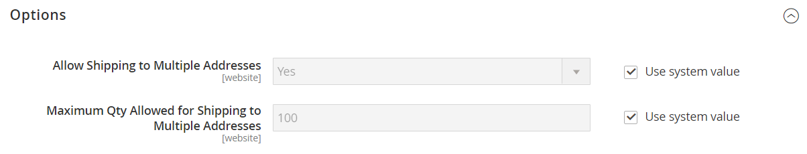

# [!UICONTROL Sales] > [!UICONTROL Multishipping Settings]

{{config}}

For detailed information about configuring these multishipping settings for your store, see [Multiple addresses](../../stores-purchase/shipping-settings.md#multiple-addresses).

## [!UICONTROL Options]

<!-- zoom -->

<!-- [Options](https://experienceleague.adobe.com/en/docs/commerce-admin/stores-sales/delivery/shipping-settings#multiple-addresses) -->

|Field|[Scope](../../getting-started/websites-stores-views.md#scope-settings)|Description|
|--- |--- |--- |
|[!UICONTROL Allow Shipping to Multiple Addresses] |Website| Determines if you allow single orders to be shipping to multiple addresses (registered customers only). Options: `Yes` / `No`|
|[!UICONTROL Maximum Qty Allowed for Shipping to Multiple Addresses]|Website|Sets a limit for the number of units  of a product that can be shipping to multiple addresses.|

{style="table-layout:auto"}

>[!NOTE]
>
> (Available with Adobe Commerce B2B only) For orders with multiple shipping addresses, the [Payment on Account](../../b2b/enable-basic-features.md#configure-payment-on-account) payment method, even if enabled, is not available during the checkout.
