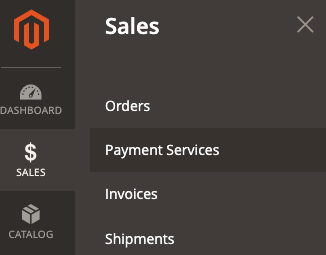
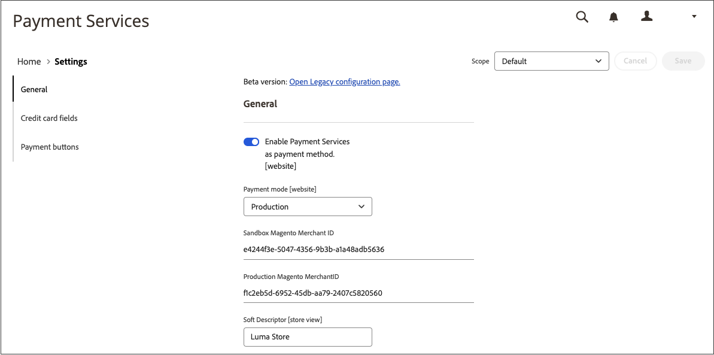
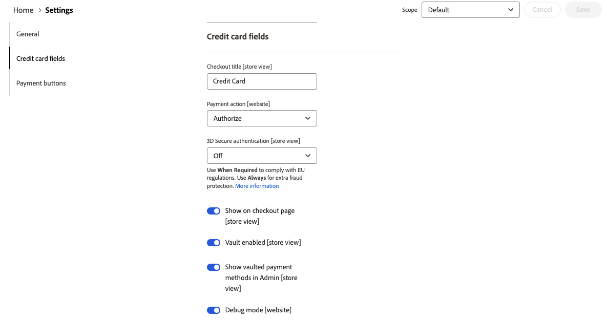
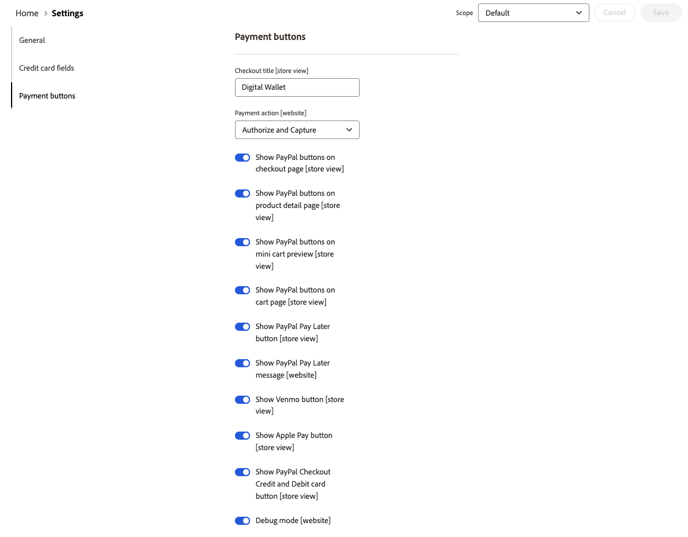
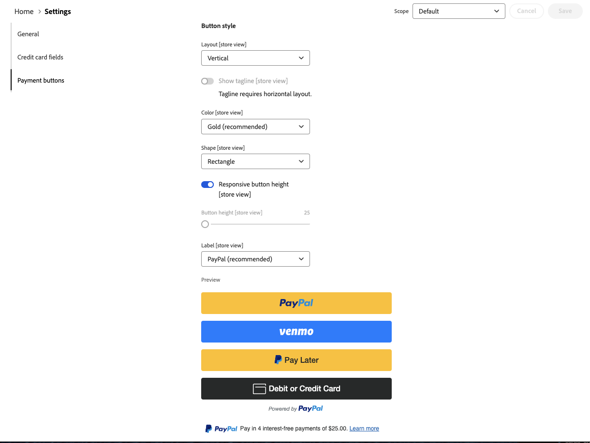

# [!UICONTROL Sales] > [!UICONTROL Payment Methods] > [!UICONTROL Payment Services]

Payment Services provides a turnkey self-service solution, including sandbox testing and a simple setup, for providing robust and secure payment processing. To learn more, see the [_Payment Services User Guide_](https://experienceleague.adobe.com/docs/commerce-merchant-services/payment-services/guide-overview.html).

To access the configuration settings for Payment Services, on the _Admin_ sidebar go to **[!UICONTROL Sales]** > **[!UICONTROL Payment Services]** and click **[!UICONTROL Settings]**.

{zoomable: no, width: 400px}

>[!NOTE]
>
>To use the Legacy configuration instead of [Settings](https://experienceleague.adobe.com/docs/commerce-merchant-services/payment-services/configure/settings.html), see [Legacy configuration](https://experienceleague.adobe.com/docs/commerce-merchant-services/payment-services/configure/configure-admin.html).

## [!UICONTROL General]

{zoomable: yes, width: 600px}

|Field|[Scope](../../getting-started/websites-stores-views.md#scope-settings)|Description|
|---|---|---|
| [!UICONTROL Enable] | website | Enable or disable [!DNL Payment Services] for your website. Options: [!UICONTROL Yes] / [!UICONTROL No] |
| [!UICONTROL Payment mode] | store view | Set the method, or environment, for your store. Options: [!UICONTROL Sandbox] / [!UICONTROL Production] |
| [!UICONTROL Sandbox Merchant ID] | store view | Your sandbox merchant ID, which is auto-generated during sandbox onboarding. |
| [!UICONTROL Production Merchant ID] | store view | Your production merchant ID, which is auto-generated during sandbox onboarding. |
| [!UICONTROL Soft Descriptor] | website or store view | Add a soft descriptor to your website(s) and store view(s) to add information to customer transactions which delineate brands, stores, or product lines. The [!UICONTROL Use website] toggle applies any soft descriptor added at the website level. The [!UICONTROL Use default] toggle applies any soft descriptor added as the default.|

{:style="table-layout:auto"}

## [!UICONTROL Credit card fields]

{zoomable: yes, width: 600px}

|Field|[Scope](../../getting-started/websites-stores-views.md#scope-settings)|Description|
|---|---|---|
| [!UICONTROL Title] | store view | Add the text for display as the title for this payment option in the Payment Method view during checkout. Options: [!UICONTROL text field] |
| [!UICONTROL Payment Action] | website | The [payment action](payment-methods.md#payment-actions) for the specified payment method. Options: [!UICONTROL Authorize] / [!UICONTROL Authorize and Capture] |
| [!UICONTROL 3DS Secure authentication] | website | Enable or disable [3DS Secure authentication](https://experienceleague.adobe.com/docs/commerce-merchant-services/payment-services/security.html#3ds). Options: [!UICONTROL Always] / [!UICONTROL When Required] / [!UICONTROL Off] |
| [!UICONTROL Show on checkout page] | website | Enable or disable credit card fields to show on checkout page. Options: [!UICONTROL Yes] / [!UICONTROL No] |
| [!UICONTROL Vault enabled] | store view | Enable or disable [credit card vaulting][vaulting.md](https://experienceleague.adobe.com/docs/commerce-merchant-services/payment-services/payments-checkout/vaulting.html). Options: [!UICONTROL Yes] / [!UICONTROL No] |
| [!UICONTROL Show vaulted payment methods in Admin] | store view | Enable or disable ability for merchant to complete orders for customers in the Admin [using a vaulted payment method](https://experienceleague.adobe.com/docs/commerce-merchant-services/payment-services/payments-checkout/vaulting.html). Options: [!UICONTROL Yes] / [!UICONTROL No] |
| [!UICONTROL Debug Mode] | website | Enable or disable Debug Mode. Options: [!UICONTROL Yes] / [!UICONTROL No] |

{:style="table-layout:auto"}

## [!UICONTROL Payment buttons]

{zoomable: yes, width: 600px}

|Field|[Scope](../../getting-started/websites-stores-views.md#scope-settings)|Description|
|---|---|---|
| [!UICONTROL Title] | store view | Add the text to be displayed as the title for this payment option in the Payment Method view during checkout. |
| [!UICONTROL Payment Action] | website | The [payment action](payment-methods.md#payment-actions){target="_blank"} for the specified payment method. Options: [!UICONTROL Authorize] / [!UICONTROL Authorize and Capture] |
| [!UICONTROL Show PayPal buttons on checkout page] | store view | Enable or disable [!DNL PayPal Smart Buttons] on the checkout page. Options: [!UICONTROL  Yes] / [!UICONTROL No] |
| [!UICONTROL Show PayPal buttons on product detail page] | store view | Enable or disable [!DNL PayPal Smart Buttons] on the product detail page. Options: [!UICONTROL  Yes] / [!UICONTROL No] |
| [!UICONTROL Show PayPal buttons in mini-cart preview] | store view | Enable or disable [!DNL PayPal Smart Buttons] in the mini-cart preview. Options: [!UICONTROL Yes] / [!UICONTROL No] |
| [!UICONTROL Show PayPal buttons on cart page] | store view | Enable or disable [!DNL PayPal Smart Buttons] on the cart page. Options: [!UICONTROL Yes] / [!UICONTROL No] |
| [!UICONTROL Show PayPal Pay Later button] | store view | Enable or disable pay later payment option appearance where payment buttons are displayed. Options: [!UICONTROL Yes] / [!UICONTROL No] |
| [!UICONTROL Show PayPal Pay Later Message] | website | Enable or disable the Pay Later messaging in the shopping cart, product page, mini-cart, and during the checkout flow. Options: [!UICONTROL Yes] / [!UICONTROL No] |
| [!UICONTROL Show Venmo button] | store view | Enable or disable the Venmo payment option where payment buttons are displayed. Options: [!UICONTROL Yes] / [!UICONTROL No] |
| [!UICONTROL Show Apple Pay button] | store view | Enable or disable the Apple Pay payment option where payment buttons are displayed. Options: [!UICONTROL Yes] / [!UICONTROL No] |
| [!UICONTROL Show PayPal Credit and Debit card button] | store view | Enable or disable the Credit and Debit card payment option where payment buttons are displayed. Options: [!UICONTROL Yes] / [!UICONTROL No] |
| [!UICONTROL Debug Mode] | website | Enable or disable Debug Mode. Options: [!UICONTROL Yes] / [!UICONTROL No] |
{:style="table-layout:auto"}

## [!UICONTROL PayPal Smart Button Styling]

{zoomable: yes, width: 600px}

|Field|[Scope](../../getting-started/websites-stores-views.md#scope-settings)|Description|
|--- |--- |--- |
|[!UICONTROL Layout]|Store View|Define style of layout for payment buttons. Options: [!UICONTROL Vertical] / [!UICONTROL Horizontal]|
|[!UICONTROL Tagline]|Store View|Enable/disable tagline. Options: [!UICONTROL Yes] / [!UICONTROL No]|
|[!UICONTROL Color]|Store View|Define color of the payment buttons. Options: [!UICONTROL Blue] / [!UICONTROL Gold] / [!UICONTROL Silver] / [!UICONTROL White] / [!UICONTROL Black]|
|[!UICONTROL Shape]|Store View|Define shape of the payment buttons. Options: [!UICONTROL Rectangular] / [!UICONTROL Pill]|
|[!UICONTROL Responsive Button Height]|Store View|Defines if payment buttons use a default height. Options: [!UICONTROL Yes] / [!UICONTROL No]|
|[!UICONTROL Height]|Store View|Define height of the payment buttons. Default value: none|
|[!UICONTROL Label]|Store View|Define label that appears in the payment buttons. Options: [!UICONTROL PayPal] / [!UICONTROL Checkout] / [!UICONTROL Buynow] / [!UICONTROL Pay] / [!UICONTROL Installment]|

{:style="table-layout:auto"}
