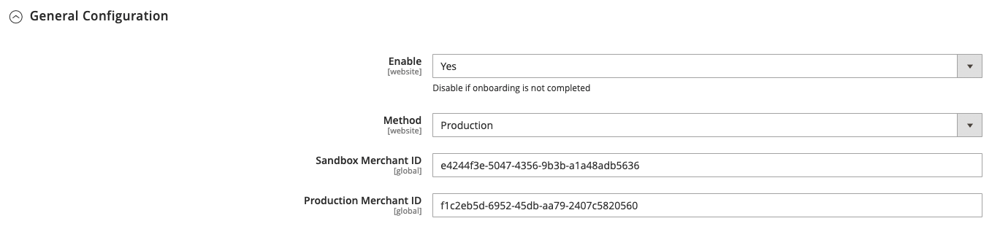
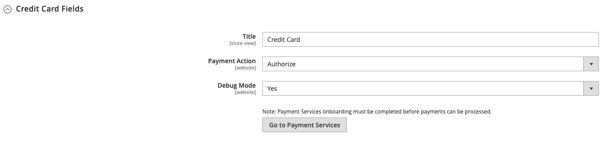
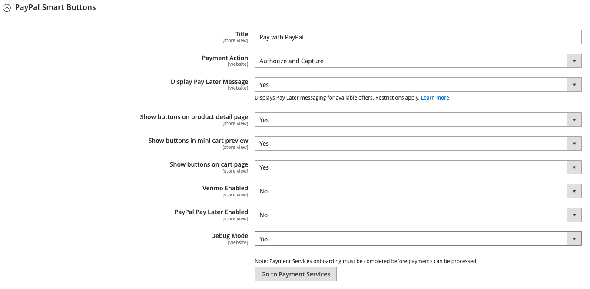
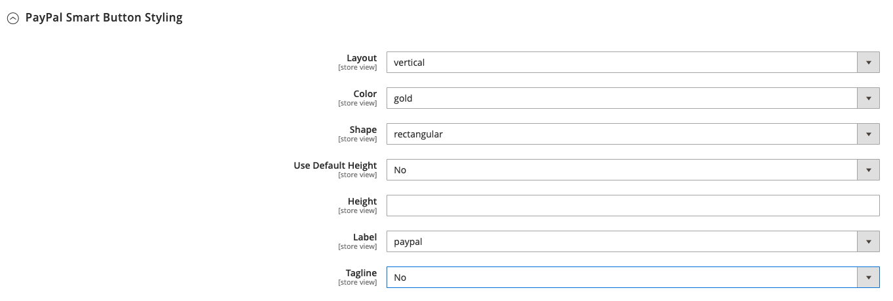

# Sales > Payment Methods > Payment Services

>[!NOTE]
>
>Payment Services for Adobe Commerce and Magento Open Source provides a turnkey self-service solution, including sandbox testing and a simple setup, for providing robust and secure payment processing. To learn more about this powerful tool set and detailed information about the installation and configuration, see the [_Payment Services User Guide_](https://experienceleague.adobe.com/docs/commerce-merchant-services/payment-services/guide-overview.html).

{{config}}

## Payment Services General Configuration

<!-- zoom -->

|Field|[Scope](../../getting-started/websites-stores-views.md#scope-settings)|Description|
|--- |--- |--- |
|Enable|Website|Determines if Payment Services are available to your customers as a payment method. Options: `Yes` / `No`|
|Method|Website|Options: Sandbox / Production|
|Merchant ID|Global|This is the unique identifier for your entire gateway account, including the multiple merchant accounts that may be in your gateway. The _Sandbox Merchant ID_ and the _Production Merchant ID_, which are used for your sandbox and production gateways, differs from your merchant ID.|

## Payment Services Credit Card Fields

<!-- zoom -->

|Field|[Scope](../../getting-started/websites-stores-views.md#scope-settings)|Description|
|--- |--- |--- |
|Title|Store View|Default value: Credit Card|
|Payment Action|Website|Determines the action taken by Payment Services when a payment is processed. Options:  **Authorize** - Funds on the customer's credit card are authorized, but not transferred from the account. An order is created in your store Admin. You can later capture the sale and create an invoice.  **Authorize and Capture** - Funds on the customer's credit card are authorized and captured by Payment Services, and an order and invoice are created in your store Admin.|
|Debug Mode|Website|Enable or disable Debug Mode. Options: `Yes` / `No`|

## Paypal Smart Buttons

<!-- zoom -->

|Field|[Scope](../../getting-started/websites-stores-views.md#scope-settings)|Description|
|--- |--- |--- |
|Title|store view|Add the text to be displayed as the title for this payment option in the Payment Method view during checkout. Default value: Pay with PayPal|
|Payment Action|Website|The [payment action](https://docs.magento.com/user-guide/configuration/sales/payment-methods.html#payment-actions){target="_blank"} for the specified payment method. Options: Authorize / Authorize and Capture|
|Display Pay Later Message|Website|Enable or disable the Pay Later messaging in the shopping cart, product page, mini-cart, and during the checkout flow. Options: `Yes` / `No`|
|Show buttons on product detail page| Store View | Enable or disable PayPal Smart Buttons on the product detail page. Options:  Yes /  No|
|Show buttons in mini cart preview| Store View | Enable or disable PayPal Smart Buttons in the minicart preview. Options:  Yes /  No|
|Show buttons on cart page| Store View | Enable or disable PayPal Smart Buttons on the cart page. Options:  Yes /  No|
|Venmo Enabled| Store View | Enable or disable Venmo payment option where payment buttons are displayed. Options:  Yes /  No|
|PayPal Pay Later Enabled| Store View | Enable or disable pay later payment option appearance where payment buttons are displayed. Options:  Yes /  No|
|Debug Mode| Website | Enable or disable Debug Mode. Options:  Yes /  No|

## Paypal Smart Button Styling

<!-- zoom -->

|Field|[Scope](../../getting-started/websites-stores-views.md#scope-settings)|Description|
|--- |--- |--- |
|Layout|Store View|Define style of layout for PayPal Smart Buttons. Options: Vertical / Horizontal|
|Color|Store View|Define color of the PayPal Smart Buttons. Options: Blue / Gold / Silver / White / Black|
|Shape|Store View|Define shape of the PayPal Smart Buttons. Options: Rectangular / Pill|
|Use Default Height|Store View|Defines if PayPal Smart Buttons use a default height. Options: `Yes` / `No`|
|Height|Store View|Define height of the PayPal Smart Buttons. Default value: none|
|Label|Store View|Define label that appears in the PayPal Smart Buttons. Options: `PayPal` / `Checkout` / `Buynow` / `Pay` / `Installment`|
|Tagline|Store View|Enables tagline. Options: `Yes` / `No`|
