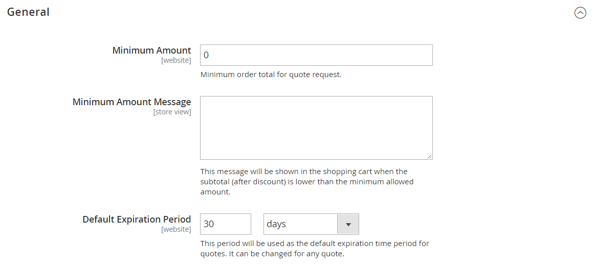

# [!UICONTROL Sales] > [!UICONTROL Quotes]

{{b2b-feature}}

>[!TIP]
>
>With the installation and enablement of Adobe Commerce B2B, the buying experience can be personalized with company-specific features. Adobe Commerce B2B is an integrated solution that supports both B2B and B2C models. For more information about the B2B features, see the [Adobe Commerce B2B User Guide](https://experienceleague.adobe.com/docs/commerce-admin/b2b/introduction.html).

{{config}}

<!-- [Quotes](https://experienceleague.adobe.com/en/docs/commerce-admin/b2b/quotes/quotes) -->

## [!UICONTROL General]

<!-- zoom -->

|Field|[Scope](../../getting-started/websites-stores-views.md#scope-settings)|Description|
|--- |--- |--- |
|[!UICONTROL Minimum Amount]|Website|The minimum amount of the shopping cart subtotal, after any discounts, that is required before a customer can submit a request for a quote. Default value: `0`|
|[!UICONTROL Minimum Amount Message]|Store View|The message that appears in the shopping cart when a customer tries to submit a request for a quote, but the minimum amount required is not met.|
|[!UICONTROL Default Expiration Period]|Website|Determines the default lifespan of a [quote](../../b2b/quote-price-negotiation.md) as time period from the date the request for a quote is submitted. Options: `Days` / `Weeks` / `Months`|

{style="table-layout:auto"}

## [!UICONTROL Attached Files]

<!-- zoom -->

|Field|[Scope](../../getting-started/websites-stores-views.md#scope-settings)|Description|
|--- |--- |--- |
|[!UICONTROL File formats for upload]|Global|Determines the file formats that can be attached to a quote. Default values supported: `doc`, `docx`, `xls`, `xlsx`, `pdf`, `txt`, `jpg`, `png`, and `jpeg`|
|[!UICONTROL Maximum file size]|Global|Determines the maximum size for a file that is attached to a quote. This setting can be overridden by the server configuration.|

{style="table-layout:auto"}
