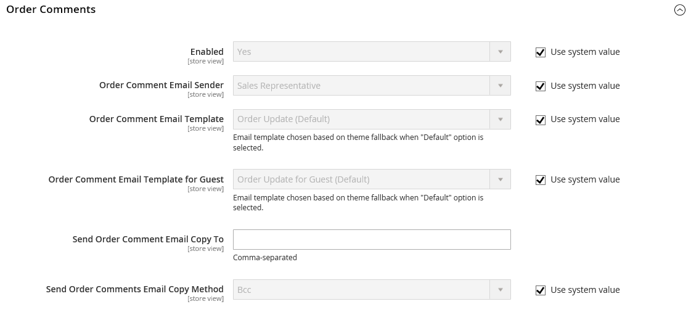
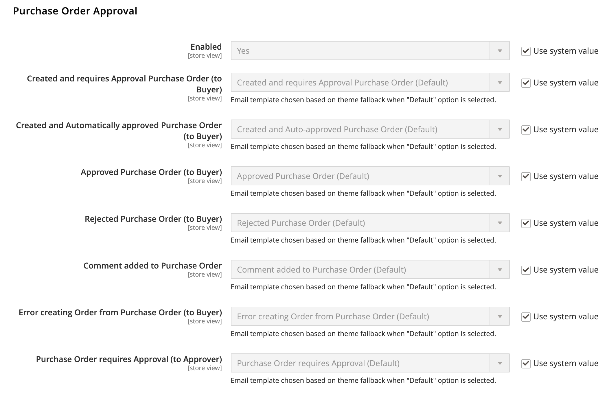
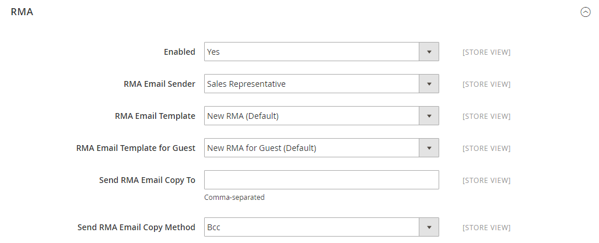

# [!UICONTROL Sales] > [!UICONTROL Sales Emails]

{{config}}

## [!UICONTROL General Settings]

<!-- zoom -->

<!-- [General Settings](https://docs.magento.com/user-guide/system/email-communications.html) -->

|Field|[Scope](../../getting-started/websites-stores-views.md#scope-settings)|Description|
|--- |--- |--- |
|[!UICONTROL Asynchronous sending]|Global|Determines if sales emails are sent asynchronously. It is recommended that you enable Asynchronous sending. Options:  **`Disable`** - (Default) Sales emails are sent when triggered by an event.  **`Enable`** - (Recommended) Sales emails are sent at predetermined, regular intervals.|

{:style="table-layout:auto"}

## [!UICONTROL Order]

<!-- zoom -->

<!-- [Order](https://docs.magento.com/user-guide/sales/orders.html) -->

|Field|[Scope](../../getting-started/websites-stores-views.md#scope-settings)|Description|
|--- |--- |--- |
|[!UICONTROL Enabled]|Store View|When enabled, sends a transactional email for each order placed. Options: `Yes` / `No`|
|[!UICONTROL New Order Confirmation Email Sender]|Store View|Identifies the store contact that appears as the message sender. Default sender: `Sales Representative`|
|[!UICONTROL New Order Confirmation Template]|Store View|Identifies the template that is sent to confirm new orders placed by customers. Default template: `New Order`|
|[!UICONTROL New Order Confirmation Template for Guest]|Store View|Identifies the template that is sent to confirm new orders placed by guests. Default template: `New Order for Guest`|
|[!UICONTROL Send Order Email Copy To]|Store View|Provides the email address of anyone to receive a copy of an order email. Separate multiple addresses with a comma.|
|[!UICONTROL Send Order Email Copy Method]|Store View|Indicates the email method used to send the copy. Options include:  **`Bcc`** - Sends a blind courtesy copy by including the recipient in the header of the same email that is sent to the customer. The BCC recipient is not visible to the customer.  **`Separate Email`** - Sends the copy as a separate email.|

{:style="table-layout:auto"}

## [!UICONTROL Order Comments]

<!-- zoom -->

<!-- [Order Comments](https://docs.magento.com/user-guide/sales/order-processing.html) -->

|Field|[Scope](../../getting-started/websites-stores-views.md#scope-settings)|Description|
|--- |--- |--- |
|[!UICONTROL Enabled]|Store View|When enabled, sends a transactional email for each order comment. Options: `Yes` / `No`|
|[!UICONTROL Order Comment Email Sender]|Store View|Identifies the store contact that appears as the message sender. Default sender: `Sales Representative`|
|[!UICONTROL Order Comment Email Template]|Store View|Identifies the template that is sent when a comment is added to a customer order. Default template: `Order Update`|
|[!UICONTROL New Order Confirmation Template for Guest]|Store View|Identifies the template that is sent when a comment is added to a guest order. Default template: `Order Update for Guest`|
|[!UICONTROL Send Order Email Copy To|Store View]|Provides the email address of anyone to receive a copy of an order comment email. Separate multiple addresses with a comma.|
|[!UICONTROL Send Order Email Copy Method]|Store View|Indicates the method used to send the copy. Options include:  **`Bcc`** - Sends a blind courtesy copy by including the recipient in the header of the same email that is sent to the customer. The BCC recipient is not visible to the customer.  **`Separate Email`** - Sends the copy as a separate email.|

{:style="table-layout:auto"}

## [!UICONTROL Invoice]

<!-- zoom -->

<!-- [Invoice](https://docs.magento.com/user-guide/sales/invoices.html) -->

|Field|[Scope](../../getting-started/websites-stores-views.md#scope-settings)|Description|
|--- |--- |--- |
|[!UICONTROL Enabled]|Store View|When enabled, sends a transactional email for each invoice generated. Options: `Yes` / `No`|
|[!UICONTROL Invoice Email Sender]|Store View|Identifies the store contact that appears as the message sender. Default sender: `Sales Representative`|
|[!UICONTROL Invoice Email Template]|Store View|Identifies the template that is sent when an invoice is generated for a customer. Default template: `New Invoice`|
|[!UICONTROL Invoice Email Template for Guest]|Store View|Identifies the template that is sent when an invoice is generated for a guest. Default template: `New Invoice for Guest`|
|[!UICONTROL Send Invoice Email Copy To]|Store View|Provides the email address of anyone to receive a copy of an invoice email. Separate multiple addresses with a comma.|
|[!UICONTROL Send Invoice Email Copy Method]|Store View|Indicates the method used to send the copy. Options include:  **`Bcc`** - Sends a blind courtesy copy by including the recipient in the header of the same email  that is sent to the customer. The BCC recipient is not visible to the customer.  **`Separate Email`** - Sends the copy as a separate email.|

{:style="table-layout:auto"}

## [!UICONTROL Invoice Comments]

<!-- zoom -->

<!-- [Invoice Comments](https://docs.magento.com/user-guide/sales/invoice-create.html) -->

|Field|[Scope](../../getting-started/websites-stores-views.md#scope-settings)|Description|
|--- |--- |--- |
|[!UICONTROL Enabled]|Store View|When enabled, sends a transactional email for each invoice comment. Options: `Yes` / `No`|
|[!UICONTROL Invoice Comment Email Sender]|Store View|Identifies the store contact that appears as the message sender. Default sender: `Sales Representative`|
|[!UICONTROL Invoice Comment Email Template]|Store View|Identifies the template that is sent when a comment is added to a customer invoice. Default template: `Invoice Update`|
|[!UICONTROL Invoice Comment Email Template for Guest]|Store View|Identifies the template that is sent when a comment is added to a guest invoice. Default template: `Invoice Update for Guest`|
|[!UICONTROL Send Invoice Comment Email Copy To]|Store View|Provides the email address of anyone to receive a copy of an invoice comment email. Separate multiple addresses with a comma.|
|[!UICONTROL Send Invoice Comments Email Copy Method]|Store View|Indicates the email method used to send the copy. Options include:  **`Bcc`** - Sends a blind courtesy copy by including the recipient in the header of the same email  that is sent to the customer. The BCC recipient is not visible to the customer.  **`Separate Email`** - Sends the copy as a separate email.|

{:style="table-layout:auto"}

## [!UICONTROL Shipment]

<!-- zoom -->

<!-- [Shipment](https://docs.magento.com/user-guide/sales/shipments.html) -->

|Field|[Scope](../../getting-started/websites-stores-views.md#scope-settings)|Description|
|--- |--- |--- |
|[!UICONTROL Enabled]|Store View|When enabled, sends a transactional email for each shipment generated. Options: `Yes` / `No`|
|[!UICONTROL Shipment Email Sender]|Store View|Identifies the store contact that appears as the sender of the message. Default sender: `Sales Representative`|
|[!UICONTROL Shipment Email Template]|Store View|Identifies the template that is sent when a shipment is generated for a customer. Default template: `New Shipment`|
|[!UICONTROL Shipment Email Template for Guest]|Store View|Identifies the template that is sent when a shipment  is generated for a guest. Default template: `New Shipment for Guest`|
|[!UICONTROL Send Shipment Email Copy To]|Store View|Provides the email address of anyone who should receive a copy of a shipment email. Separate multiple addresses with a comma.|
|[!UICONTROL Send Shipment Email Copy Method]|Store View|Indicates the method used to send the copy. Options include:  **`Bcc`** - Sends a blind courtesy copy by including the recipient in the header of the same email that is sent to the customer. The BCC recipient is not visible to the customer.  **`Separate Email`** - Sends the copy as a separate email.|

{:style="table-layout:auto"}

## [!UICONTROL Shipment Comments]

<!-- zoom -->

<!-- [Shipment Comments](https://docs.magento.com/user-guide/sales/shipments.html) -->

|Field|[Scope](../../getting-started/websites-stores-views.md#scope-settings)|Description|
|--- |--- |--- |
|[!UICONTROL Enabled]|Store View|When enabled, sends a transactional email for each shipment comment. Options: `Yes` / `No`|
|[!UICONTROL Shipment Comment Email Sender]|Store View|Identifies the store contact that appears as the message sender. Default sender: `Sales Representative`|
|[!UICONTROL Shipment Comment Email Template]|Store View|Identifies the template that is sent when a comment is added to a customer shipment. Default template: `Shipment Update`|
|[!UICONTROL Shipment Comment Email Template for Guest]|Store View|Identifies the template that is sent when a comment is added to a guest shipment. Default template: `Shipment Update for Guest`|
|[!UICONTROL Send Shipment Comment Email Copy To]|Store View|Provides the email address of anyone to receive a copy of a shipment comment email. Separate multiple addresses with a comma.|
|[!UICONTROL Send Shipment Comments Email Copy Method]|Store View|Indicates the email method used to send the copy. Options include:  **`Bcc`** - Sends a blind courtesy copy by including the recipient in the header of the same email  that is sent to the customer. The BCC recipient is not visible to the customer.  **`Separate Email`** - Sends the copy as a separate email.|

{:style="table-layout:auto"}

## [!UICONTROL Credit Memo]

<!-- zoom -->

<!-- [Credit Memo](https://docs.magento.com/user-guide/sales/credit-memos.html) -->

|Field|[Scope](../../getting-started/websites-stores-views.md#scope-settings)|Description|
|--- |--- |--- |
|[!UICONTROL Enabled]|Store View|Activates the transactional email for each credit memo generated. Options: `Yes` / `No`|
|[!UICONTROL Credit Memo Email Sender]|Store View|Identifies the store contact that appears as the sender of the message. Default sender: `Sales Representative`|
|[!UICONTROL Credit Memo Email Template]|Store View|Identifies the template that is sent when a credit memo is generated for a customer. Default template: `New Credit Memo`|
|[!UICONTROL Credit Memo Email Template for Guest]|Store View|Identifies the template that is sent when a credit memo is generated for a guest. Default template: `New Credit Memo for Guest`|
|[!UICONTROL Send Credit Memo Email Copy To]|Store View|Provides the email address of anyone who should receive a copy of a credit memo email. Separate multiple addresses with a comma.|
|[!UICONTROL Send Credit Memo Email Copy Method]|Store View|Indicates the method used to send the copy. Options include:  **`Bcc`** - Sends a blind courtesy copy by including the recipient in the header of the same email that is sent to the customer. The BCC recipient is not visible to the customer.  **`Separate Email`** - Sends the copy as a separate email.|

{:style="table-layout:auto"}

## [!UICONTROL Credit Memo Comments]

<!-- zoom -->

<!-- [Credit Memo Comments](https://docs.magento.com/user-guide/sales/credit-memo-create.html) -->

|Field|[Scope](../../getting-started/websites-stores-views.md#scope-settings)|Description|
|--- |--- |--- |
|[!UICONTROL Enabled]|Store View|When enabled, sends a transactional email for each credit memo comment. Options: `Yes` / `No`|
|[!UICONTROL Credit Memo Comment Email Sender]|Store View|Identifies the store contact that appears as the message sender. Default sender: `Sales Representative`|
|[!UICONTROL Credit Memo Comment Email Template]|Store View|Identifies the template that is sent when a comment is added to a customer credit memo. Default template: `Credit Memo Update`|
|[!UICONTROL Credit Memo Comment Email Template for Guest]|Store View|Identifies the template that is sent when a comment is added to a guest credit memo. Default template: `Credit Memo Update for Guest`|
|[!UICONTROL Send Credit Memo Comment Email Copy To]|Store View|Specifies the email address of anyone to receive a copy of a credit memo comment email. Separate multiple addresses with a comma.|
|[!UICONTROL Send Credit Memo Comments Email Copy Method]|Store View|Indicates the email method used to send the copy. Options include:  **`Bcc`** - Sends a blind courtesy copy by including the recipient in the header of the same email  that is sent to the customer. The BCC recipient is not visible to the customer.  **`Separate Email`** - Sends the copy as a separate email.|

{:style="table-layout:auto"}

## [!UICONTROL Order Ready For Pickup in Store]

<!-- zoom -->

<!-- [Order Ready For Pickup in Store](https://docs.magento.com/user-guide/shipping/shipping-in-store-delivery.html) -->

|Field|[Scope](../../getting-started/websites-stores-views.md#scope-settings)|Description|
|--- |--- |--- |
|[!UICONTROL Enabled]|Store View|When enabled, sends a transactional email when an order is ready for in-store pickup. Options: `Yes` / `No`|
|[!UICONTROL Order Ready For Pickup Email Sender]|Store View|Identifies the store contact that appears as the message sender. Default sender: `General Contact`|
|[!UICONTROL Order Ready For Pickup Email Template]|Store View|Identifies the template that is used for the transactional email for each order that is ready for pickup in store for a registered customer. Default template: `Order is Ready for Pickup`|
|[!UICONTROL Order Ready For Pickup Email Template for Guest]|Store View|Identifies the template that is used for the transactional email for each order that is ready for pickup in store for a guest. Default template: `Order is Ready for Pickup for Guest`|
|Send Order Ready For Pickup Email Copy To|Store View|Specifies the email address of anyone to receive a copy of an _Order Ready For Pickup_ email. Separate multiple addresses with a comma.|
|[!UICONTROL Send Order Ready For Pickup Email Copy Method]|Store View|Indicates the email method used to send the copy. Options:  **`Bcc`** - Sends a blind courtesy copy by including the recipient in the header of the same email that is sent to the customer. The BCC recipient is not visible to the customer.  **`Separate Email`** - Sends the copy as a separate email.|

{:style="table-layout:auto"}

## [!UICONTROL Purchase Order Approval]

{{b2b-feature}}

<!-- zoom -->

|Field|[Scope](../../getting-started/websites-stores-views.md#scope-settings)|Description|
|--- |--- |--- |
|[!UICONTROL Enabled]|Store View|When enabled, sends emails during the purchase order process. Options: `Yes` / `No` |
| [!UICONTROL Created and requires Approval Purchase Order (to Buyer)] | Store View | Sends an email confirmation to the purchase order creator. |
| [!UICONTROL Created and Automatically approved Purchase Order (to Buyer)] | Store View | Sends an email confirmation to the purchase order creator. |
| [!UICONTROL Approved Purchase Order (to Buyer)] | Store View | Sends an email to the creator on purchase order approval. |
| [!UICONTROL Rejected Purchase Order (to Buyer)] | Store View | Sends an email to the creator when the purchase order has been rejected. |
| [!UICONTROL Comment added to Purchase Order] | Store View | Sends an email to the creator when a comment has been added to the PO. |
| [!UICONTROL Error creating Order from Purchase Order (to Buyer)] | Store View | Notifies creator that an error occurred when converting a PO to an order.|
| [!UICONTROL Purchase Order required Approval (to Approver)] | Store View | Sends an email to notify the approver that the purchase order requires their approval. |

{:style="table-layout:auto"}

## [!UICONTROL Quote]

{{b2b-feature}}

<!-- zoom -->

<!-- [Quotes](https://docs.magento.com/user-guide/customers/account-dashboard-quotes.html) -->

|Field|[Scope](../../getting-started/websites-stores-views.md#scope-settings)|Description|
|--- |--- |--- |
|[!UICONTROL Enabled]|Store View|Enables quote email messages to be sent from the current store view. Options: `Yes` / `No`|
|[!UICONTROL Updated Quote Template (to Buyer)]|Store View|Determines the email template that is used for notification sent to the buyer when an updated quote is available. Default template: `Updated Quote`|
|[!UICONTROL Declined Quote Template (to Buyer)]|Store View|Determines the email template that is used for notification sent to the buyer when a quote is declined. Default template: `Declined Quote`|
|[!UICONTROL New Quote Template (to Seller)]|Store View|Determines the email template that is used for notification sent to the seller when a request for a new quote is received. Default template: `New Quote`|
|[!UICONTROL Updated Quote Template (to Seller)]|Store View|Determines the email template that is used for notification sent to the seller when an updated quote is received. Default template: `Updated Quote`|
|[!UICONTROL Quote Expiration (in 48 hrs)]|Store View|Specifies the email template that is used for the expiration notice that is sent 48 hours before the quote expires. Default template: `Expiration Warning`|
|[!UICONTROL Quote Expiration (in 24 hrs)]|Store View|Specifies the email template that is used for the expiration notice that is sent 24 hours before the quote expires. Default template: `Expiration Warning 1`|
|[!UICONTROL Expiration Date Reset]|Store View|Specifies the email template that is used for the notice that is sent when the expiration date changes. Default template: `Expiration Date Reset`|
|[!UICONTROL Send Quote Email Copy To]|Store View|Specifies the email address of each person who is to receive a copy of the quote email. Separate multiple addresses with a comma.|
|[!UICONTROL Send Quote Email Copy Method]|Store View|Indicates the email method used to send the copy. Options include:  **`Bcc`** - Sends a blind courtesy copy by including the recipient in the header of the same email  that is sent to the customer. The BCC recipient is not visible to the customer.  **`Separate Email`** - Sends the copy as a separate email.|

{:style="table-layout:auto"}

## [!UICONTROL RMA]

{{ee-feature}}

<!-- zoom -->

<!-- [RMA](https://docs.magento.com/user-guide/sales/returns.html) -->

|Field|[Scope](../../getting-started/websites-stores-views.md#scope-settings)|Description|
|--- |--- |--- |
|[!UICONTROL Enabled]|Store View|Activates [email notification](https://docs.magento.com/user-guide/marketing/email-templates.html) for each RMA generated. Options: `Yes` / `No`|
|[!UICONTROL RMA Email Sender]|Store View|Identifies the [store contact](https://docs.magento.com/user-guide/stores/store-email-addresses.html) that appears as the sender of the message. Default value: `Sales Representative`|
|[!UICONTROL RMA Email Template]|Store View|Determines the [email template](https://docs.magento.com/user-guide/marketing/email-templates.html) that is used for the notification sent when an RMA is generated for a customer. Default template: `New RMA`|
|[!UICONTROL RMA Email Template for Guest]|Store View|Determines the template that is sent when an RMA is generated for a guest. Default template: `New RMA for Guest`|
|[!UICONTROL Send RMA Email Copy To]|Store View|Provides the email address of anyone who should receive a copy of an RMA email. Separate multiple addresses with a comma.|
|[!UICONTROL Send RMA  Email Copy Method]|Store View|Indicates the email method used to send the copy. Options include:  **`Bcc`** - Sends a blind courtesy copy by including the recipient in the header of the same email  that is sent to the customer. The BCC recipient is not visible to the customer.  **`Separate Email`** - Sends the copy as a separate email.|

{:style="table-layout:auto"}

## [!UICONTROL RMA Authorization]

{{ee-feature}}

<!-- zoom -->

<!-- [RMA Authorization](https://docs.magento.com/user-guide/sales/rma-configure.html) -->

|Field|[Scope](../../getting-started/websites-stores-views.md#scope-settings)|Description|
|--- |--- |--- |
|[!UICONTROL Enabled]|Store View|When enabled, sends an email notification for each RMA authorization. Options: `Yes` / `No`|
|[!UICONTROL RMA Authorization Email Sender]|Store View|Identifies the [store contact](https://docs.magento.com/user-guide/stores/store-email-addresses.html) that appears as the message sender. Default value: `Sales Representative`|
|[!UICONTROL RMA Authorization Email Template]|Store View|Determines the [email template](https://docs.magento.com/user-guide/marketing/email-templates.html) that is used when an RMA authorization notification is sent. Default template: `RMA Authorization`|
|[!UICONTROL RMA Authorization Email Template for Guest]|Store View|Determines the template that is used when an RMA authorization notification is sent to a guest. Default template: `RMA Authorization for Guest`|
|[!UICONTROL Send RMA Authorization Email Copy To]|Store View|Provides the email address of anyone to receive a copy of an RMA authorization email. Separate multiple addresses with a comma.|
|[!UICONTROL Send RMA Authorization Email Copy Method]|Store View|Indicates the email method used to send the copy. Options include:  **`Bcc`** - Sends a blind courtesy copy by including the recipient in the header of the same email  that is sent to the customer. The BCC recipient is not visible to the customer.  **`Separate Email`** - Sends the copy as a separate email.|

{:style="table-layout:auto"}

## [!UICONTROL RMA Admin Comments]

{{ee-feature}}

<!-- zoom -->

|Field|[Scope](../../getting-started/websites-stores-views.md#scope-settings)|Description|
|--- |--- |--- |
|[!UICONTROL Enabled]|Store View|When enabled, sends an email notification for each RMA Admin comment. Options: `Yes` / `No`|
|[!UICONTROL RMA Comment Email Sender]|Store View|Identifies the [store contact](https://docs.magento.com/user-guide/stores/store-email-addresses.html) that appears as the message sender. Default value: `Sales Representative`|
|[!UICONTROL RMA Comment Email Template]|Store View|Determines the [email template](https://docs.magento.com/user-guide/marketing/email-templates.html) that is used when an Admin adds a comment to an RMA for a customer. Default template: `RMA Admin Comments`|
|[!UICONTROL RMA Comment Email Template for Guest]|Store View|Determines the template that is used when an Admin adds a comment to an RMA for a guest. Default template: `RMA Admin Comments for Guest`|
|[!UICONTROL Send RMA Comment Email Copy To]|Store View|Provides the email address of anyone to receive a copy of the notification. Separate multiple addresses with a comma.|
|[!UICONTROL Send RMA Comments Email Copy Method]|Store View|Indicates the email method used to send the copy. Options include:  **`Bcc`** - Sends a blind courtesy copy by including the recipient in the header of the same email  that is sent to the customer. The BCC recipient is not visible to the customer.  **`Separate Email`** - Sends the copy as a separate email.|

{:style="table-layout:auto"}

## [!UICONTROL RMA Customer Comments]

{{ee-feature}}

<!-- zoom -->

<!-- [RMA Customer Comments](https://docs.magento.com/user-guide/sales/returns.html) -->

|Field|[Scope](../../getting-started/websites-stores-views.md#scope-settings)|Description|
|--- |--- |--- |
|[!UICONTROL Enabled]|Store View|When enabled, sends an [email notification](https://docs.magento.com/user-guide/marketing/email-templates.html) for each RMA customer comment. Options: `Yes` / `No`|
|[!UICONTROL RMA Comment Email Sender]|Store View|Identifies the [store contact](https://docs.magento.com/user-guide/stores/store-email-addresses.html) that appears as the message sender. Default value: `Customer Support`|
|[!UICONTROL RMA Comment Email Recipient]|Store View|Identifies the store contact that is the recipient of the customer comment email. Default value: `Sales Representative`|
|[!UICONTROL RMA Comment Email Template]|Store View|Determines the [email template](https://docs.magento.com/user-guide/sales/rma-configure.html) that is used when a customer adds a comment to an RMA. Default template: `RMA Admin Comments`|
|[!UICONTROL Send RMA Comment Email Copy To]|Store View|Provides the email address of anyone to receive a copy of the notification. Separate multiple addresses with a comma.|
|[!UICONTROL Send RMA Comments Email Copy Method]|Store View|Indicates the email method used to send the copy. Options include:  **`Bcc`** - Sends a blind courtesy copy by including the recipient in the header of the same email  that is sent to the customer. The BCC recipient is not visible to the customer.  **`Separate Email`** - Sends the copy as a separate email.|

{:style="table-layout:auto"}
