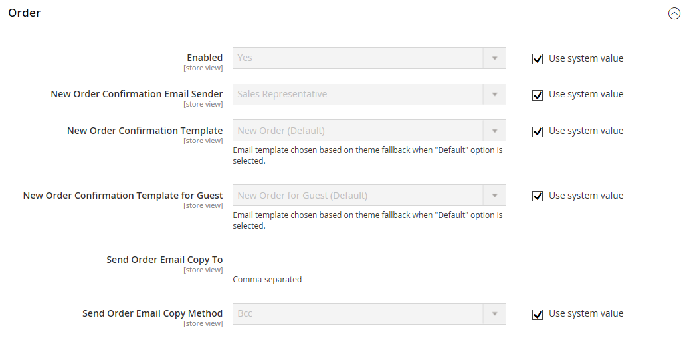

# Sales > Sales Emails

{{config}}

## General Settings

<!-- zoom -->

<!-- General Settings](https://docs.magento.com/user-guide/system/email-communications.html) -->

|Field|[Scope](../../getting-started/websites-stores-views.md#scope-settings)|Description|
|--- |--- |--- |
|Asynchronous sending|Global|Determines if sales emails are sent asynchronously. It is recommended that you enable Asynchronous sending. Options:  **Disable** - (Default) Sales emails are sent when triggered by an event.  **Enable** - (Recommended) Sales emails are sent at predetermined, regular intervals.|

## Order

<!-- zoom -->

<!-- Order](https://docs.magento.com/user-guide/sales/orders.html) -->

|Field|[Scope](../../getting-started/websites-stores-views.md#scope-settings)|Description|
|--- |--- |--- |
|Enabled|Store View|When enabled, sends a transactional email for each order placed. Options include: Yes / No|
|New Order Confirmation Email Sender|Store View|Identifies the store contact that appears as the message sender. Default sender: Sales Representative|
|New Order Confirmation Template|Store View|Identifies the template that is sent to confirm new orders placed by customers. Default template: New Order|
|New Order Confirmation Template for Guest|Store View|Identifies the template that is sent to confirm new orders placed by guests. Default template: New Order for Guest|
|Send Order Email Copy To|Store View|Provides the email address of anyone to receive a copy of an order email. Separate multiple addresses with a comma.|
|Send Order Email Copy Method|Store View|Indicates the email method used to send the copy. Options include:  **Bcc** - Sends a blind courtesy copy by including the recipient in the header of the same email that is sent to the customer. The BCC recipient is not visible to the customer.  **Separate Email** - Sends the copy as a separate email.|

## Order Comments

<!-- zoom -->

<!-- Order Comments](https://docs.magento.com/user-guide/sales/order-processing.html) -->

|Field|[Scope](../../getting-started/websites-stores-views.md#scope-settings)|Description|
|--- |--- |--- |
|Enabled|Store View|When enabled, sends a transactional email for each order comment. Options include: Yes / No|
|Order Comment Email Sender|Store View|Identifies the store contact that appears as the message sender. Default sender: Sales Representative|
|Order Comment Email Template|Store View|Identifies the template that is sent when a comment is added to a customer order. Default template: Order Update|
|New Order Confirmation Template for Guest|Store View|Identifies the template that is sent when a comment is added to a guest order. Default template: Order Update for Guest|
|Send Order Email Copy To|Store View|Provides the email address of anyone to receive a copy of an order comment email. Separate multiple addresses with a comma.|
|Send Order Email Copy Method|Store View|Indicates the method used to send the copy. Options include:  **Bcc** - Sends a blind courtesy copy by including the recipient in the header of the same email that is sent to the customer. The BCC recipient is not visible to the customer.  **Separate Email** - Sends the copy as a separate email.|

## Invoice

<!-- zoom -->

<!-- Invoice](https://docs.magento.com/user-guide/sales/invoices.html) -->

|Field|[Scope](../../getting-started/websites-stores-views.md#scope-settings)|Description|
|--- |--- |--- |
|Enabled|Store View|When enabled, sends a transactional email for each invoice generated. Options include: Yes / No|
|Invoice Email Sender|Store View|Identifies the store contact that appears as the message sender. Default sender: Sales Representative|
|Invoice Email Template|Store View|Identifies the template that is sent when an invoice is generated for a customer. Default template: New Invoice|
|Invoice Email Template for Guest|Store View|Identifies the template that is sent when an invoice is generated for a guest. Default template: New Invoice for Guest|
|Send Invoice Email Copy To|Store View|Provides the email address of anyone to receive a copy of an invoice email. Separate multiple addresses with a comma.|
|Send Invoice Email Copy Method|Store View|Indicates the method used to send the copy. Options include:  **Bcc** - Sends a blind courtesy copy by including the recipient in the header of the same email  that is sent to the customer. The BCC recipient is not visible to the customer.  **Separate Email** - Sends the copy as a separate email.|

## Invoice Comments

<!-- zoom -->

<!-- Invoice Comments](https://docs.magento.com/user-guide/sales/invoice-create.html) -->

|Field|[Scope](../../getting-started/websites-stores-views.md#scope-settings)|Description|
|--- |--- |--- |
|Enabled|Store View|When enabled, sends a transactional email for each invoice comment. Options include: Yes / No|
|Invoice Comment Email Sender|Store View|Identifies the store contact that appears as the message sender. Default sender: Sales Representative|
|Invoice Comment Email Template|Store View|Identifies the template that is sent when a comment is added to a customer invoice. Default template: Invoice Update|
|Invoice Comment Email Template for Guest|Store View|Identifies the template that is sent when a comment is added to a guest invoice. Default template: Invoice Update for Guest|
|Send Invoice Comment Email Copy To|Store View|Provides the email address of anyone to receive a copy of an invoice comment email. Separate multiple addresses with a comma.|
|Send Invoice Comments Email Copy Method|Store View|Indicates the email method used to send the copy. Options include:  **Bcc** - Sends a blind courtesy copy by including the recipient in the header of the same email  that is sent to the customer. The BCC recipient is not visible to the customer.  **Separate Email** - Sends the copy as a separate email.|

## Shipment

<!-- zoom -->

<!-- Shipment](https://docs.magento.com/user-guide/sales/shipments.html) -->

|Field|[Scope](../../getting-started/websites-stores-views.md#scope-settings)|Description|
|--- |--- |--- |
|Enabled|Store View|When enabled, sends a transactional email for each shipment generated. Options include: Yes / No|
|Shipment Email Sender|Store View|Identifies the store contact that appears as the sender of the message. Default sender: Sales Representative|
|Shipment Email Template|Store View|Identifies the template that is sent when a shipment is generated for a customer. Default template: New Shipment|
|Shipment Email Template for Guest|Store View|Identifies the template that is sent when a shipment  is generated for a guest. Default template: New Shipment for Guest|
|Send Shipment Email Copy To|Store View|Provides the email address of anyone who should receive a copy of a shipment email. Separate multiple addresses with a comma.|
|Send Shipment Email Copy Method|Store View|Indicates the method used to send the copy. Options include:  **Bcc** - Sends a blind courtesy copy by including the recipient in the header of the same email that is sent to the customer. The BCC recipient is not visible to the customer.  **Separate Email** - Sends the copy as a separate email.|

## Shipment Comments

<!-- zoom -->

<!-- Shipment Comments](https://docs.magento.com/user-guide/sales/shipments.html) -->

|Field|[Scope](../../getting-started/websites-stores-views.md#scope-settings)|Description|
|--- |--- |--- |
|Enabled|Store View|When enabled, sends a transactional email for each shipment comment. Options include: Yes / No|
|Shipment Comment Email Sender|Store View|Identifies the store contact that appears as the message sender. Default sender: Sales Representative|
|Shipment Comment Email Template|Store View|Identifies the template that is sent when a comment is added to a customer shipment. Default template: Shipment Update|
|Shipment Comment Email Template for Guest|Store View|Identifies the template that is sent when a comment is added to a guest shipment. Default template: Shipment Update for Guest|
|Send Shipment Comment Email Copy To|Store View|Provides the email address of anyone to receive a copy of a shipment comment email. Separate multiple addresses with a comma.|
|Send Shipment Comments Email Copy Method|Store View|Indicates the email method used to send the copy. Options include:  **Bcc** - Sends a blind courtesy copy by including the recipient in the header of the same email  that is sent to the customer. The BCC recipient is not visible to the customer.  **Separate Email** - Sends the copy as a separate email.|

## Credit Memo

<!-- zoom -->

<!-- Credit Memo](https://docs.magento.com/user-guide/sales/credit-memos.html) -->

|Field|[Scope](../../getting-started/websites-stores-views.md#scope-settings)|Description|
|--- |--- |--- |
|Enabled|Store View|Activates the transactional email for each credit memo generated. Options include: Yes / No|
|Credit Memo Email Sender|Store View|Identifies the store contact that appears as the sender of the message. Default sender: Sales Representative|
|Credit Memo Email Template|Store View|Identifies the template that is sent when a credit memo is generated for a customer. Default template: New Credit Memo|
|Credit Memo Email Template for Guest|Store View|Identifies the template that is sent when a credit memo is generated for a guest. Default template: New Credit Memo for Guest|
|Send Credit Memo Email Copy To|Store View|Provides the email address of anyone who should receive a copy of a credit memo email. Separate multiple addresses with a comma.|
|Send Credit Memo Email Copy Method|Store View|Indicates the method used to send the copy. Options include:  **Bcc** - Sends a blind courtesy copy by including the recipient in the header of the same email that is sent to the customer. The BCC recipient is not visible to the customer.  **Separate Email** - Sends the copy as a separate email.|

## Credit Memo Comments

<!-- zoom -->

<!-- Credit Memo Comments](https://docs.magento.com/user-guide/sales/credit-memo-create.html) -->

|Field|[Scope](../../getting-started/websites-stores-views.md#scope-settings)|Description|
|--- |--- |--- |
|Enabled|Store View|When enabled, sends a transactional email for each credit memo comment. Options include: Yes / No|
|Credit Memo Comment Email Sender|Store View|Identifies the store contact that appears as the message sender. Default sender: Sales Representative|
|Credit Memo Comment Email Template|Store View|Identifies the template that is sent when a comment is added to a customer credit memo. Default template: Credit Memo Update|
|Credit Memo Comment Email Template for Guest|Store View|Identifies the template that is sent when a comment is added to a guest credit memo. Default template: Credit Memo Update for Guest|
|Send Credit Memo Comment Email Copy To|Store View|Specifies the email address of anyone to receive a copy of a credit memo comment email. Separate multiple addresses with a comma.|
|Send Credit Memo Comments Email Copy Method|Store View|Indicates the email method used to send the copy. Options include:  **Bcc** - Sends a blind courtesy copy by including the recipient in the header of the same email  that is sent to the customer. The BCC recipient is not visible to the customer.  **Separate Email** - Sends the copy as a separate email.|

## Order Ready For Pickup in Store

<!-- zoom -->

<!-- Order Ready For Pickup in Store](https://docs.magento.com/user-guide/shipping/shipping-in-store-delivery.html) -->

|Field|[Scope](../../getting-started/websites-stores-views.md#scope-settings)|Description|
|--- |--- |--- |
|Enabled|Store View|When enabled, sends a transactional email when an order is ready for in-store pickup. Options: `Yes` / `No`|
|Order Ready For Pickup Email Sender|Store View|Identifies the store contact that appears as the message sender. Default sender: `General Contact`|
|Order Ready For Pickup Email Template|Store View|Identifies the template that is used for the transactional email for each order that is ready for pickup in store for a registered customer. Default template: `Order is Ready for Pickup`|
|Order Ready For Pickup Email Template for Guest|Store View|Identifies the template that is used for the transactional email for each order that is ready for pickup in store for a guest. Default template: `Order is Ready for Pickup for Guest`|
|Send Order Ready For Pickup Email Copy To|Store View|Specifies the email address of anyone to receive a copy of an _Order Ready For Pickup_ email. Separate multiple addresses with a comma.|
|Send Order Ready For Pickup Email Copy Method|Store View|Indicates the email method used to send the copy. Options:  **Bcc** - Sends a blind courtesy copy by including the recipient in the header of the same email that is sent to the customer. The BCC recipient is not visible to the customer.  **Separate Email** - Sends the copy as a separate email.|

## Purchase Order Approval

{{b2b-feature}}

<!-- zoom -->

|Field|[Scope](../../getting-started/websites-stores-views.md#scope-settings)|Description|
|--- |--- |--- |
|Enabled|Store View|When enabled, sends emails during the purchase order process. Options: `Yes` / `No` |
| Created and requires Approval Purchase Order (to Buyer) | Store View | Sends an email confirmation to the purchase order creator. |
| Created and Automatically approved Purchase Order (to Buyer) | Store View | Sends an email confirmation to the purchase order creator. |
| Approved Purchase Order (to Buyer) | Store View | Sends an email to the creator on purchase order Approval. |
| Rejected Purchase Order (to Buyer) | Store View | Sends an email to the creator when the purchase order has been Rejected. |
| Comment added to Purchase Order | Store View | Sends an email to the creator when a comment has been added to the PO. |
| Error creating Order from Purchase Order (to Buyer) | Store View | Notifies creator that an error occurred when converting a PO to an order.|
| Purchase Order required Approval (to Approver) | Store View | Sends an email to notify the approver that the purchase order requires their approval. |

## Quote

{{b2b-feature}}

<!-- zoom -->

<!--Quotes](https://docs.magento.com/user-guide/customers/account-dashboard-quotes.html) -->

|Field|[Scope](../../getting-started/websites-stores-views.md#scope-settings)|Description|
|--- |--- |--- |
|Enabled|Store View|Enables quote email messages to be sent from the current store view. Options: `Yes` / `No`|
|Updated Quote Template (to Buyer)|Store View|Determines the email template that is used for notification sent to the buyer when an updated quote is available. Default template: `Updated Quote`|
|Declined Quote Template (to Buyer)|Store View|Determines the email template that is used for notification sent to the buyer when a quote is declined. Default template: Declined Quote|
|New Quote Template (to Seller)|Store View|Determines the email template that is used for notification sent to the seller when a request for a new quote is received. Default template: New Quote|
|Updated Quote Template (to Seller)|Store View|Determines the email template that is used for notification sent to the seller when an updated quote is received. Default template: Updated Quote|
|Quote Expiration (in 48 hrs)|Store View|Specifies the email template that is used for the expiration notice that is sent 48 hours before the quote expires. Default template: Expiration Warning|
|Quote Expiration (in 24 hrs)|Store View|Specifies the email template that is used for the expiration notice that is sent 24 hours before the quote expires. Default template: Expiration Warning 1|
|Expiration Date Reset|Store View|Specifies the email template that is used for the notice that is sent when the expiration date changes. Default template: Expiration Date Reset|
|Send Quote Email Copy To|Store View|Specifies the email address of each person who is to receive a copy of the quote email. Separate multiple addresses with a comma.|
|Send Quote Email Copy Method|Store View|Indicates the email method used to send the copy. Options include:  **Bcc** - Sends a blind courtesy copy by including the recipient in the header of the same email  that is sent to the customer. The BCC recipient is not visible to the customer.  **Separate Email** - Sends the copy as a separate email.|

## RMA

{{ee-feature}}

<!-- zoom -->

<!--RMA](https://docs.magento.com/user-guide/sales/returns.html) -->

|Field|[Scope](../../getting-started/websites-stores-views.md#scope-settings)|Description|
|--- |--- |--- |
|Enabled|Store View|Activates [email notification](https://docs.magento.com/user-guide/marketing/email-templates.html) for each RMA generated. Options: `Yes` / `No`|
|RMA Email Sender|Store View|Identifies the [store contact](https://docs.magento.com/user-guide/stores/store-email-addresses.html) that appears as the sender of the message. Default value: Sales Representative|
|RMA Email Template|Store View|Determines the [email template](https://docs.magento.com/user-guide/marketing/email-templates.html) that is used for the notification sent when an RMA is generated for a customer. Default template: New RMA|
|RMA Email Template for Guest|Store View|Determines the template that is sent when an RMA is generated for a guest. Default template: New RMA for Guest|
|Send RMA Email Copy To|Store View|Provides the email address of anyone who should receive a copy of an RMA email. Separate multiple addresses with a comma.|
|Send RMA  Email Copy Method|Store View|Indicates the email method used to send the copy. Options include:  **Bcc** - Sends a blind courtesy copy by including the recipient in the header of the same email  that is sent to the customer. The BCC recipient is not visible to the customer.  **Separate Email** - Sends the copy as a separate email.|

## RMA Authorization

{{ee-feature}}

<!-- zoom -->

<!--RMA Authorization](https://docs.magento.com/user-guide/sales/rma-configure.html) -->

|Field|[Scope](../../getting-started/websites-stores-views.md#scope-settings)|Description|
|--- |--- |--- |
|Enabled|Store View|When enabled, sends an email notification for each RMA authorization. Options: `Yes` / `No`|
|RMA Authorization Email Sender|Store View|Identifies the [store contact](https://docs.magento.com/user-guide/stores/store-email-addresses.html) that appears as the message sender. Default value: Sales Representative|
|RMA Authorization Email Template|Store View|Determines the [email template](https://docs.magento.com/user-guide/marketing/email-templates.html) that is used when an RMA authorization notification is sent. Default template: RMA Authorization|
|RMA Authorization Email Template for Guest|Store View|Determines the template that is used when an RMA authorization notification is sent to a guest. Default template: RMA Authorization for Guest|
|Send RMA Authorization Email Copy To|Store View|Provides the email address of anyone to receive a copy of an RMA authorization email. Separate multiple addresses with a comma.|
|Send RMA Authorization Email Copy Method|Store View|Indicates the email method used to send the copy. Options include:  **Bcc** - Sends a blind courtesy copy by including the recipient in the header of the same email  that is sent to the customer. The BCC recipient is not visible to the customer.  **Separate Email** - Sends the copy as a separate email.|

## RMA Admin Comments

{{ee-feature}}

<!-- zoom -->

|Field|[Scope](../../getting-started/websites-stores-views.md#scope-settings)|Description|
|--- |--- |--- |
|Enabled|Store View|When enabled, sends an email notification for each RMA Admin comment. Options: `Yes` / `No`|
|RMA Comment Email Sender|Store View|Identifies the [store contact](https://docs.magento.com/user-guide/stores/store-email-addresses.html) that appears as the message sender. Default value: Sales Representative|
|RMA Comment Email Template|Store View|Determines the [email template](https://docs.magento.com/user-guide/marketing/email-templates.html) that is used when an Admin adds a comment to an RMA for a customer. Default template: RMA Admin Comments|
|RMA Comment Email Template for Guest|Store View|Determines the template that is used when an Admin adds a comment to an RMA for a guest. Default template: RMA Admin Comments for Guest|
|Send RMA Comment Email Copy To|Store View|Provides the email address of anyone to receive a copy of the notification. Separate multiple addresses with a comma.|
|Send RMA Comments Email Copy Method|Store View|Indicates the email method used to send the copy. Options include:  **Bcc** - Sends a blind courtesy copy by including the recipient in the header of the same email  that is sent to the customer. The BCC recipient is not visible to the customer.  **Separate Email** - Sends the copy as a separate email.|

## RMA Customer Comments

{{ee-feature}}

<!-- zoom -->

<!--RMA Customer Comments](https://docs.magento.com/user-guide/sales/returns.html) -->

|Field|[Scope](../../getting-started/websites-stores-views.md#scope-settings)|Description|
|--- |--- |--- |
|Enabled|Store View|When enabled, sends an [email notification](https://docs.magento.com/user-guide/marketing/email-templates.html) for each RMA customer comment. Options: `Yes` / `No`|
|RMA Comment Email Sender|Store View|Identifies the [store contact](https://docs.magento.com/user-guide/stores/store-email-addresses.html) that appears as the message sender. Default value: Customer Support|
|RMA Comment Email Recipient|Store View|Identifies the store contact that is the recipient of the customer comment email. Default value: Sales Representative.|
|RMA Comment Email Template|Store View|Determines the [email template](https://docs.magento.com/user-guide/sales/rma-configure.html) that is used when a customer adds a comment to an RMA. Default template: RMA Admin Comments|
|Send RMA Comment Email Copy To|Store View|Provides the email address of anyone to receive a copy of the notification. Separate multiple addresses with a comma.|
|Send RMA Comments Email Copy Method|Store View|Indicates the email method used to send the copy. Options include:  **Bcc** - Sends a blind courtesy copy by including the recipient in the header of the same email  that is sent to the customer. The BCC recipient is not visible to the customer.  **Separate Email** - Sends the copy as a separate email.|
