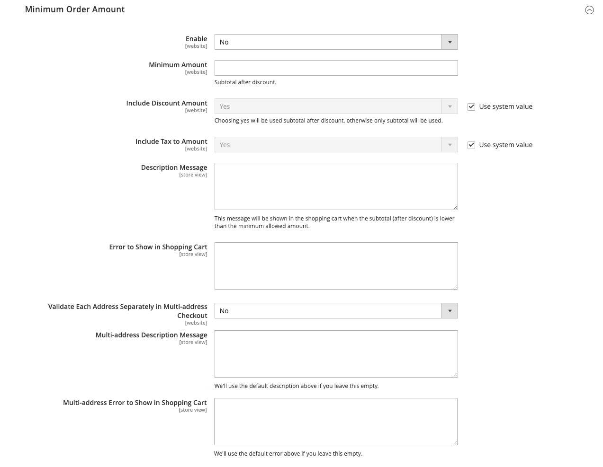

# Sales > Sales

{{config}}

## General

<!-- zoom -->

<!-- General](https://docs.magento.com/user-guide/marketing/sales-documents-ref-id.html) -->

|Field|[Scope](../../getting-started/websites-stores-views.md#scope-settings)|Description|
|--- |--- |--- |
|Hide Customer IP|Store View|Determines if the customer IP address appears on orders, invoices, shipments, and credit memos. Options: `Yes` / `No`|

## Checkout Totals Sort Order

<!-- zoom -->

<!-- Checkout Totals Sort Order](https://docs.magento.com/user-guide/sales/checkout-totals-sort-order.html) -->

|Field|[Scope](../../getting-started/websites-stores-views.md#scope-settings)|Description|
|--- |--- |--- |
|Subtotal|Website|A number that determines when the subtotal is calculated in relation to other checkout totals. Default value: 10|
|Discount|Website|A number that determines when the discount is calculated in relation to other checkout totals. Default value: 20|
|Shipping|Website|A number that determines when the shipping is calculated in relation to other checkout totals. Default value: 30|
|Tax|Website|A number that determines when Tax is calculated in relation to other checkout totals. Default value: 40|
|Fixed Product Tax|Website|A number that determines when the Fixed Product Tax is calculated in relation to other checkout totals. Default value: 50|
|Grand Total|Website|A number that determines when the Grand Total is calculated in relation to other checkout totals. Default value: 100|

## Reorder

<!-- zoom -->

<!-- Reorder](https://docs.magento.com/user-guide/sales/reorders-allow.html) -->

|Field|[Scope](../../getting-started/websites-stores-views.md#scope-settings)|Description|
|--- |--- |--- |
|Allow Reorder|Store View|Determines if the customers can reorder from their accounts. Options: `Yes` / `No`|

## Allow Zero Grand Total

|Field|[Scope](../../getting-started/websites-stores-views.md#scope-settings)|Description|
|--- |--- |--- |
|Allow Zero Grand Total for Credit Memo|Store View|Determines the possibility of creating a Credit Memo with a Zero Grand Total. Options: `Yes` / `No`|

## Invoice and Packing Slip Design

<!-- zoom -->

<!-- Invoice and Packing Slip Design](https://docs.magento.com/user-guide/marketing/sales-document-pdf-logo.html) -->

|Field|[Scope](../../getting-started/websites-stores-views.md#scope-settings)|Description|
|--- |--- |--- |
|Logo for PDF Print-outs|Store View|Identifies the logo file that appears in the header of PDF invoices and packing slips. Allowed file types:  JPG/JPEG  TIF/TIFF  PNG|
|Logo for HTML Print View|Store View|Identifies the logo file that appears in the header of HTML print view of invoices and packing slips. Allowed file types:  JPG /JPEG  GIF  PNG|
|Address|Store View|The store address as you want it to appear on invoices and packing slips.|

## Minimum Order Amount

<!-- zoom -->

<!-- Minimum Order Amount](https://docs.magento.com/user-guide/sales/cart-minimum-order-amount.html) -->

|Field|[Scope](../../getting-started/websites-stores-views.md#scope-settings)|Description|
|--- |--- |--- |
|Enable|Website|Determines if a minimum order amount is set for the site. Options: `Yes` / `No`|
|Minimum Amount|Website|Specifies the minimum subtotal, order after discounts are applied.|
|Include Discount Amount|Website|Determines if the minimum order amount includes applied discounts. Options: `Yes` / `No`|
|Include Tax to Amount|Website|Determines if the minimum order amount includes tax. Options: `Yes` / `No`|
|Description Message|Store View|Determines the message that appears at the top of the shopping cart when the cart total is less than the minimum order amount. If left blank, the following default message appears: `Minimum order amount is $[minimum_amount]`|
|Error to Show in Shopping Cart|Store View|Determines the message that appears from the mini cart or checkout link when the order amount is less than the minimum order amount required. If left blank, a default message appears.|
|Validate Each Address Separately in Multi-address Checkout|Website|For multi-item orders, determines if order items going to separate addresses much meet the minimum order amount. Options: `Yes` / `No`|
|Multi-address Description Message|Store View|For multi-address orders, determines the message that appears in the shopping cart if the items sent to an address are less than the minimum order amount.|
|Multi-address Error to Show in Shopping Cart|Store View|For multi-address orders, determines the message that appears from the mini cart or checkout link when the order amount is less than the minimum order amount required. If left blank, a default message appears.|

## Dashboard

<!-- zoom -->

<!-- Dashboard](https://docs.magento.com/user-guide/stores/admin-dashboard.html) -->

|Field|[Scope](../../getting-started/websites-stores-views.md#scope-settings)|Description|
|--- |--- |--- |
|Use Aggregated Data (beta)|Global|Determines if real-time, aggregated sales data is used to produce dashboard snapshot reports. If you have a large amount of data to process, performance can be improved by turning off the display of real-time data. Options: `Yes` / `No`|

## Orders Cron Settings

<!-- zoom -->

<!-- Orders Cron Settings](https://docs.magento.com/user-guide/system/cron.html) -->

|Field|[Scope](../../getting-started/websites-stores-views.md#scope-settings)|Description|
|--- |--- |--- |
|Pending Payment Order Lifetime|Website|Determines the lifetime of pending orders in minutes. Default setting: 480 minutes (8 hours)|

## Gift Options

<!-- zoom -->

<!-- Gift Options](https://docs.magento.com/user-guide/sales/gift-options.html) -->

|Field|[Scope](../../getting-started/websites-stores-views.md#scope-settings)|Description|
|--- |--- |--- |
|Allow Gift Messages on Order Level|Website|Specify whether a gift message can be added for the entire order.|
|Allow Gift Messages on Order Items|Website|Specify whether a gift message can be added for an individual order item.|
|Allow Gift Wrapping on Order Level|Website| (Adobe Commerce only) Specify whether gift wrapping can be added for the entire order.|
|Allow Gift Wrapping for Order Items|Website| (Adobe Commerce only) Specify whether gift wrapping can be added for the individual order item.|
|Allow Gift Receipt|Website| (Adobe Commerce only) Specify whether a gift receipt can be added for the order.|
|Allow Printed Card|Website| (Adobe Commerce only) Specify whether a printed card can be added for the order.|
|Default Price for Printed Card|Website| (Adobe Commerce only) Specify the default price for the printed card.|

## Minimum Advertised Price

<!-- zoom -->

<!-- Minimum Advertised Price](https://docs.magento.com/user-guide/catalog/product-price-minimum-advertised.html) -->

|Field|[Scope](../../getting-started/websites-stores-views.md#scope-settings)|Description|
|--- |--- |--- |
|Enable MAP|Website|Activates Minimum Advertised Price for your store. Options: `Yes` / `No`|
|Display Actual Price|Website|Determines where the actual price of a product is visible to the customer. Options:  **In Cart** - Displays the actual product price in the shopping cart.  **Before Order Confirmation** - Displays the actual product price at the end of the checkout process, just before the order is confirmed.  **On Gesture** - Displays the actual product price in a popup when the customer clicks the "Click for price" or "What's this?" link.|
|Default Popup Text Message|Store View|The pop-up text message that appears when the customer selects the "Click for price" link from a category list or product view page.|
|Default "What's This" Text Message|Store View|The pop-up text message that appears when the customer clicks the "What's this?" link from the product view page.|
|Manufacturer's Suggested Retail Price|Global|The retail price as suggested by the manufacturer (MSRP).|

## Order by SKU Settings

{{ee-feature}}

<!-- zoom -->

<!--Order by SKU Settings](https://docs.magento.com/user-guide/customers/account-dashboard-order-by-sku.html) -->

<!-- zoom -->

|Field|[Scope](../../getting-started/websites-stores-views.md#scope-settings)|Description|
|--- |--- |--- |
|Enable Order by SKU on My Account in Storefront|Website|Determines if Order by SKU is available in the customer account dashboard. Options:  **Yes, for Everyone** - The Order by SKU tab appears in the account dashboard of all customers.  **Yes, for Specified Customer Groups** - The Order by SKU tab appears in the account dashboard for members of specified groups or a shared catalog.  **No** - The Order by SKU tab is not available in the customer account.|
|Customer Groups|Website|Determines the Customer Groups. Options: General / Retailer / Wholesale|

## Instant Purchase

<!-- zoom -->

<!-- Instant Purchase](https://docs.magento.com/user-guide/sales/checkout-instant-purchase.html) -->

|Field|[Scope](../../getting-started/websites-stores-views.md#scope-settings)|Description|
|--- |--- |--- |
|Enabled|Store View|Enables Instant Purchase for the store view, if the payment method, such as Braintree, has vault enabled. Options: `Yes` / `No`|
|Button Text|Store View|Specifies the text that appears on the Instant Purchase button. The default button text is "Instant Purchase".|

## Orders, Invoices, Shipments, Credit Memos Archiving

{{ee-feature}}

<!-- zoom -->

<!--Orders, Invoices, Shipments, Credit Memos Archiving](https://docs.magento.com/user-guide/sales/order-archive.html) -->

|Field|[Scope](../../getting-started/websites-stores-views.md#scope-settings)|Description|
|--- |--- |--- |
|Enable Archiving|Global|Determines if archiving is enabled. Options: `Yes` / `No`|
|Archive Orders Purchased|Global|Determines the number of days that pass before a completed order is archived. Default value: 30|
|Order  Statuses to be Archived|Global|Determines the [status](https://docs.magento.com/user-guide/sales/order-status.html) of orders to be archived. By default, orders with a status of either Complete or Closed are archived. Options: Pending / Processing / Suspected Fraud / Complete / Closed / Canceled / On Hold|

## RMA Settings

{{ee-feature}}

<!-- zoom -->

<!--RMA Settings](https://docs.magento.com/user-guide/sales/rma-configure.html) -->

|Field|[Scope](../../getting-started/websites-stores-views.md#scope-settings)|Description|
|--- |--- |--- |
|Enable RMA on Storefront|Website|Determines if customers can create and view RMA requests from the storefront. RMA can be applied to both new and existing orders. By default, RMA is not enabled for the storefront. Options: `Yes` / `No`|
|Enable RMA on Product Level|Website|Determines the default value for the Enable RMA field in product information.|
|Use Store Address|Website|Determines the contact name and address that is used for shipments of returned merchandise. Options:  **Yes** - Uses the [Point of Origin](https://docs.magento.com/user-guide/shipping/point-of-origin.html) address from Shipping Settings.  **No** - Opens the address form so you can enter an alternate address.|
