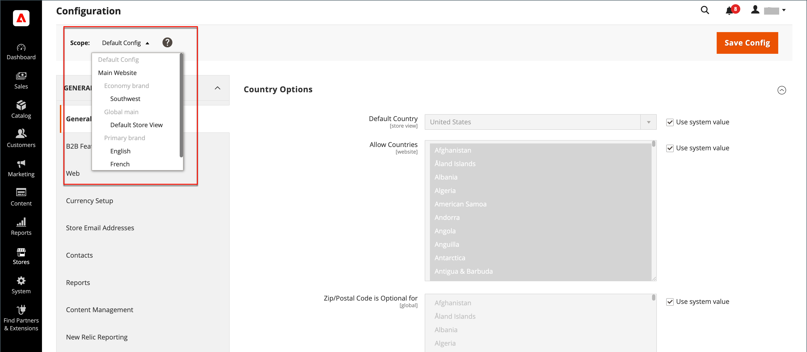
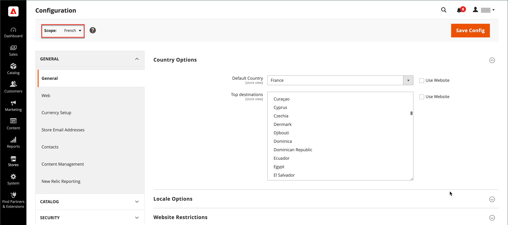

# Configuration scope

The Store View chooser in the upper-left corner of many configuration pages filters the view of the page for a specific scope, and sets the value of some entities that are used by Commerce. It lists each level in the hierarchy by name, and is used to change the scope to another level. Any settings that represent the current scope are grayed out, so only those that represent the current scope setting are available. The scope is initially set to _Default Config_. For Admin users with restricted access, the list of available store views includes only those to which the user has [permission](../systems/permissions.md) to access.

|Level|Description|
|--- |--- |
|[!UICONTROL Default Config]|The default system configuration.|
|[!UICONTROL Main Website]|The name of the website at the top of the hierarchy.|
|[!UICONTROL Main Website Store]|The name of the default store that is associated with the parent website.|
|[!UICONTROL Default Store View]|The name of the default store view that is associated with the parent store.|
|[!UICONTROL Stores Configuration]|Jumps to the Stores grid, and is the same as choosing [!UICONTROL Stores] > [!UICONTROL All Stores] from the Admin sidebar.|

{:style="table-layout:auto"}

{width="700" zoomable="yes"}

## [!UICONTROL Use system value]

The _[!UICONTROL Use System Value]_ checkbox to the right of many configuration settings is used to either apply or override the default field value within the current configuration scope. The default field value cannot be changed when the checkbox is selected. To change the value, clear the checkbox and enter the new value. You are prompted to confirm whenever you change the system value.

The checkbox label changes according to the current scope, and always refers to the parent level that is one step up in the scope hierarchy. Because the parent level is a container for all the items below that level, the scope setting from the parent level is inherited unless it is overridden.

## Default value options

|Checkbox|Description|
|--- |--- |
|[!UICONTROL Use system value]|This checkbox appears when the configuration scope is set to `Default Config`.|
|[!UICONTROL Use Default]|This checkbox appears when the configuration scope is set to Main `Website`, and refers to the default store that is assigned to the website.|
|[!UICONTROL Use Website]|This checkbox appears when the configuration scope set to a specific store view. When selected, it uses the setting from the parent website that is associated with the store view. In this case, the store level is skipped because it is understood to apply to the default store that is associated with the website.|

{:style="table-layout:auto"}

## Set the scope

Before making a configuration setting that applies only to a specific website, store, or store view, do the following:

1. On the _Admin_ sidebar, do one of the following:

   - For most configuration settings, go to **[!UICONTROL Stores]** > _[!UICONTROL Settings]_ > **[!UICONTROL Configuration]**.

   - For [design-related settings](../content-design/configuration.md), go to **[!UICONTROL Content]** > _[!UICONTROL Design]_ > **[!UICONTROL Configuration]**. Then in the grid, choose the applicable store view.

1. Navigate to the configuration setting to be changed and do the following:

   - In the upper-left corner, set **[!UICONTROL Store View]** to the specific view where the configuration applies. When prompted to confirm scope switching, click **[!UICONTROL OK]**.

      A checkbox appears after each field, and additional fields might become available.

   - Clear the **[!UICONTROL Use system value]** checkbox after any field that you want to edit. Then, update the value for the view.

   - Repeat this process for every field that needs to be updated on the page.

   {width="700" zoomable="yes"}

1. When complete, click **[!UICONTROL Save Config]**.

## Scope quick reference

|Scope|Description|
|--- |--- |
|**[!UICONTROL Global]**||
|Admin|All websites, stores, and store views in the installation are managed from the same Admin.|
|Default Config|The global [default configuration](../getting-started/websites-stores-views.md#scope-settings) settings are used through the store hierarchy, unless they are overridden at a lower level.|
|Catalog|The term _catalog_ refers to the product database as a whole, and is available throughout the installation.|
|Product Prices|Product prices can be configured for application at either a global or website level.|
|Product Configurations|Attributes that are used as [configurable product](../catalog/product-create-configurable.md) options must have a global scope.|
|Customers|Customer accounts can be configured for application at a global or website level. Each website can have a separate set of [customer accounts](../customers/customer-account-scope.md) or share customer accounts with other websites in the installation.|
|**[!UICONTROL Website]**||
|Domain|Additional [websites](../stores-purchase/introduction.md#store-structure) can be set up as subdomains of the primary domain, or  have separate IP addresses and dedicated domains.|
|Customers|Customer accounts can be configured for application at a global or website level. Each website can have a separate set of [customer accounts](../customers/customer-account-scope.md) or share customer accounts with other websites in the installation.|
|Currency|Each website can be assigned a different [base currency](../stores-purchase/currency-configuration.md). The base currency is used to process all transactions, although a different display currency might appear to the customer, according to the locale of the store view.|
|Products|Individual products are assigned to the hierarchy at the website level. The Products grid lists all products in the catalog, and the websites where they are available. The [Product in Websites](../catalog/settings-basic-websites.md) setting identifies each website where the product is available.|
|Product Prices|[Product prices](../catalog/catalog-price-scope.md) can be configured for application at either a global or website level.|
|Payment Methods|[Payment methods](../stores-purchase/payments.md) are configured at the website level, although the title and instructions can be configured for each store view.|
|Checkout|The [checkout process](../stores-purchase/checkout-process.md) takes place at the website level, although some display options can be configured for each store view. All stores associated with a website have the same [checkout configuration](../stores-purchase/checkout-process.md#checkout-options).|
|Allowed countries|Allowed countries can be configured on the website level. The [allowed countries](../getting-started/store-details.md#country-options) settings are used in the checkout to limit where a customer can come from.|
|**[!UICONTROL Store]**||
|Domain|With multiple stores, each store can have the same domain, a subdomain, or distinctly different domains. For more information, refer to [Adding Stores](../stores-purchase/stores.md#add-stores).|
|Root Category|Each store can have a separate set of products and main menu that is based on a "root" category and subcategories. Each catalog has a [root category](../catalog/category-root.md) that is assigned at the store level.|
|**[!UICONTROL Store View]**||
|Subcategories|The [subcategories](../catalog/category-create.md#category-structure) that make up the main menu (under the root) are assigned at the store view level.|
|Locale|Each store view can be assigned a different [locale](../getting-started/store-details.md#locale-options). The display currency, units of measurement, and Admin interface are specific to the locale.|
|Languages|To support multiple languages, all content, including product descriptions, must be [translated](../stores-purchase/store-localize.md#localize-products) for each store view.|
|Display Currency|A different [display currency](../stores-purchase/currency-configuration.md) can be used for each store view, although the transactions are processed at the website level using the base currency.|

{:style="table-layout:auto"}
