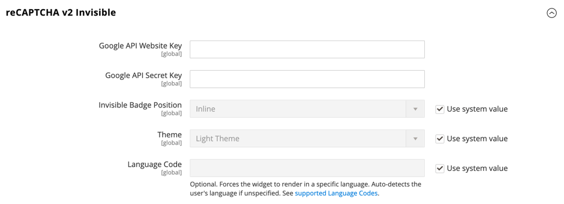

# [!UICONTROL Security] > [!UICONTROL Google reCAPTCHA Admin Panel]

>[!IMPORTANT]
>
>Before Google reCAPTCHA can be configured, you must ensure that your `PHP.ini` file includes the following setting: `allow_url_fopen = 1`. This may require developer assistance. See [Required PHP Settings](https://experienceleague.adobe.com/docs/commerce-operations/installation-guide/prerequisites/php-settings.html) in the _Installation Guide_.

{{config}}

For more information about changing these settings, see [Google reCAPTCHA](../../systems/security-google-recaptcha.md) in the _Admin Systems Guide_.

## [!UICONTROL reCAPTCHA v2 ("I am not a robot")]

<!-- zoom -->

|Field|[Scope](../../getting-started/websites-stores-views.md#scope-settings)|Description|
|--|--|--|
|[!UICONTROL Google API Website Key]|Global|The website key that is created when you register your Google reCAPTCHA account.|
|[!UICONTROL Google API Secret Key]|Global|The secret key that is associated with your Google reCAPTCHA account.|
|[!UICONTROL Size]|Global|The size of the Google reCAPTCHA box that appears during login. Options: `Normal` (default) / `Compact`|
|[!UICONTROL Theme]|Global|Determines the style of the Google reCAPTCHA box. Options: `Light Theme` (default) / `Dark Theme`|
|[!UICONTROL Language Code]|Global|A [two-character code](https://developers.google.com/recaptcha/docs/language) that specifies the language that is used for Google reCAPTCHA text and messaging.|

{:style="table-layout:auto"}

## [!UICONTROL reCAPTCHA v2 Invisible]

<!-- zoom -->

|Field|[Scope](../../getting-started/websites-stores-views.md#scope-settings)|Description|
|--|--|--|
|[!UICONTROL Google API Website Key]|Global|The website key that is created when you register your Google reCAPTCHA account.|
|[!UICONTROL Google API Secret Key]|Global|The secret key that is associated with your Google reCAPTCHA account.|
|[!UICONTROL Invisible Badge Position]|Global|The position of the invisible reCAPTCHA badge on each page. Options: `Inline` / `Bottom Right` / `Bottom Left`|
|[!UICONTROL Theme]|Global|Determines the style of the Google reCAPTCHA box. Options: `Light Theme` (default) / `Dark Theme`|
|[!UICONTROL Language Code]|Global|A [two-character code](https://developers.google.com/recaptcha/docs/language) that specifies the language that is used for Google reCAPTCHA text and messaging.|

{:style="table-layout:auto"}

## [!UICONTROL reCAPTCHA v3 Invisible]

<!-- zoom -->

|Field|[Scope](../../getting-started/websites-stores-views.md#scope-settings)|Description|
|--|--|--|
|[!UICONTROL Google API Website Key]|Global|The website key that is created when you register your Google reCAPTCHA account.|
|[!UICONTROL Google API Secret Key]|Global| The secret key that is associated with your Google reCAPTCHA account.|
|[!UICONTROL Minimum Score Threshold]|Global| The minimum score that identifies a user interaction as a potential risk, where 1.0 is a typical user interaction, and 0.0 is likely a bot. Default: `0.5`|
|[!UICONTROL Invisible Badge Position]|Global|The position of the invisible reCAPTCHA badge on each page. Options: `Inline` / `Bottom Right` / `Bottom Left`|
|[!UICONTROL Theme]|Global|Determines the style of the Google reCAPTCHA box. Options: `Light Theme` (default) / `Dark Theme`|
|[!UICONTROL Language Code]|Global|A [two-character code](https://developers.google.com/recaptcha/docs/language) that specifies the language that is used for Google reCAPTCHA text and messaging.|

{:style="table-layout:auto"}

## [!UICONTROL reCAPTCHA Failure Messages]

<!-- zoom -->

|Field|[Scope](../../getting-started/websites-stores-views.md#scope-settings)|Description|
|--|--|--|
|[!UICONTROL reCAPTCHA Validation Failure Message]|Global|The message that is displayed in the Admin if verification fails. Default text: `reCAPTCHA verification failed.`|
|[!UICONTROL reCAPTCHA Technical Failure Message]|Global|The message that is displayed in the Admin if reCAPTCHA fails to return a verification result. Default text: `Something went wrong with reCAPTCHA. Please contact the store owner.`|

{:style="table-layout:auto"}

## [!UICONTROL Admin Panel]

<!-- zoom -->

>[!NOTE]
>
>The reCAPTCHA type that you choose must match the type that is associated with the API key from your Google reCAPTCHA account.

>[!WARNING]
>
>When using reCAPTCHA version 3, a genuine user with low score cannot proceed. For version 2, a genuine user with a low score receives a challenge. Consider carefully if genuine users with a low score should have an opportunity to solve a challenge (version 2) or be blocked (version 3).

|Field|[Scope](../../getting-started/websites-stores-views.md#scope-settings)|Description|
|--|--|--|
|[!UICONTROL Enable for Login]|Global|Determines the type of reCAPTCHA that is enabled for the [Admin login](https://experienceleague.adobe.com/docs/commerce-admin/start/admin/admin-signin.html). Options: **`No`** - (default) Does not validate the Admin login. **`reCAPTCHA v2 ("I am not a robot")`** - Requires the user to select the _I'm not a robot_ checkbox. **`Invisible reCAPTCHA v2`** - Validates user behavior in the background without requiring interactions based on score. **`Invisible reCAPTCHA v3`** -  (Recommended) Validates user behavior in the background based on interaction score.|
|[!UICONTROL Enable for Forgot Password]|Global|Determines the type of reCAPTCHA that is enabled to request an [Admin password reset](https://experienceleague.adobe.com/docs/commerce-admin/start/admin/admin-signin.html#reset-your-password). Options: **`No`** - (default) Does not validate the password reset request. **`reCAPTCHA v2 ("I am not a robot")`** - Requires the user to select the _I'm not a robot_ checkbox. **`Invisible reCAPTCHA v2`** - Validates user behavior in the background without requiring interactions based on score. **`Invisible reCaptcha v3`** -  (Recommended) Validates user behavior in the background based on interaction score.|

{:style="table-layout:auto"}
