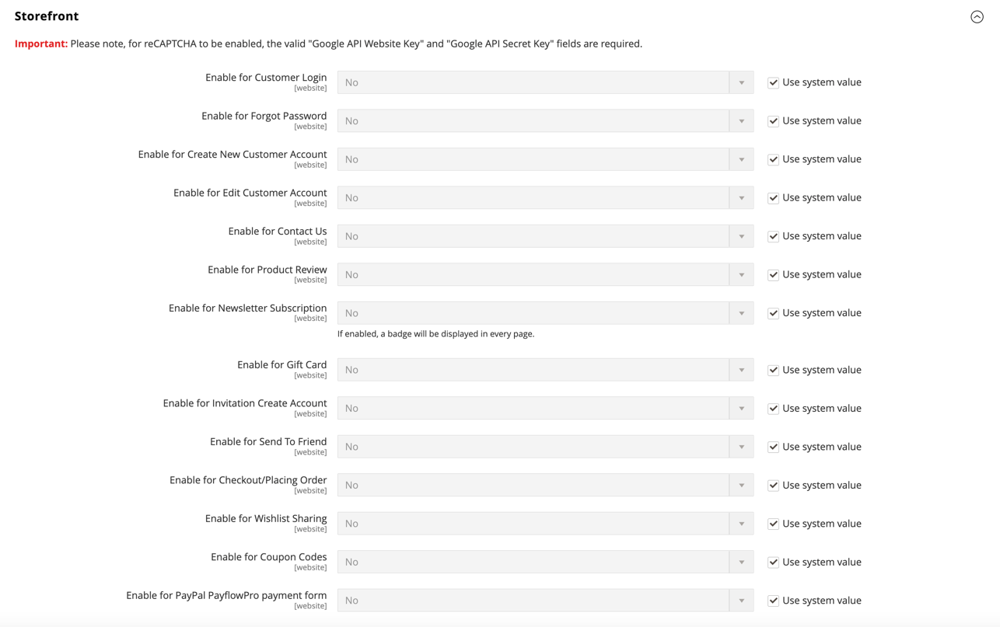

# [!UICONTROL Security] > [!UICONTROL Google reCAPTCHA Storefront]

>[!IMPORTANT]
>
>Before Google reCAPTCHA can be configured, you must ensure that your `PHP.ini` file includes the following setting: `allow_url_fopen = 1`. This may require developer assistance. See [PHP Settings](https://experienceleague.adobe.com/docs/commerce-operations/installation-guide/prerequisites/php-settings.html) in the _Installation Guide_.

{{config}}

For more information about using Google reCAPTCHA to secure your store, see Google [reCAPTCHA](../../systems/security-google-recaptcha.md) in the _Admin Systems Guide_.

## [!UICONTROL reCAPTCHA v2 ("I am not a robot")]

<!-- zoom -->

|Field|[Scope](../../getting-started/websites-stores-views.md#scope-settings)|Description|
|--|--|--|
|[!UICONTROL Google API Website Key]|Website|The website key that is created when you register your Google reCAPTCHA account.|
|[!UICONTROL Google API Secret Key]|Website|The secret key that is associated with your Google reCAPTCHA account.|
|[!UICONTROL Size]|Website|The size of the Google reCAPTCHA box that appears when a customer logs in to their account. Options: `Normal` (default) / `Compact`|
|[!UICONTROL Theme]|Website|Determines the style of the Google reCAPTCHA box. Options: `Light Theme` (default) / `Dark Theme`|
|[!UICONTROL Language Code]|Store view|The [two-character code](https://developers.google.com/recaptcha/docs/language) that specifies the language that is used for Google reCAPTCHA text and messaging.|

{style="table-layout:auto"}

## [!UICONTROL reCAPTCHA v2 Invisible]

<!-- zoom -->

|Field|[Scope](../../getting-started/websites-stores-views.md#scope-settings)|Description|
|--|--|--|
|[!UICONTROL Google API Website Key]|Website|The website key that is created when you register your Google reCAPTCHA account.|
|[!UICONTROL Google API Secret Key]|Website|The secret key that is associated with your Google reCAPTCHA account.|
|[!UICONTROL Invisible Badge Position]|Website|The position of the invisible reCAPTCHA badge on each page. Options: `Inline` / `Bottom Right` / `Bottom Left`|
|[!UICONTROL Theme]|Global|Determines the style of the Google reCAPTCHA box. Options: `Light Theme` (default) / `Dark Theme`|
|[!UICONTROL Language Code]|Store view|A [two-character code](https://developers.google.com/recaptcha/docs/language) that specifies the language that is used for Google reCAPTCHA text and messaging.|

{style="table-layout:auto"}

## [!UICONTROL reCAPTCHA v3 Invisible]

<!-- zoom -->

|Field|[Scope](../../getting-started/websites-stores-views.md#scope-settings)|Description|
|--|--|--|
|[!UICONTROL Google API Website Key]|Website|The website key that is created when you register your Google reCAPTCHA account.|
|[!UICONTROL Google API Secret Key]|Website| The secret key that is associated with your Google reCAPTCHA account.|
|[!UICONTROL Minimum Score Threshold]|Global| The minimum score that identifies a user interaction as a potential risk, where 1.0 is a typical user interaction, and 0.0 is likely a bot. Default: `0.5`|
|[!UICONTROL Invisible Badge Position]|Website|The position of the invisible reCAPTCHA badge on each page. Options: `Inline` / `Bottom Right` / `Bottom Left`|
|[!UICONTROL Theme]|Website|Determines the style of the Google reCAPTCHA box. Options: `Light Theme` (default) / `Dark Theme`|
|[!UICONTROL Language Code]|Store view|A [two-character code](https://developers.google.com/recaptcha/docs/language) that specifies the language that is used for Google reCAPTCHA text and messaging.|

{style="table-layout:auto"}

## [!UICONTROL reCAPTCHA Failure Messages]

<!-- zoom -->

|Field|[Scope](../../getting-started/websites-stores-views.md#scope-settings)|Description|
|--|--|--|
|[!UICONTROL reCAPTCHA Validation Failure Message]|Store view|The message that is displayed in the storefront if verification fails. Default text: `reCAPTCHA verification failed.`|
|[!UICONTROL reCAPTCHA Technical Failure Message]|Store view|The message that is displayed in the storefront if reCAPTCHA fails to return a verification result. Default text: `Something went wrong with reCAPTCHA. Please contact the store owner.`|

{style="table-layout:auto"}

## [!UICONTROL Storefront]

<!-- zoom -->

>[!NOTE]
>
>The reCAPTCHA type that you choose must match the type that is associated with the API key from your Google reCAPTCHA account.

>[!WARNING]
>
>When using reCAPTCHA version 3, a genuine user with low score cannot proceed. For version 2, a genuine user with a low score receives a challenge. Consider carefully if genuine users with a low score should have an opportunity to solve a challenge (version 2) or be blocked (version 3).

|Field|[Scope](../../getting-started/websites-stores-views.md#scope-settings)|Description|
|--|--|--|
|[!UICONTROL Enable for Customer Login]|Website|Specifies the type of reCAPTCHA that is used when customers [sign in](../../customers/customer-sign-in.md) to their accounts. Options: **`No`** - (default) Does not validate the login request. **`reCAPTCHA v2 ("I am not a robot")`** - Requires the user to select the _I'm not a robot_ checkbox. **`Invisible reCAPTCHA v2`** - Validates user behavior in the background without requiring interactions based on score. **`Invisible reCAPTCHA v3`** -  (Recommended) Validates user behavior in the background based on interaction score.|
|[!UICONTROL Enable for Forgot Password]|Website|Specifies the type of reCAPTCHA that is used when customers request a [password reset](../../customers/password-reset.md). Options: **`No`** - (default) Does not validate the password reset request. **`reCAPTCHA v2 ("I am not a robot")`** - Requires the user to select the _I'm not a robot_ checkbox. **`Invisible reCAPTCHA v2`** - Validates user behavior in the background without requiring interactions based on score. **`Invisible reCAPTCHA v3`** -  (Recommended) Validates user behavior in the background based on interaction score.|
|[!UICONTROL Enable for Create New Customer Account]|Website|Specifies the type of reCAPTCHA that is used when customer signs up for a [new account](../../customers/account-create.md). Options: **`No`** - (default) Does not validate the account request. **`reCAPTCHA v2 ("I am not a robot")`** - Requires the user to select the _I'm not a robot_ checkbox. **`Invisible reCAPTCHA v2`** - Validates user behavior in the background without requiring interactions based on score. **`Invisible reCAPTCHA v3`** - (Recommended) Validates user behavior in the background based on interaction score.|
|[!UICONTROL Enable for Edit Customer Account]|Website|Specifies the type of reCAPTCHA that is used when customer changes their [account information](../../customers/account-dashboard-account-information.md). Options: **`No`** - (default) Does not validate the account request. **`reCAPTCHA v2 ("I am not a robot")`** - Requires the user to select the _I'm not a robot_ checkbox. **`Invisible reCAPTCHA v2`** - Validates user behavior in the background without requiring interactions based on score. **`Invisible reCAPTCHA v3`** -  (Recommended) Validates user behavior in the background based on interaction score.|
|[!UICONTROL Enable for Create New Company Account]|Website| (Available with Adobe Commerce B2B only) Specifies the type of reCAPTCHA that is used when a new [company account](../../b2b/account-company-create.md) is created. Options: **`No`** - (default) Does not validate the account request. **`reCAPTCHA v2 ("I am not a robot")`** - Requires the user to select the _I'm not a robot_ checkbox. **`Invisible reCAPTCHA v2`** - Validates user behavior in the background without requiring interactions based on score. **`Invisible reCAPTCHA v3`** - (Recommended) Validates user behavior in the background based on interaction score.|
|[!UICONTROL Enable for Contact Us]|Website|Specifies the type of reCAPTCHA that is used to send a message from the [Contact Us](../../getting-started/store-details.md#contact-us-form) page of your store. Options: **`No`** - (default) Does not validate the message request. **`reCAPTCHA v2 ("I am not a robot")`** - Requires the user to select the _I'm not a robot_ checkbox. **`Invisible reCAPTCHA v2`** - Validates user behavior in the background without requiring interactions based on score. **`Invisible reCAPTCHA v3`** - (Recommended) Validates user behavior in the background based on interaction score.|
|[!UICONTROL Enable for Product Review]|Website| Specifies the type of reCAPTCHA that is used when customers submit a [product review](../../merchandising-promotions/product-reviews.md). Options: **`No`** - (default) Does not validate the product review request. **`reCAPTCHA v2 ("I am not a robot")`** - Requires the user to select the _I'm not a robot_ checkbox. **`Invisible reCAPTCHA v2`** - Validates user behavior in the background without requiring interactions based on score. **`Invisible reCAPTCHA v3`** - (Recommended) Validates user behavior in the background based on interaction score.|
|[!UICONTROL Enable for Newsletter Subscription]|Website|Specifies the type of invisible reCAPTCHA that is used when customers sign up for a [newsletter subscription](../../merchandising-promotions/newsletter-subscribers.md). Options: **`No`** - (default) Does not validate the newsletter subscription request. **`reCAPTCHA v2 ("I am not a robot")`** - Requires the user to select the _I'm not a robot_ checkbox. **`Invisible reCAPTCHA v2`** - Validates user behavior in the background without requiring interactions based on score. **`Invisible reCAPTCHA v3`** - (Recommended) Validates user behavior in the background based on interaction score.|
|[!UICONTROL Enable for Gift Card] |Website| (Adobe Commerce only) Specifies the type of reCAPTCHA that is used when customers enter a [gift card](../../catalog/product-gift-card-create.md) code. Options: **`No`** - (default) Does not validate the gift card code submission. **`reCAPTCHA v2 ("I am not a robot")`** - Requires the user to select the _I'm not a robot_ checkbox. **`Invisible reCAPTCHA v2`** - Validates user behavior i.n the background without requiring interactions based on score. **`Invisible reCAPTCHA v3`** - (Recommended) Validates user behavior in the background based on interaction score.|
|[!UICONTROL Enable for Invitation Create Account]|Website|Specifies the type of reCAPTCHA that is used when customers send an account creation [invitation](../../merchandising-promotions/invitations.md) code. Options: **`No`** - (default) Does not validate the invitation email submission. **`reCAPTCHA v2 ("I am not a robot")`** - Requires the user to select the _I'm not a robot_ checkbox. **`Invisible reCAPTCHA v2`** - Validates user behavior i.n the background without requiring interactions based on score. **`Invisible reCAPTCHA v3`** -  (Recommended) Validates user behavior in the background based on interaction score.|
|[!UICONTROL Enable for Send to Friend]|Website|Specifies the type of reCAPTCHA that is used when customers [share a product](../../stores-purchase/email-a-friend.md) with a friend. Options: **`No`** - (default) Does not validate the email submission. **`reCAPTCHA v2 ("I am not a robot")`** - Requires the user to select the _I'm not a robot_ checkbox. **`Invisible reCAPTCHA v2`** - Validates user behavior in the background without requiring interactions based on score. **`Invisible reCAPTCHA v3`** -  (Recommended) Validates user behavior in the background based on interaction score.|
|[!UICONTROL Enable for Wishlist Sharing]|Website|Specifies the type of reCAPTCHA that is used when customers [share a wishlist](../../stores-purchase/wishlist-storefront.md#share-the-wish-list). Options: **`No`** - (default) Does not validate the message and email submission. **`reCAPTCHA v2 ("I am not a robot")`** - Requires the user to select the _I'm not a robot_ checkbox. **`Invisible reCAPTCHA v2`** - Validates user behavior i.n the background without requiring interactions based on score. **`Invisible reCAPTCHA v3`** -  (Recommended) Validates user behavior in the background based on interaction score.|
|[!UICONTROL Enable for Coupon Codes]|Website|Specifies the type of reCAPTCHA that is used when customers enter a [coupon code](../../merchandising-promotions/price-rules-cart-coupon.md). Options: **`No`** - (default) Does not validate the coupon code submission. **`reCAPTCHA v2 ("I am not a robot")`** - Requires the user to select the _I'm not a robot_ checkbox. **`Invisible reCAPTCHA v2`** - Validates user behavior i.n the background without requiring interactions based on score. **`Invisible reCAPTCHA v3`** -  (Recommended) Validates user behavior in the background based on interaction score.|
|[!UICONTROL Enable for PayPal Payflow Pro payment form] |Website|Specifies the type of reCAPTCHA that is used when customers pay for a purchase with [PayPal Payflow Pro](../../stores-purchase/paypal-payflow-pro.md). Options: **`No`** - (default) Does not validate the password reset request. **`reCAPTCHA v2 ("I am not a robot")`** - Requires the user to select the _I'm not a robot_ checkbox. **`Invisible reCAPTCHA v2`** - Validates user behavior in the background without requiring interactions based on score. **`Invisible reCAPTCHA v3`** - (Recommended) Validates user behavior in the background based on interaction score.|

{style="table-layout:auto"}
