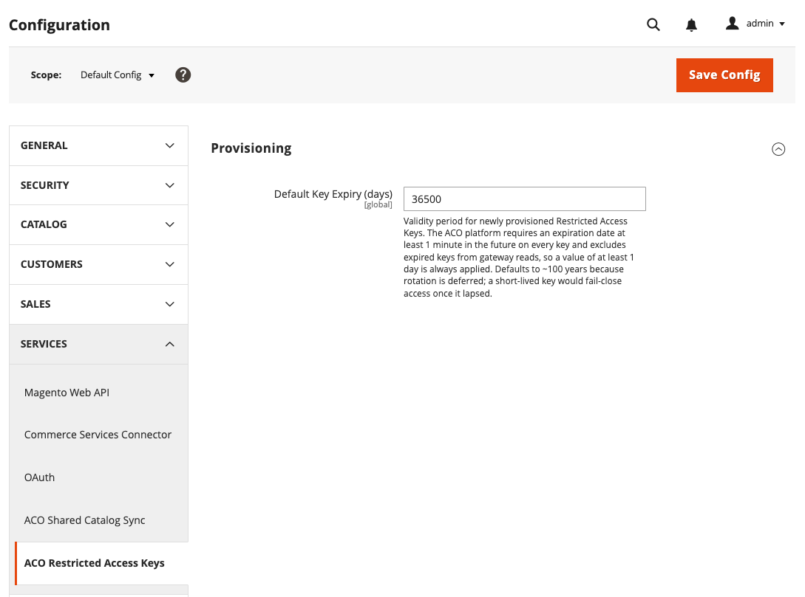

# [!UICONTROL Services] > [!UICONTROL ACO Restricted Access Keys]

[!BADGE Private Beta]{type=Caution tooltip="Requires the Adobe Commerce Optimizer Connector for B2B extension, which is currently in private beta."}

Use this setting to control the default expiration period that the [!DNL Adobe Commerce Optimizer Connector for B2B] applies to restricted access keys it provisions for B2B shared catalog views. See [Restricted Access Keys management](../../systems/restricted-access-keys.md) to create, assign, and delete these keys.

{{config}}

## [!UICONTROL Provisioning]

<!-- zoom -->

|Field|[Scope](../../getting-started/websites-stores-views.md#scope-settings)|Description|
|--- |--- |--- |
|[!UICONTROL Default Key Expiry (days)]|Global|Validity period for newly provisioned restricted access keys. [!DNL Adobe Commerce Optimizer] requires an expiration date at least one minute in the future on every key, and excludes expired keys from gateway reads, so a value of at least one day is always applied. Default value: `36500`|

{style="table-layout:auto"}

>[!NOTE]
>
>The default expiry defaults to roughly 100 years because automatic key rotation is not yet available. A short-lived key would fail-close access to the catalog view once it lapsed. See [Key selection and rotation](../../systems/restricted-access-keys.md#key-selection-and-rotation).

>[!MORELIKETHIS]
>
> - [Restricted Access Keys management](../../systems/restricted-access-keys.md) — Create, assign, and delete restricted access keys
> - [Catalog View Sync Status monitoring](../../systems/catalog-view-sync-status.md) — Monitor keys nearing expiration
