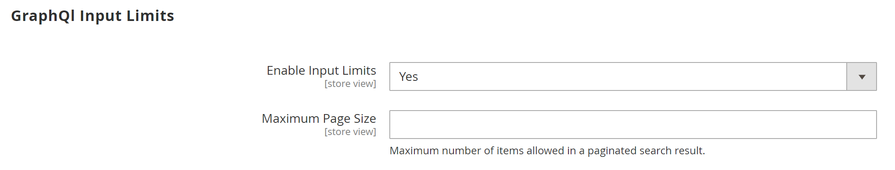
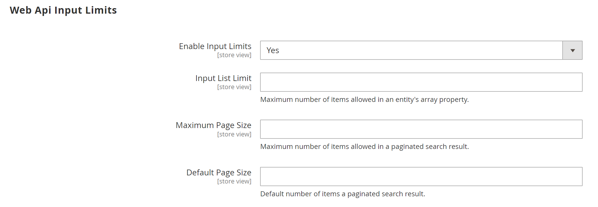
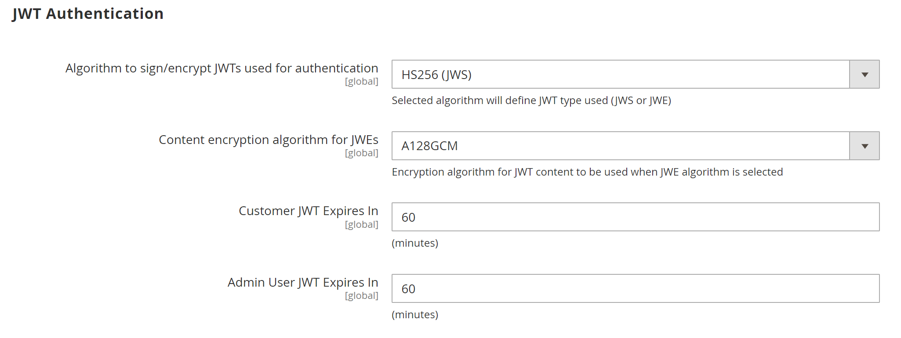

# [!UICONTROL Services] > [!UICONTROL Magento Web API]

{{config}}

<!-- [X-ref](../systems/integrations.md) -->

## [!UICONTROL SOAP Settings]

<!-- zoom -->

|Field|[Scope](../../getting-started/websites-stores-views.md#scope-settings)|Description|
|--- |--- |--- |
|[!UICONTROL Default Response Charset]|Store View|Determines the default character set. If empty, UTF-8 is used.|

{:style="table-layout:auto"}

## [!UICONTROL GraphQl Input Limits]

<!-- zoom -->

|Field|[Scope](../../getting-started/websites-stores-views.md#scope-settings)|Description|
|--- |--- |--- |
|[!UICONTROL Enable Input Limits]|Store View|Determines if input limits are enabled for GraphQL calls. Default Value: `No`.|
|[!UICONTROL Maximum Page Size]|Store View|Sets the maximum number of items allowed in a paginated search result in the GraphQL response. This option is not available when _Enable Input Limits_ = `No`.|

{:style="table-layout:auto"}

## [!UICONTROL Web Api Input Limits]

<!-- zoom -->

|Field|[Scope](../../getting-started/websites-stores-views.md#scope-settings)|Description|
|--- |--- |--- |
|[!UICONTROL Enable Input Limits]|Store View|Determines if input limits are enabled for Web API calls. Default Value: `No`.|
|Input List Limit|Store View|Sets the maximum number of items allowed in an entity array property in the Web API request. This option is not available when _Enable Input Limits_ = `No`.|
|[!UICONTROL Maximum Page Size]|Store View|Sets the maximum number of items allowed in a paginated search result in the Web API response. This option is not available when _Enable Input Limits_ = `No`.|
|[!UICONTROL Default Page Size]|Store View|Sets the default number of items in a paginated search result in the Web API response.|

{:style="table-layout:auto"}

## [!UICONTROL Web API Security]

<!-- zoom -->

|Field|[Scope](../../getting-started/websites-stores-views.md#scope-settings)|Description|
|--- |--- |--- |
|[!UICONTROL Allow Anonymous Guest Access]|Global|Determines is guests can anonymously access CMS, catalog, and store resources from both SOAP and REST APIs. By default, anonymous guest access is not allowed. Options: `Yes` / `No`|

{:style="table-layout:auto"}

## [!UICONTROL JWT Authentication]

<!-- zoom -->

|Field|[Scope](../../getting-started/websites-stores-views.md#scope-settings)|Description|
|--- |--- |--- |
|[!UICONTROL Algorithm to sign/encrypt JWTs used for authentication]|Global|Specifies the type of JWS or JWE algorithm used for JWT (JSON Web Token) encryption|
|[!UICONTROL Content encryption algorithm for JWEs]|Global|Specifies the type of content encryption algorithm used for JWT encryption when JWE algorithm is selected. This option is ignored for JWS algorithms.|
|[!UICONTROL Customer JWT Expires In]|Global|Sets the length of time (in minutes) before a customer JWT bearer token expires. The customer JWT bearer token expires in 30 minutes if this field is empty or has a negative value. Default value: `60`|
|[!UICONTROL Admin User JWT Expires In]|Global|Sets the length of time (in minutes) before the Admin JWT bearer token expires. The admin JWT bearer token expires in 30 minutes if this field is empty or has a negative value. Default value: `60`|

{:style="table-layout:auto"}
