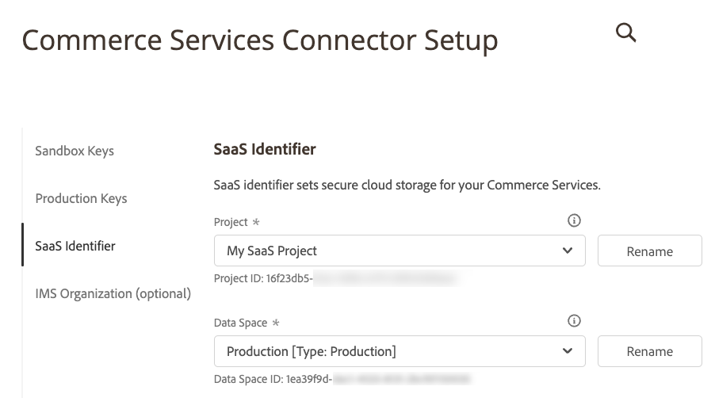
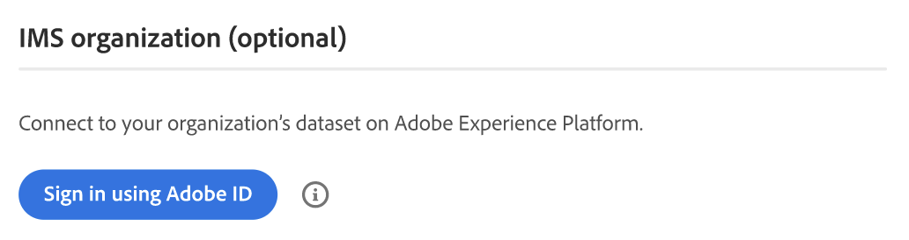

# [!UICONTROL Services] > [!UICONTROL Commerce Services Connector]

To learn how to connect your store to Adobe Commerce services, see [Commerce Services](https://experienceleague.adobe.com/docs/commerce/user-guides/integration-services/saas.html).

{{config}}

## [!UICONTROL Sandbox API Keys]

<!-- zoom -->

|Field|[Scope](../../getting-started/websites-stores-views.md#scope-settings)|Description|
|--- |--- |--- |
|[!UICONTROL Sandbox public API key]|Global|API key that identifies the author and their entitlements, if any.|
|[!UICONTROL Sandbox private API key]|Global|A private key associated with the API key.|

{style="table-layout:auto"}

## [!UICONTROL Production Keys]

<!-- zoom -->

|Field|[Scope](../../getting-started/websites-stores-views.md#scope-settings)|Description|
|--- |--- |--- |
|[!UICONTROL Production public API key]|Global|API key that identifies the author and their entitlements, if any.|
|[!UICONTROL Production private API key]|Global|A private key associated with the API key.|

{style="table-layout:auto"}

## [!UICONTROL SaaS Identifier]

<!-- zoom -->

|Field|[Scope](../../getting-started/websites-stores-views.md#scope-settings)|Description|
|--- |--- |--- |
|[!UICONTROL Project]|Global|Name of the SaaS project that groups all of your SaaS data spaces. A _Create Project_ button appears if no SaaS projects exist.|
|[!UICONTROL Data Space]|Global|Lists the SaaS data spaces in the specified SaaS project. The number of SaaS data spaces depends on your [Commerce license](https://experienceleague.adobe.com/docs/commerce/user-guides/integration-services/saas.html): Adobe Commerce - One production data space; two testing data spaces; Magento Open Source - One production data space; no testing data spaces|

{style="table-layout:auto"}

## [!UICONTROL IMS Organization]

<!-- zoom -->

|Field|Description|
|--- |--- |
|[!UICONTROL Sign in using Adobe ID]| Your Adobe ID is usually the email address you first used when you started your membership, or purchased an Adobe application or service. Your Adobe ID is the key that you need to access your Adobe account.|

{style="table-layout:auto"}
