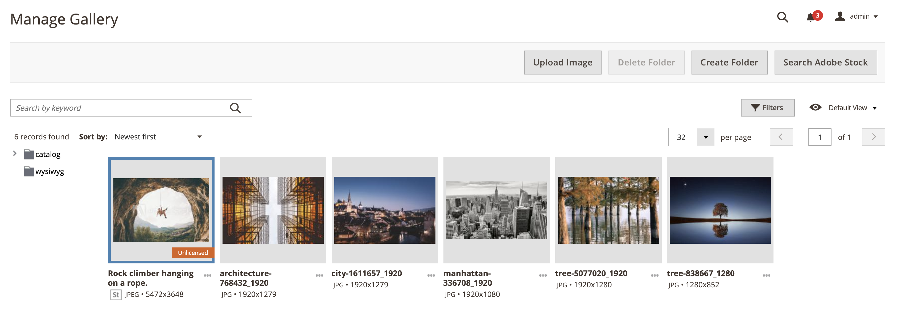
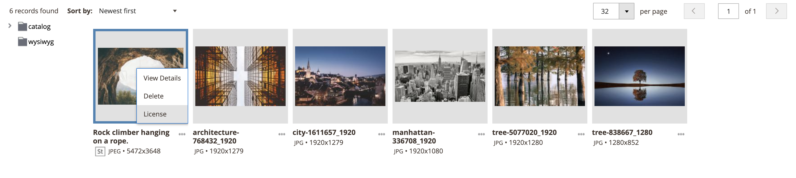
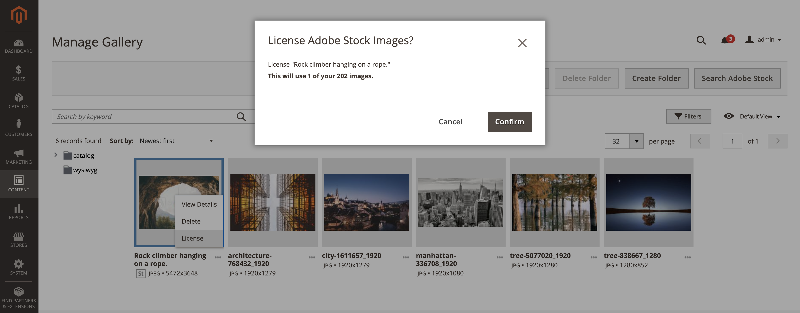
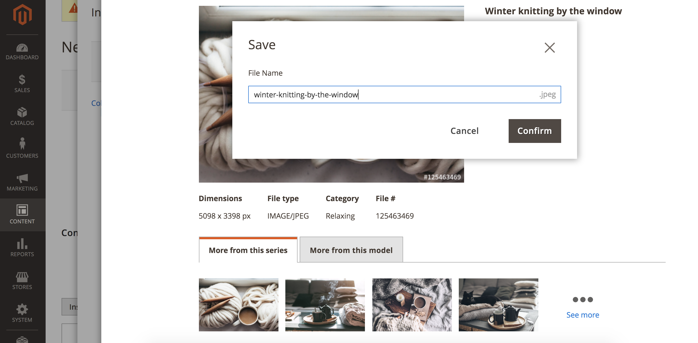

# License an Adobe Stock image

Adobe Stock assets that you want to use for your production Adobe Commerce and Magento Open Source stores should be licensed. This licensing ensures you have legal access to the image and to eliminate the Adobe Stock watermark that is present on all [image previews](./adobe-stock-save-preview.md). To license images or to save already-licensed images, you must be logged in to your Adobe account.

The new [[!DNL Media Gallery]](media-gallery.md) provides a direct integration with Adobe Stock, making it easy to license your images directly from the gallery page.

>[!BEGINSHADEBOX]

**Prerequisities**

The Adobe Stock licensing feature is available only if the the [Adobe Stock Integration](./adobe-stock.md) is installed and configured. Licensing [Adobe Stock](https://stock.adobe.com) images requires a paid Adobe Stock plan and an [Adobe account](https://helpx.adobe.com/manage-account/using/access-adobe-id-account.html).

>[!ENDSHADEBOX] 

## License an image from the new [!DNL Media Gallery]

1. On the _Admin_ sidebar, go to **[!UICONTROL Content]** > _[!UICONTROL Media]_ > **[!UICONTROL Media Gallery]**.

1. Follow the steps on [Using Adobe Stock Images](./adobe-stock-manage.md) to log in and save preview images to the [media storage](./media-storage.md).

    {width="600" zoomable="yes"}

1. Click the three dots below the image ({width="10" zoomable="no"}), and then click **[!UICONTROL License]**.

    {width="600" zoomable="yes"}

   >[!NOTE]
   >
   >If you are not logged in, the login form appears. For more information about login, see [Using Adobe Stock Images](./adobe-stock-manage.md).

1. In the licensing confirmation dialog, click **[!UICONTROL Confirm]** to license the image.

    {width="350" zoomable="yes"}

   >[!NOTE]
   >
   >You must have available [Adobe Stock credits](https://helpx.adobe.com/stock/help/credit-packs.html) in your account to license the image.

## License an image from the standard media storage

1. [Access the Adobe Stock Search grid](adobe-stock-manage.md).

1. To [view the image details](adobe-stock-manage.md#view-image-details), click an image in the search grid in order.

1. Depending on the current licensing status of the image, do one of the following:

   - If the image is already licensed, click **[!UICONTROL Save]**.

   - If the image is _not_ licensed, click **[!UICONTROL License and Save]**.

      >[!NOTE]
      >
      >You must have available [Adobe Stock credits](https://helpx.adobe.com/stock/help/credit-packs.html) in your account to license the image.

    This action displays a prompt for you to specify a file name that is used to save the image to the [media storage](./media-storage.md). A default file name is provided, but you can customize the name to your preferences.

    {width="550" zoomable="yes"}

1. Click **[!UICONTROL Confirm]**.

    The page redirects to the media storage and your saved preview is displayed.
