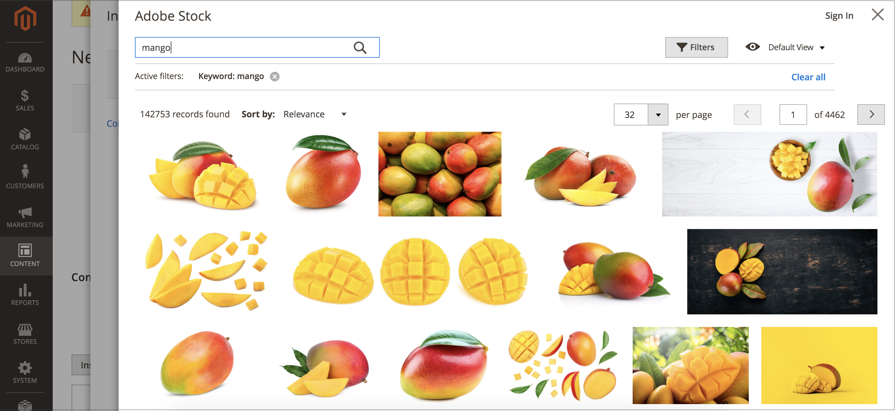
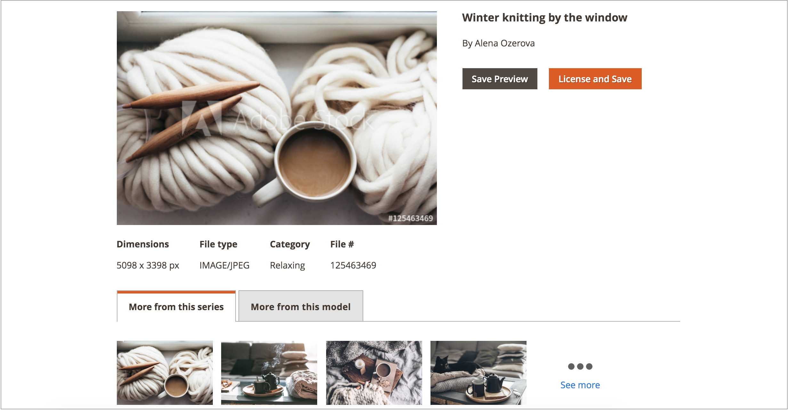
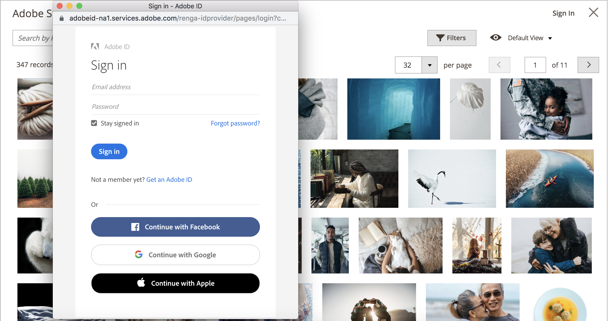
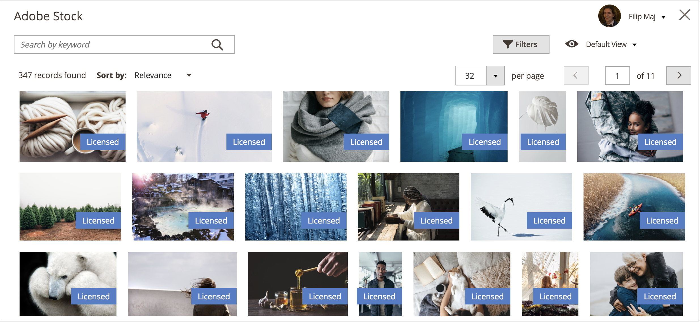

# Use Adobe Stock Images

[Adobe Stock][adobe-stock] images can be used in place of uploading your own image content. One common use case is to upload and place image content when creating a page.

The [[!DNL Media Gallery]](media-gallery.md) provides a direct integration with Adobe Stock, making it easy to license your images directly from the gallery page.

## Access the Adobe Stock search grid

The Adobe Stock search panel is accessible when you [add or edit a page](page-add.md), when you [create or edit a category](../catalog/category-create.md), or when you [insert images via the Content Editor](editor-insert-image.md).

To search Adobe Stock assets and add a stock image to a page:

1. On the _Admin_ sidebar, go to **[!UICONTROL Content]** > _[!UICONTROL Elements]_ > **[!UICONTROL Pages]**.

1. Click **[!UICONTROL Add a New Page]**.

   If you want to edit an existing page, you can use the _[!UICONTROL Action]_ column to click **[!UICONTROL Select]** and choose **[!UICONTROL Edit]**.

1. Expand  the **[!UICONTROL Content]** section and do the following:

   - If you have the [WYSIWYG editor enabled](editor.md), click **[!UICONTROL Show/Hide Editor]** and then click **[!UICONTROL Insert Image]**.

   - If you have [Page Builder enabled](../page-builder/setup.md), expand the **[!UICONTROL Media]** panel and drag an **Image** placeholder to the target container. Then click **[!UICONTROL Select from Gallery]**.

      <!-- zoom -->

1. Click **[!UICONTROL Search Adobe Stock]**.

To search Adobe Stock assets and add a stock image to a category:

1. On the _Admin_ sidebar, go to **[!UICONTROL Catalog]** > **[!UICONTROL Categories]**.

1. Click **[!UICONTROL Add Root Category]** or **[!UICONTROL Add Subcategory]**.

   If you want to add the image to an existing category, click the category name in the list on the left.

1. Expand the **[!UICONTROL Content]** section, and under _[!UICONTROL Category Image]_ click **[!UICONTROL Select from Gallery]**.

1. Click **[!UICONTROL Search Adobe Stock]**.

To search Adobe Stock assets and add a stock image from the WYSIWYG Editor:

1. click **[!UICONTROL Show/Hide Editor]**.

1. Click **[!UICONTROL Insert Image]**.

1. Click **[!UICONTROL Search Adobe Stock]**.

   {width="600" zoomable="yes"}

## Filter and search for Adobe Stock assets

The [Adobe Stock search Grid][access-search] provides querying and filtering functionality to help you find the perfect image for your [!DNL Commerce] stores.

By default, the search results shown are from an Adobe Stock curated gallery of a few hundred results. When you apply your own keyword search, you are searching the millions of assets available via Adobe Stock.

### Search for Adobe Stock assets by keywords

1. [Access the Adobe Stock Search grid][access-search].

1. Enter your keyword search into the **[!UICONTROL Search by keyword]** input field in the top-left and click the magnifying glass or press **Enter**.

   {width="600" zoomable="yes"}

### Filter Adobe Stock assets

1. [Run a keyword search for Adobe Stock assets][search-by-keywords].

1. Click **[!UICONTROL Filters]**.

   There are several filters available to refine your search results:

   |Filter|Description|
   |---|---|
   |[!UICONTROL Subcategory]|Filter for images that are **Photos** or **Illustrations**|
   |[!UICONTROL Orientation]|Filter for images by size, shape, and aspect|
   |[!UICONTROL Color]|Use a color palette to filter for images by color|
   |[!UICONTROL Price]|Filter for images based on their cost|
   |[!UICONTROL Safe search]|Enable or disable Safe search|
   |[!UICONTROL Isolated Assets]|Show only Isolated Assets, which have subjects appear alone on a solid background|

   {style="table-layout:auto"}

   {width="600" zoomable="yes"}

1. Click **[!UICONTROL Apply Filters]**.

   The search result grid is updated with your refined search.

## View image details

Each image has details available for viewing. Additional image-specific actions, such as [saving image previews][save-preview] or [saving (and optionally licensing) images][save-licensed], are available via this detailed view.

1. [Access the Adobe Stock search grid][access-search].

1. Click an image in the search results.

   Further image details are displayed, such as:

   - A larger version of the image
   - Image metadata, such as _[!UICONTROL Dimensions]_, _[!UICONTROL File type]_, _[!UICONTROL Category]_, _[!UICONTROL File]_, and _Keywords_
   - Related images, such as images from the same _series_ or _model_
   - Action buttons, such as [[!UICONTROL Save Preview]][save-preview] and [[!UICONTROL Save (and optionally license) Image]][save-licensed]

      {width="600" zoomable="yes"}

## Log in to your Adobe account

To gain complete access to an image and eliminate the Adobe Stock watermark, you must [sign in with an Adobe account][adobe-signin] and purchase credits to license rights to use an image.

1. [Access the Adobe Stock Search grid][access-search].

1. Click **[!UICONTROL Sign In]** at the top right.

   A new browser window guides you through the [Adobe sign-in process][adobe-signin].

   After completing the sign-in process, the [licensed state][licensed-state] of images is displayed in search results as a label.

   {width="600" zoomable="yes"}

### View the licensed state of search results

[Log in to your Adobe account][log-in-to-adobe-account].

All licensed images associated to your Adobe account have a label displayed on them, making it clear which images you have licensed.

{width="600" zoomable="yes"}

### Save images to the media storage

Images searched using the Adobe Stock integration can be saved to the [!DNL Commerce] [media storage][media-storage] for easy reuse across your [!DNL Commerce] store.

You can save two types of images: an [image preview][save-preview] or a [licensed image][save-licensed].

#### Save an image preview

An image preview is a watermarked version of an Adobe Stock asset. Image previews are free and are a good way to experiment with different images before you decide to purchase a license for specific images and use them on your production stores.

1. [Access the Adobe Stock search grid][access-search].

1. To [view the image details][view-details], click an image in the search grid.

1. Click **[!UICONTROL Save Preview]**.

   This action displays a prompt for you to specify a file name that is used to save the image to the [media storage][media-storage]. A default file name is provided, but you can customize the name to your preferences.

    {width="500" zoomable="yes"}

1. Click **[!UICONTROL Confirm]**.

    The page redirects to the [media storage][media-storage] and your saved preview is displayed.

#### Save a licensed image

Adobe Stock assets that you want to use for your production [!DNL Commerce] stores should be licensed. Licensing ensures that you have legal access to the image and to eliminate the Adobe Stock watermark that is present on all [image previews][save-preview]. To license images or to save already-licensed images, you must be logged in to your Adobe account.

1. [Log in to your Adobe account][log-in-to-adobe-account].

1. To [view the image details][view-details], click an image in the search grid. 

1. Depending on the current licensing status of the image, do one of the following:

   - If the image is already licensed, click **[!UICONTROL Save]**.

   - If the image is _not_ licensed, click **[!UICONTROL License and Save]**.

      >[!NOTE]
      >
      >You must have available [Adobe Stock credits][stock-credits] in your account to license the image.

   This action displays a prompt for you to specify a file name that is used to save the image to the [media storage][media-storage]. A default file name is provided, but you can customize the name to your preferences.

1. Click **[!UICONTROL Confirm]**.

    The page redirects to the [media storage][media-storage] and your saved preview is displayed.

[adobe-stock]: https://stock.adobe.com
[media-storage]: media-storage.md
[access-search]: #access-the-adobe-stock-search-grid
[search-by-keywords]: #search-for-adobe-stock-assets-by-keywords
[view-details]: #view-image-details
[log-in-to-adobe-account]: #log-in-to-your-adobe-account
[adobe-signin]: https://helpx.adobe.com/manage-account/using/access-adobe-id-account.html
[licensed-state]: #view-the-licensed-state-of-search-results
[save-to-media-storage]: #save-images-to-the-media-storage
[save-preview]: adobe-stock-save-preview.md
[save-licensed]: adobe-stock-license-image.md
[stock-credits]: https://helpx.adobe.com/stock/help/credit-packs.html
