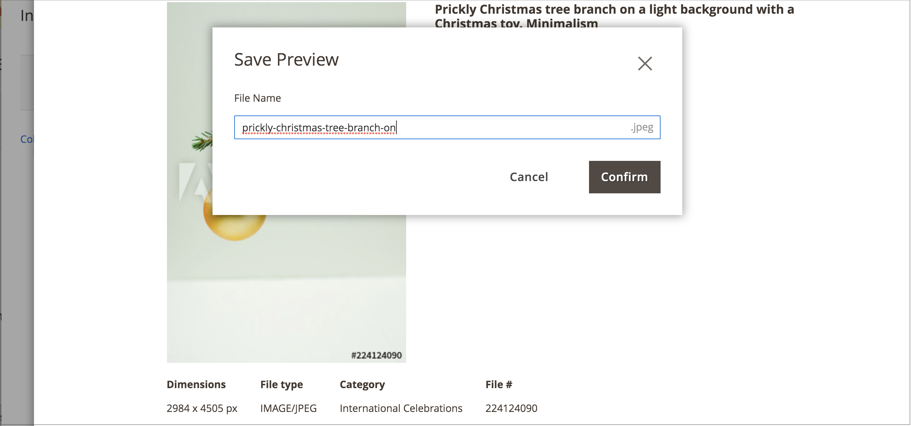

# Save an Adobe Stock Image Preview

An image preview is a watermarked version of an Adobe Stock asset. Image previews are free and are a good way to experiment with different images before you decide to [purchase a license][stock-license] for specific images and use them on your production stores.

When you are ready to license an image, the new [[!DNL Media Gallery]](media-gallery.md) provides a direct integration with Adobe Stock, making it easy to license the image directly from the gallery page.

## Prerequisites

This feature requires the [Adobe Stock Integration][adobe-stock-integration] module and configuration.

## Save a preview image

1. [Access the Adobe Stock search grid][access-search].

1. To [view the image details][view-details], click an image in the search grid.

1. Click **[!UICONTROL Save Preview]**.

   This action displays a prompt for you to specify a file name that is used to save the image to the [media storage][media-storage]. A default file name is provided, but you can customize the name to your preferences.

   <!-- zoom -->

1. Click **[!UICONTROL Confirm]**.

   The page redirects to the media storage and your saved preview is displayed.

[stock-license]: adobe-stock-license-image.md
[access-search]: adobe-stock-manage.md#access-the-adobe-stock-search-grid
[view-details]: adobe-stock-manage.md#view-image-details
[media-storage]: media-storage.md
[adobe-stock-integration]: adobe-stock.md
