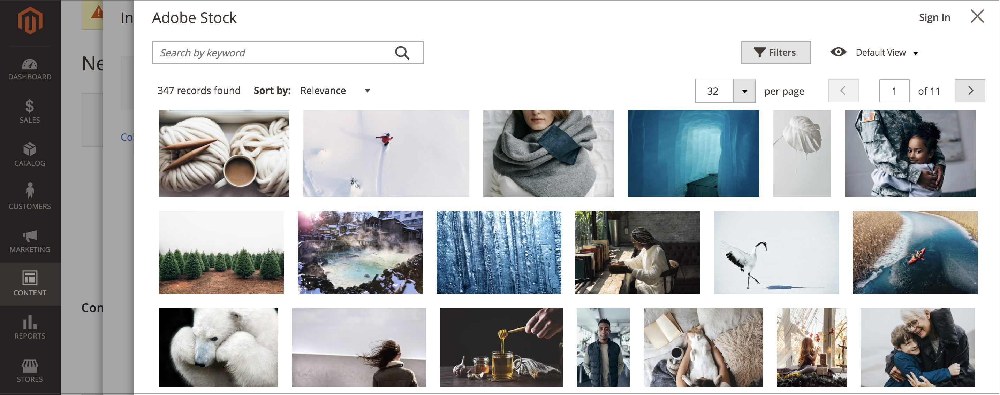

# Adobe Stock Integration

To get access to countless media assets for use in your store, integrate [Adobe Stock][adobe-stock] with [!UICONTROL Commerce].

{width="700" zoomable="yes"}

The Adobe Stock service provides businesses with access to millions of high-quality, curated, royalty-free photos, vectors, illustrations, videos, templates, and 3D assets for all their creative projects. [!DNL Commerce] users are able to quickly find, preview, and license Adobe Stock assets. Users can also save them to the [media storage][media-storage], all without leaving the Admin workspace.

## Prerequisites

This integration requires:

- An [Adobe Developer][dev-console] account
- Adobe Commerce or Magento Open Source, 2.3.4 or later

Licensing Adobe Stock images requires:

- An [Adobe account][adobe-signin]
- A paid [Adobe Stock][adobe-stock] plan associated with the account

## Integrate [!DNL Commerce] and Adobe Stock

Configuring the Adobe Stock integration for Adobe Commerce is a two-step process: 

1. [Create an adobe.developer integration](#create-an-adobe-developer-integration) to generate an API Key
1. [Configure the Adobe Stock integration in the Commerce Admin](#configure-the-adobe-stock-integration)

### Create an Adobe Developer integration

1. Navigate to the [Adobe Developer Console][dev-console].

1. Under _[!UICONTROL Quick Start]_, click **[!UICONTROL Create new project]**.

1. In the _[!UICONTROL Project overview]_ block, click **[!UICONTROL Add API]**.

1. Select **[!UICONTROL Adobe Stock]** from the integrations list and click **[!UICONTROL Next]**.

1. Select the OAuth 2.0 **[!UICONTROL Web App]**.

1. Specify the **[!UICONTROL redirect URI]**.

   The default redirect URI is in the form `${HOST}/${ADMIN_URI}/adobe_ims/oauth/callback/`, such as `https://store.myshop.com/admin_hgkq1l/adobe_ims/oauth/callback/`, where:

   - `${HOST}` is your [!DNL Commerce] fully qualified domain name (for example, `https://store.myshop.com`).
   - `${ADMIN_URI}` is your [!DNL Commerce] Admin URI (such as `admin_hgkq1l`), which can be retrieved by running `magento info:adminuri`.

1. Specify the **[!UICONTROL Redirect URI pattern]**, which is the same as your redirect URI with two differences:

   - Any periods (`.`) must be escaped with two backslashes (`\\`).
   - Add `.*` to the end of the pattern.

   Using the example from the previous default redirect URI, it would be `https://store\\.myshop\\.com/admin_hgkq1l/adobe_ims/oauth/callback/.*`.

1. Click **[!UICONTROL Next]**.

1. Review thw available scopes and click **[!UICONTROL Save configured API]**.

1. On the page that follows, copy your **[!UICONTROL Client ID]** (API key) and **[!UICONTROL Client secret]**.

   This information is used in steps of the next section.

### Configure the Adobe Stock integration

To set the system configuration in your [!DNL Commerce] Admin, use the _API Key_ and _Client secret_ generated in the [previous section][create-integration].

1. On the _Admin_ sidebar, go to **[!UICONTROL Stores]** > _[!UICONTROL Settings]_ > **[!UICONTROL Configuration]**.

1. In the left panel, expand **[!UICONTROL Advanced]** and choose **[!UICONTROL System]**.

1. Expand  **[!UICONTROL Adobe Stock Integration]** and do the following:

   - Set **[!UICONTROL Enabled Adobe Stock]** to `Yes`.

   - Enter your **[!UICONTROL API Key (Client ID)]**.

   - Enter your **[!UICONTROL Client Secret]**.

   - Click **[!UICONTROL Test Connection]** to validate your keys.

   {width="600" zoomable="yes"}

   Give the validation a few seconds. If your credentials are valid, you should see a green _Connection Successful!_ message.

1. When complete, click **[!UICONTROL Save Config]**.

[adobe-stock]: https://stock.adobe.com
[adobe-signin]: https://helpx.adobe.com/manage-account/using/access-adobe-id-account.html
[media-storage]: media-storage.md
[dev-console]: https://developer.adobe.com/console/home
[create-integration]: #create-an-adobeio-integration
