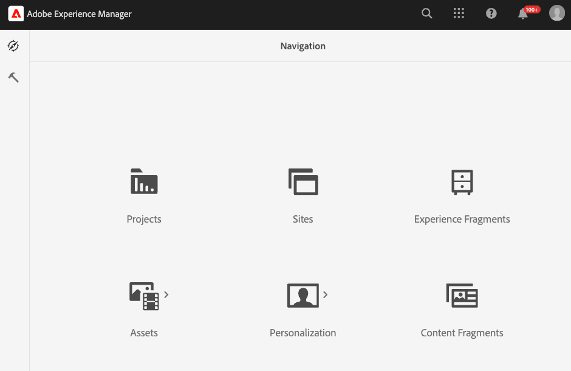
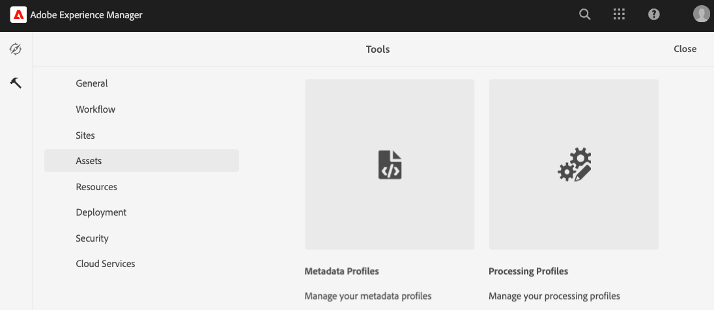
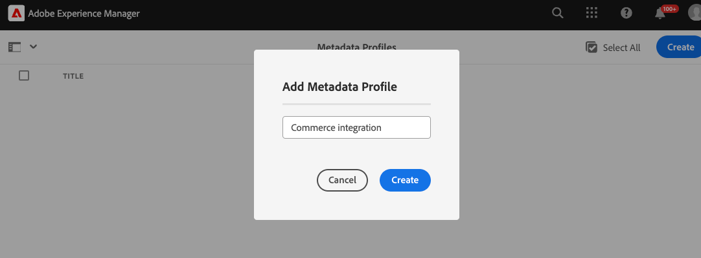
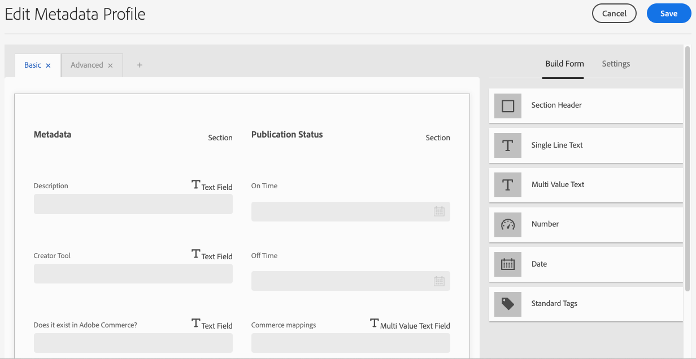
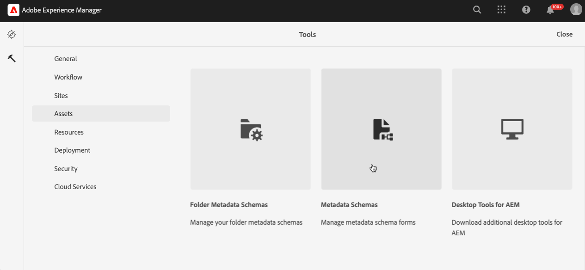
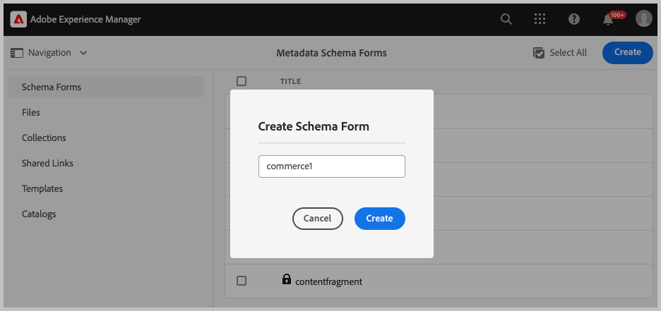

# Configure Experience Manager Assets

{{$include /help/_includes/aem-assets-integration-beta-note.md}}

In Experience Manager assets, each asset is described by metadata which enables users to find assets, understand them more fully, and make decisions about managing and using them.

- **[Metadata profiles](https://experienceleague.adobe.com/en/docs/experience-manager-cloud-service/content/assets/manage/metadata-profiles)** let you apply default metadata to assets within a folder. All assets in the folder inherit the default metadata configured in the profile.

- **[Metadata schema](https://experienceleague.adobe.com/en/docs/experience-manager-cloud-service/content/assets/manage/metadata-schemas)** defines the layout of the properties page and the set of fields that can be used as metadata properties on an AEM asset.

The Experience Manager Integration for Commerce requires all Commerce assets stored in AEM Assets to have metadata stored in a metadata profile and added to a metadata schema. This metadata is used to manage communication and synchronization processes between Adobe Commerce and Experience Manager Assets.

For the initial onboarding, update the AEM Assets configuration with Commerce metadata by adding the the following fields to both an AEM Assets metadata profile and a metadata schema.

| Field type  | Label   | Property   | Default Value |
|------ | ------- | ---------- | ------------- |
| Text | **Does it exist in Adobe Commerce?** | `./jcr:content/metadata/commerce:isCommerce` | yes |
| Multi Value Text | **Commerce mappings** | `./jcr:content/metadata/commerce:mappings` | none |

Metadata maps when an asset is pushed from Commerce for the first time. Media assets that have the built-in or custom fields automatically map to the specified fields the first time an asset is sent to Experience Manager Assets.

## Configure metadata

### Add Commerce fields to a metadata profile

1. From the Adobe Experience Manager workspace, go to the Author Content administration workspace for AEM Assets by clicking the Adobe Experience Manager icon.

   {width="600" zoomable="yes"}

1. Open the Administrator tools by selecting the hammer icon.

   {width="600" zoomable="yes"}

1. Open the profile configuration page by clicking **[!UICONTROL Metadata Profiles]**.

1. **[!UICONTROL Create]** a metadata profile for the Commerce integration.

   {width="600" zoomable="yes"}

1. Add `Does Commerce exist?` and `Commerce mappings` metadata fields for Commerce.

   {width="600" zoomable="yes"}

1. Save the update.

1. Apply the `Commerce integration` metadata profile to the folder where Commerce assets are stored.

   1. From the[!UICONTROL  Metadata Profiles] page, select the Commerce integration profile.

   1. From the action menu, select **[!UICONTROL Apply Metadata Profiles to Folder(s)]**.

   1. Select the folder containing Commerce assets.

      Create a Commerce folder if it does not exist.

   1. Click **[!UICONTROL Apply]**.

### Add Commerce fields to a metadata schema form

1. From the AEM Author Content administration panel for Assets, open **[!UICONTROL Metadata Schemas]** ([!UICONTROL Manage metadata schema forms]).

   {width="600" zoomable="yes"}

1. **[!UICONTROL Create]** a metadata schema for Commerce.

   {width="600" zoomable="yes"}

1. On the [!UICONTROL Metadata Schema Form], create the `Does Commerce exist?` and `Commerce mappings` fields and map the properties.

1. Click **[!UICONTROL Save]**.

## Add an asset to the Commerce folder

Create at least one asset in the AEM Assets Commerce folder that has the Commerce metadata attributes assigned.

This asset is required to setup synchronization between your Commerce instance and AEM Assets.

## Map metadata for assets

Metadata maps when an asset is pushed from Commerce for the first time. Media assets that have the built-in or custom fields automatically map to the specified fields the first time an asset is sent to Experience Manager Assets.

Before you can begin asset mapping, complete the following tasks:

- [Install and configure the AEM Assets Integration for Commerce](aem-assets-configure-commerce.md)
- [Set up synchronization services to transfer assets between your Adobe Commerce project environment and the AEM Assets project environment](aem-assets-setup-synchronization.md)

