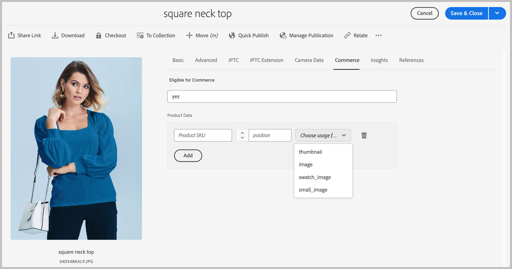
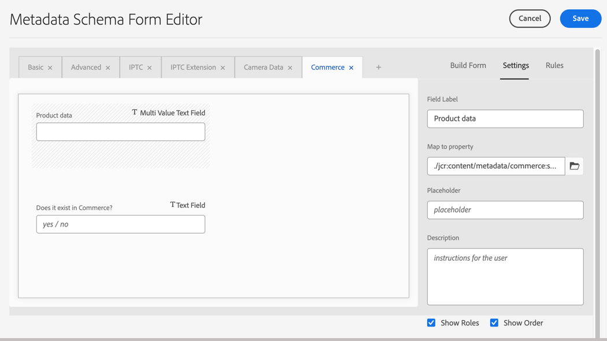

# Configure Experience Manager Assets

Prepare the AEM as a Cloud Service environment to manage Commerce assets by updating the environment configuration and configuring the Assets metadata to identify and manage Commerce assets.

The integration requires adding a custom `Commerce` namespace and additional [profile metadata](https://experienceleague.adobe.com/en/docs/experience-manager-cloud-service/content/assets/manage/metadata-profiles) and [schema metadata](https://experienceleague.adobe.com/en/docs/experience-manager-cloud-service/content/assets/manage/metadata-schemas).

Adobe provides an AEM project template to add the namespace and metadata schema resources to the AEM Assets as a Cloud Service environment configuration. The template adds:

- A [custom namespace](https://github.com/ankumalh/assets-commerce/blob/main/ui.config/jcr_root/apps/commerce/config/org.apache.sling.jcr.repoinit.RepositoryInitializer~commerce-namespaces.cfg.json), `Commerce` to identify Commerce-related properties.

- A custom metadata type `commerce:isCommerce` with the label `Does it exist in Commerce?` to tag Commerce assets associated with an Adobe Commerce project.

- A custom metadata type `commerce:productmetadata` and a corresponding UI component to add a *[!UICONTROL Product Data]* property. Product Data includes the metadata properties to associate a Commerce asset with product SKUs, and to specify image `role` and `position` attributes for the asset.

  {width="600" zoomable="yes"}

- A metadata schema form with a Commerce tab that includes the `Does it exist in Adobe Commerce?` and `Product Data` fields for tagging Commerce assets. The form also provides options to show or hide the `roles` and `order` (position) fields from the AEM Assets UI.

   {width="600" zoomable="yes"}

- A [sample tagged and approved Commerce asset](https://github.com/ankumalh/assets-commerce/blob/main/ui.content/src/main/content/jcr_root/content/dam/wknd/en/activities/hiking/equipment_6.jpg/.content.xml) `equipment_6.jpg` to support initial asset synchronization. Only approved Commerce assets can be synchronized from AEM Assets to Adobe Commerce.

For additional information about the Commerce-Assets AEM project, see the [Readme](https://github.com/ankumalh/assets-commerce).

## Customize the AEM Assets environment configuration

>[!BEGINSHADEBOX]

**Prerequisites**

- [Access to the AEM Assets Cloud Manager Program and environments](https://experienceleague.adobe.com/en/docs/experience-manager-cloud-service/content/onboarding/journey/cloud-manager#access-sysadmin-bo) with the Program and Deployment Manager roles.

- A [local AEM development environment](https://experienceleague.adobe.com/en/docs/experience-manager-learn/cloud-service/local-development-environment-set-up/overview) and familiarity with the AEM local development process.

- Understand [AEM project structure](https://experienceleague.adobe.com/en/docs/experience-manager-cloud-service/content/implementing/developing/aem-project-content-package-structure) and how to deploy custom content packages using Cloud Manager.

>[!ENDSHADEBOX]

### Deploy the Commerce-Assets AEM project to the AEM Assets authoring environment

1. From the Cloud Manager, create production and staging environments for your AEM Assets project, if needed.

1. Configure a deployment pipeline, if needed.

1. From GitHub, download the boilerplate code from the [Commerce-Assets AEM project](https://github.com/ankumalh/assets-commerce).

1. From your [local AEM development environnment](https://experienceleague.adobe.com/en/docs/experience-manager-learn/cloud-service/local-development-environment-set-up/overview), install the custom code into your AEM Assets environment configuration as a Maven package, or by manually copying the code into the existing project configuration.

1. Commit the changes and push your local development branch to the Cloud Manager git repository.

1. From Cloud Manager, [deploy your code to update the AEM environment](https://experienceleague.adobe.com/en/docs/experience-manager-cloud-service/content/implementing/using-cloud-manager/deploy-code#deploying-code-with-cloud-manager).

## Configure a metadata profile

Set default values for Commerce asset metadata by creating a metadata profile. Once set up, apply this profile to AEM Asset folders to automatically use these defaults. This optional setup helps streamline asset processing by reducing manual steps.

1. From the Adobe Experience Manager workspace, go to the Author Content administration workspace for AEM Assets by clicking the Adobe Experience Manager icon.

   {width="600" zoomable="yes"}

1. Open the Administrator tools by selecting the hammer icon.

   {width="600" zoomable="yes"}

1. Open the profile configuration page by clicking **[!UICONTROL Metadata Profiles]**.

1. **[!UICONTROL Create]** a metadata profile for the Commerce integration.

   {width="600" zoomable="yes"}

1. Add a tab for Commerce metadata.

   1. On the left, click  **[!UICONTROL Settings]**.

   1. Click  **[!UICONTROL +]** in the tab section, and then specify the **[!UICONTROL Tab Name]**, `Commerce`.

1. Add the `Does it exist in Commerce?` field to the form, and set the default value to `yes`.

   {width="600" zoomable="yes"}

1. Save the update.

1. Apply the `Commerce integration` metadata profile to the folder where Commerce assets are stored.

   1. From the[!UICONTROL  Metadata Profiles] page, select the Commerce integration profile.

   1. From the action menu, select **[!UICONTROL Apply Metadata Profiles to Folder(s)]**.

   1. Select the folder containing Commerce assets.

      Create a Commerce folder if it does not exist.

   1. Click **[!UICONTROL Apply]**.

>[!TIP]
>
>You can automatically synchronize Commerce assets as they are uploaded to the AEM Assets environment by updating the metadata profile to set the default value for the _[!UICONTROL Review Status]_ field to `Approved`. The property type for the `Review Status` field is `./jcr:content/metadata/dam:status`.

## Next steps

After updating the AEM environment, set up Adobe Commerce:

1. [Install and configure the AEM Assets Integration for Commerce](aem-assets-configure-commerce.md)
2. [Enable asset synchronization to transfer assets between your Adobe Commerce project environment and the AEM Assets project environment](aem-assets-setup-synchronization.md)
