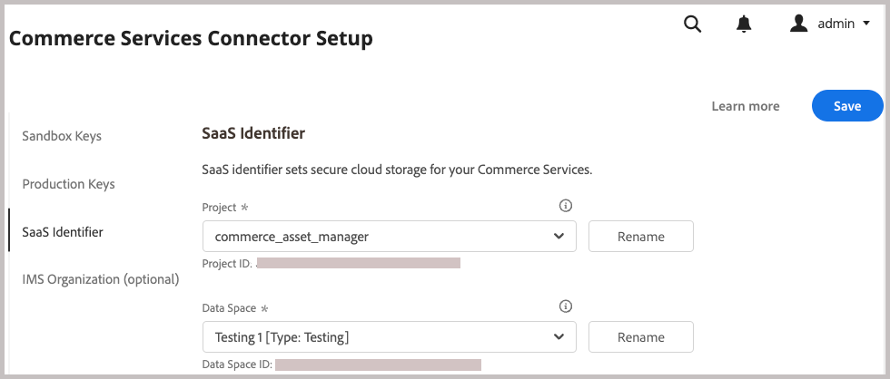
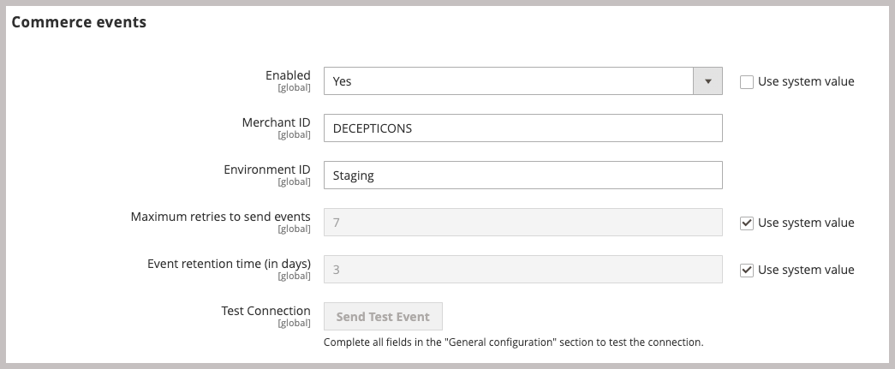
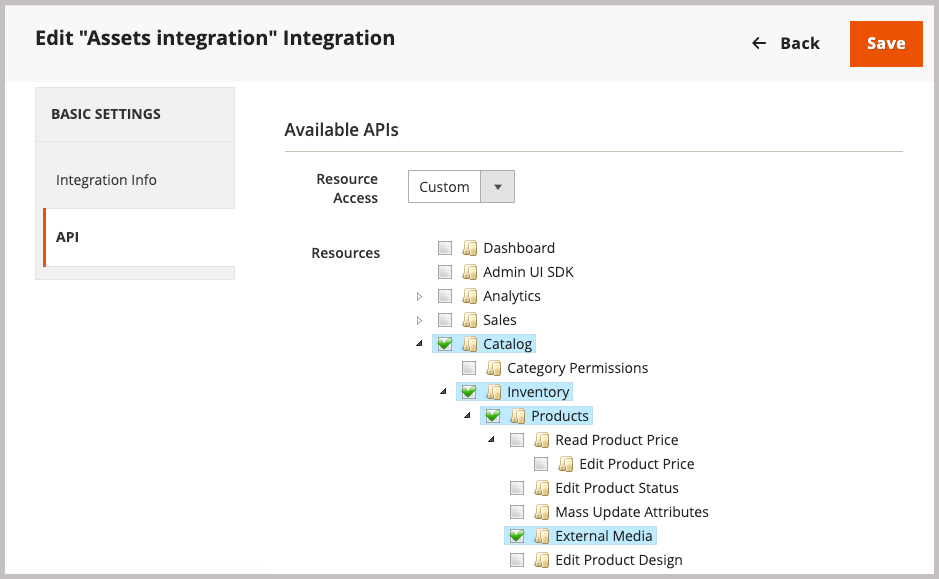
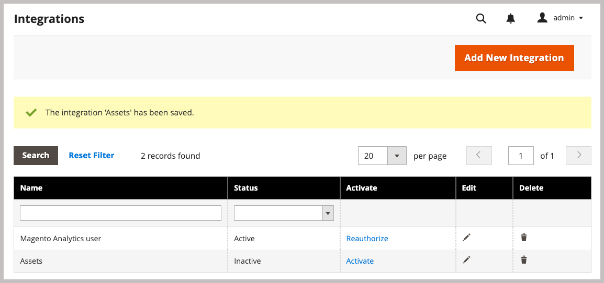
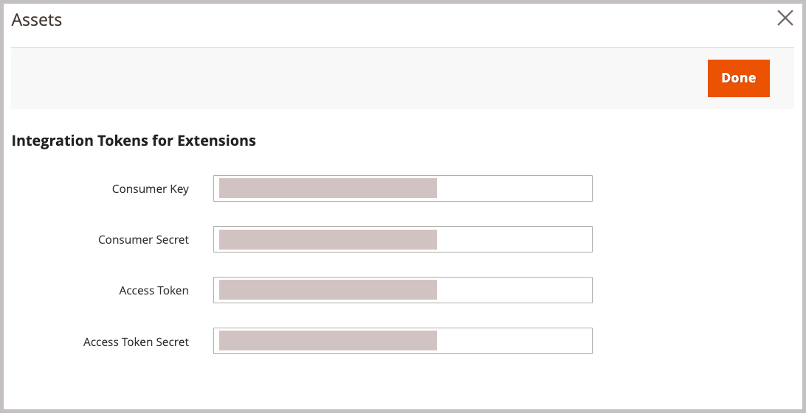

# Install Adobe Commerce packages

The AEM Assets Integration for Commerce extension (`aem-assets-integration`) enables synchronization of assets between Adobe Commerce and Adobe Experience Manager Assets. The extension provides a set of tools and services to manage assets, including product images, videos, and other media assets, across both platforms.

Add this extension to the Commerce environment by installing the `aem-assets-integration` PHP extension. You also need to enable Adobe I/O Events for Commerce and generate the credentials required for communication and workflows between Adobe Commerce and Adobe Experience Manager Assets.

## System requirements

The AEM Assets Integration for Commerce extension has the following system and configuration requirements.

**Software requirements**

- Adobe Commerce 2.4.5+
- PHP version compatible with installed version of Adobe Commerce–version 8.1, 8.2, 8.3, or 8.4)
- Composer: 2.x

**Access requirements**

You need the following roles and permissions to set up the integration.

- [Commerce cloud project administrator](https://experienceleague.adobe.com/en/docs/commerce-cloud-service/user-guide/project/user-access)—Install required extensions and configure the Commerce application server from the Admin or the command line.

  - Access [repo.magento.com](https://repo.magento.com/admin/dashboard) to install the extension.

    For key generation and obtaining the necessary rights, see [Get your authentication keys](https://experienceleague.adobe.com/en/docs/commerce-operations/installation-guide/prerequisites/authentication-keys). For cloud installations, see the [Commerce on Cloud Infrastructure Guide](https://experienceleague.adobe.com/en/docs/commerce-cloud-service/user-guide/develop/authentication-keys)

- [Commerce Admin](https://experienceleague.adobe.com/en/docs/commerce-admin/start/guide-overview)—Update store configuration and manage Commerce user accounts.

>[!TIP]
>
> Adobe Commerce can be configured to use [Adobe IMS authentication](/help/getting-started/adobe-ims-config.md).

## Installation and configuration workflow

Install the Adobe Commerce package and prepare the Commerce environment by completing the following tasks:

1. [Install the AEM Assets Integration for Commerce extension (`aem-assets-integration`)](#install-the-aem-assets-integration-extension).
1. [Configure the Commerce Services Connector](#configure-the-commerce-services-connector) to connect your Adobe Commerce instance and with the services that enable data to be transmitted between Adobe Commerce and AEM Assets.
1. [Configure Adobe I/O Events for Commerce](#configure-adobe-io-events-for-commerce)
1. [Get authentication credentials for API access](#get-authentication-credentials-for-api-access)

## Install the `aem-assets-integration` extension

Install the latest version of the AEM Assets Integration extension (`aem-assets-integration`) on an Adobe Commerce instance with version Adobe Commerce 2.4.5+. The AEM Asset Integration is delivered as a composer metapackage from the [repo.magento.com](https://repo.magento.com/admin/dashboard) repository.

>[!BEGINTABS]

>[!TAB Cloud infrastructure]

Use this method to install the [!DNL AEM Assets Integration] extension for a Commerce Cloud instance.

1. On your local workstation, change to the project directory for your Adobe Commerce on cloud infrastructure project.

   >[!NOTE]
   >
   >For information about managing Commerce project environments locally, see [Managing branches with the CLI](https://experienceleague.adobe.com/en/docs/commerce-cloud-service/user-guide/develop/cli-branches) in the _Adobe Commerce on Cloud Infrastructure User Guide_.

1. Check out the environment branch to update using the Adobe Commerce Cloud CLI.

   ```shell
   magento-cloud environment:checkout <environment-id>
   ```

1. Add the AEM Assets Integration for Commerce extension.

   ```shell
   composer require "magento/aem-assets-integration" "<version-tbd>" --no-update
   ```

1. Update package dependencies.

   ```shell
   composer update "magento/aem-assets-integration"
   ```

1. Commit and push code changes for the `composer.json` and `composer.lock` files.

1. Add, commit, and push the code changes for the `composer.json` and `composer.lock` files to the cloud environment.

   ```shell
   git add -A
   git commit -m "Install AEM Assets Integration extension for Adobe Commerce"
   git push origin <branch-name>
   ```

   Pushing the updates initiates the [Commerce cloud deployment process](https://experienceleague.adobe.com/en/docs/commerce-cloud-service/user-guide/develop/deploy/process) to apply the changes. Check the deployment status from the [deploy log](https://experienceleague.adobe.com/en/docs/commerce-cloud-service/user-guide/develop/test/log-locations#deploy-log).

>[!TAB On-premises]

Use this method to install the [!DNL AEM Assets Integration] extension for an on-premises instance.

1. Use Composer to add the AEM Assets Integration for Commerce extension to your project:

   ```shell
   composer require "magento/aem-assets-integration" --no-update
   ```

1. Update dependencies and install the extension:

   ```shell
   composer update  "magento/aem-assets-integration"
   ```

1. Upgrade Adobe Commerce:

   ```shell
   bin/magento setup:upgrade
   ```

1. Clear the cache:

   ```shell
   bin/magento cache:clean
   ```

>[!TIP]
>
>When deploying to production, consider not clearing compiled code to save time. Always back up your system before making changes.

>[!ENDTABS]

## Configure the Commerce Services Connector

>[!NOTE]
>
>Commerce Services Connector setup is a one-time process required to use [Adobe Commerce SaaS services](https://experienceleague.adobe.com/en/docs/commerce/user-guides/integration-services/saas#availableservices). If you have already configured the connector for another service, you can view the existing configuration from the Commerce Admin by selecting **[!UICONTROL Systems]** > [!UICONTROL Services] > **[!UICONTROL Commerce Services Connector]**.

To transmit data between your Adobe Commerce instance and the services that enable the AEM Assets Integration, configure the Commerce Services Connector from the Admin (**[!UICONTROL System]** > [!UICONTROL Services] > **[!UICONTROL Commerce Services Connector]**). 

{width="600" zoomable="yes"}ed

Provide the following values in the configuration

- Production and sandbox API keys for authentication
- Data space name (SaaS identifier) for secure cloud storage
- IMS organization ID where your Commerce and AEM Assets environments are provisioned

For detailed instructions, watch the [Commerce Services Connector configuration video](https://experienceleague.adobe.com/en/docs/commerce-learn/tutorials/admin/adobe-commerce-services/configure-adobe-commerce-services-connector#configuration-faqs), of see the [Commerce Services Connector](https://experienceleague.adobe.com/en/docs/commerce/user-guides/integration-services/saas#organizationid) documentation.

When you save the configuration, the system generates the SaaS project and database IDs for your environment. These values are required to enable asset synchronization between Adobe Commerce and AEM Assets.

## Configure Adobe I/O Events for Commerce

The AEM Assets Integration uses the Adobe I/O Events service to send custom event data between the Commerce instance and Experience Cloud. The event data is used to coordinate workflows for the AEM Assets integration.

Before configuring Adobe I/O Events, verify the RabbitMQ and cron job configuration for your Commerce project: 

- Ensure that RabbitMQ is enabled and listening for events.
  - [RabbitMQ Setup for Adobe Commerce on premises](https://experienceleague.adobe.com/en/docs/commerce-cloud-service/user-guide/configure/service/rabbitmq)
  - [RabbitMQ Setup for Adobe Commerce on cloud infrastructure](https://experienceleague.adobe.com/en/docs/commerce-cloud-service/user-guide/configure/service/rabbitmq)
  - Verify that [cron jobs are enabled](https://developer.adobe.com/commerce/extensibility/events/configure-commerce/#check-cron-and-message-queue-configuration). Cron jobs are required for communication and workflows for the AEM Assets integration.

>[!NOTE]
>
> For projects on Commerce version 2.4.5, you must [install the Adobe I/O modules](https://developer.adobe.com/commerce/extensibility/events/installation/#install-adobe-io-modules-on-commerce). In Commerce version 2.4.6+, these modules are loaded automatically. For the AEM Assets integration for Commerce, you only need to install the modules. App Builder setup is not required.


### Enable the Commerce Eventing framework

Enable the eventing framework from the Commerce Admin.

>[!NOTE]
>
>App Builder setup is required only if you plan to use a custom matching strategy to synchronize assets between Commerce and AEM Assets.

1. From the Admin, go to **[!UICONTROL Stores]** > [!UICONTROL Settings] > **[!UICONTROL Configuration]** > **[!UICONTROL Adobe Services]** > **Adobe I/O Events**.

1. Expand **[!UICONTROL Commerce events]**.

1. Set **[!UICONTROL Enabled]** to `Yes`.

   {width="600" zoomable="yes"}

1. Enter the merchant company name in the **[!UICONTROL Merchant ID]** and the environment name in the **[!UICONTROL Environment ID]** fields. Use only alphanumeric characters and underscores when setting these values.

>[!BEGINSHADEBOX]

**Configure Custom VCL for blocking requests**

If you use a custom VCL snippet to block unknown incoming requests, you might need to include the HTTP header `X-Ims-Org-Idheader` to allow incoming connections from the AEM Assets Integration for Commerce service.

>[!TIP]
>
> You can use the Fastly CDN module to create an Edge ACL with a list of IP addresses that you want to block.

The following custom VCL snippet code (JSON format) shows an example with a `X-Ims-Org-Id` request header.

```json
{
  "name": "blockbyuseragent",
  "dynamic": "0",
  "type": "recv",
  "priority": "5",
  "content": "if ( req.http.X-ims-org ~ \"<YOUR-IMS-ORG>\" ) {error 405 \"Not allowed\";}"
}
```

Before creating a snippet based on this example, review the values to determine whether you need to make any changes:

- `name`: Name for the VCL snippet. This example uses the name `blockbyuseragent`.

- `dynamic`: Sets the snippet version. This example uses `0`. See the [Fastly VCL snippets](https://www.fastly.com/documentation/reference/api/vcl-services/snippet/) for detailed data model information.

- `type`: Specifies the type of VCL snippet, which determines the location of the snippet in the generated VCL code. This example uses `recv`. See the [Fastly VCL snippet reference](https://www.fastly.com/documentation/reference/api/#api-section-snippet) for the list of snippet types.

- `priority`: Determines when the VCL snippet runs. This example uses priority `5` to run immediately and check whether an Admin request is coming from an allowed IP address.

- `content`: The snippet of VCL code to run, which checks the client IP address. If the IP is in the Edge ACL, it is blocked from access with a `405 Not allowed` error for the entire website. All other client IP addresses are allowed access.

For detailed information about using VCL snippets to block incoming requests, see [Custom VCL for blocking requests](https://experienceleague.adobe.com/en/docs/commerce-cloud-service/user-guide/cdn/custom-vcl-snippets/fastly-vcl-blocking) in the _Commerce on Cloud Infrastructure Guide_.

>[!ENDSHADEBOX]

## Get authentication credentials for API access

The AEM Assets Integration for Commerce requires OAuth authentication credentials to allow API access to the Commerce instance. These credentials are required to authenticate API requests when managing assets using the AEM Assets integration.

You generate the credentials by adding the integration to the Commerce instance and activating it.

### Add the integration to the Commerce environment

1. From the Admin, go to **System** > Extensions > **Integrations**, then click **Add New Integration**.

1. Enter information about the integration.

   In the **General** section, only specify the integration **Name** and **Email**. Use the email for an Adobe IMS account with access to the organization where Commerce and Experience Manager Assets are deployed.

   {width="600" zoomable="yes"}

1. Verify your identity by clicking **Confirm Identity**.

   The system verifies your identity by authenticating to Experience Cloud with your Adobe Id.

1. Configure API resources.

   1. From the left panel, click **[!UICONTROL API]**.

   1. Select the external media resource **[!UICONTROL Catalog > Inventory > Products > External Media]**.

      {width="600" zoomable="yes"}

1. Click **[!UICONTROL Save]**.

### Generate OAuth credentials

On the Integrations page, generate the OAuth authentication credentials by clicking **Activate** for the Assets integration. You need these credentials to register the Commerce project with the Assets Rule Engine service, and to submit API requests to manage assets between Adobe Commerce and AEM Assets.

1. From the Integrations page, generate the credentials by clicking **[!UICONTROL Activate]**.

   {width="600" zoomable="yes"}

1. If you plan to use the API, save the credentials for the consumer key and access token to configure authentication in your API client.

   {width="600" zoomable="yes"}

1. Click **[!UICONTROL Done]**.

>[!NOTE]
>
>You can also generate authentication credentials using the Adobe Commerce APIs. For details about this process and more information about OAuth-based authentication for Adobe Commerce, see [OAuth-based authentication](https://developer.adobe.com/commerce/webapi/get-started/authentication/gs-authentication-oauth/) in the Adobe Developer documentation.

## Next step

[Connect the Adobe Commerce and AEM Assets project environments and select the matching strategy for synchronizing assets](aem-assets-setup-synchronization.md)
