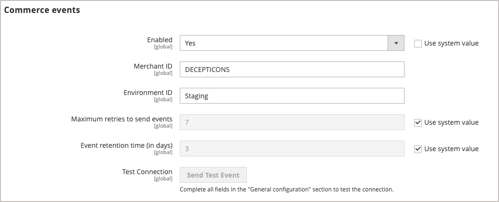

# Onboarding and installation AEM Assets

Get started with the AEM Assets integration for Adobe Commerce by configuring the Commerce application to use the AEM Assets integration and the Adobe I/O Events service.

## System requirements

**Software requirements**

- Adobe Commerce 2.4.5+
- PHP 8.1, 8.2, 8.3
- Composer: 2.x

**Supported platforms**

Adobe Commerce on cloud infrastructure: 2.4.4+
Adobe Commerce on premises: 2.4.4+

## Configuration overview

Enable the integration by completing the following tasks

1. [Install the AEM Assets integration extension (`aem-assets-integration`)](#install-the-aem-assets-integration-extension).
1. [Configure the Commerce Service Connector](#configure-the-commerce-services-connector) to connect your Adobe Commerce instance and with the services that enable data to be transmitted between Adobe Commerce and AEM Assets.
1. [Configure Adobe I/O Events for Commerce](#configure-adobe-io-events-for-commerce)
1. [Onboard a new tenant](#onboard-new-tenant)
1. [Enable the AEM Assets integration in the Admin UI](#enable-aem-assets-integration)


## Install the AEM Assets Integration extension

>[!BEGINSHADEBOX]

**Prerequisite**

- Access [repo.magento.com](https://repo.magento.com) to install the extension. For key generation and obtaining the necessary rights, see [Get your authentication keys](https://experienceleague.adobe.com/en/docs/commerce-operations/installation-guide/prerequisites/authentication-keys). For cloud installations, see the [Commerce on Cloud Infrastructure Guide](https://experienceleague.adobe.com/en/docs/commerce-cloud-service/user-guide/develop/authentication-keys)

- Access to the command line of the Adobe Commerce application server.

>[!ENDSHADEBOX]

Install the latest version of the AEM Assets Integration extension (`aem-assets-integration`) on an Adobe Commerce running Adobe Commerce 2.4.4 or later. The AEM Asset Integration is delivered as a composer metapackage from the [repo.magento.com](https://repo.magento.com/) repository.

>[!BEGINTABS]

>[!TAB Cloud infrastructure]

Use this method to install the [!DNL AEM Assets Integration] extension for a Commerce Cloud instance.

1. On your local workstation, change to the project directory for your Adobe Commerce on cloud infrastructure project.

   >[!NOTE]
   >
   >For information about managing Commerce project environments locally, see [Managing branches with the CLI](https://experienceleague.adobe.com/en/docs/commerce-cloud-service/user-guide/develop/cli-branches) in the _Adobe Commerce on Cloud Infrastructure User Guide_.

1. Check out the environment branch to update using the Adobe Commerce Cloud CLI.

   ```shell
   magento-cloud environment:checkout <environment-id>
   ```

1. Add the Catalog Service module.

   ```bash
   composer require "magento/aem-assets-integration" "<version-tbd>" --no-update
   ```

1. Update package dependencies.

   ```bash
   composer update "magento/aem-assets-integration"
   ```

1. Commit and push code changes for the `composer.json` and `composer.lock` files.

1. Add, commit, and push the code changes for the `composer.json` and `composer.lock` files to the cloud environment.

   ```shell
   git add -A
   git commit -m "Install AEM Assets Integration extension for Adobe Commerce"
   git push origin <branch-name>
   ```

   Pushing the updates initiates the [Commerce cloud deployment process](https://experienceleague.adobe.com/en/docs/commerce-cloud-service/user-guide/develop/deploy/process) to apply the changes. Check the deployment status from the [deploy log](https://experienceleague.adobe.com/en/docs/commerce-cloud-service/user-guide/develop/test/log-locations#deploy-log).

>[!TAB On-premises]

Use this method to install the [!DNL AEM Assets Integration] extension for an on-premises instance.

1. Use Composer to add the Catalog Service module to your project:

   ```bash
   composer require "magento/aem-assets-integration" "version tbd"  --no-update
   ```

1. Update dependencies and install the extension:

   ```bash
   composer update  "magento/aem-assets-integration"
   ```

1. Upgrade Adobe Commerce:

   ```bash
   bin/magento setup:upgrade
   ```

1. Clear the cache:

   ```bash
   bin/magento cache:clean
   ```

   >[!TIP]
   >
   >In some cases, particularly when deploying to production, you might wish to avoid clearing compiled code because it can take some time. Ensure that you back up your system before making any changes.

>[!ENDTABS]

## Configure the Commerce Services Connector

To transmit data between your Adobe Commerce instance and the services that enable the AEM Assets Integration, configure the Commerce Services Connector with the following:

- Configure your Commerce instance with production and sandbox API keys for authentication.
- Specify a data space (SaaS identifier) for secure cloud storage.
- Connect to your organizations dataset on Adobe Experience Platform by signing into the same IMS organization that you use to access AEM Assets.

For detailed instructions, see [Commerce Services Connector](https://experienceleague.adobe.com/en/docs/commerce-merchant-services/user-guides/integration-services/saas#organizationid).

## Configure Adobe I/O Events for Commerce

>[!BEGINSHADEBOX]

**Prerequisite**

- Ensure that RabbitMQ is enabled and listening for events.
  - [RabbitMQ Setup for Adobe Commerce on premises](https://experienceleague.adobe.com/en/docs/commerce-cloud-service/user-guide/configure/service/rabbitmq)
  - [RabbitMQ Setup for Adobe Commerce on cloud infrastructure](https://experienceleague.adobe.com/en/docs/commerce-cloud-service/user-guide/configure/service/rabbitmq)

>[!ENDSHADEBOX]

When the AEM Assets integration is enabled, the Adobe I/O Events service sends Commerce event data to Experience Cloud to manage administrator access to Commerce projects. Set up requires the following steps.

1. Enable the Commerce Eventing framework by configuring Adobe I/O events on the application server and in the Admin
1. Enable data synchronization between Adobe Commerce and AEM Assets by using the Assets Rules Engine Service API to configure the connection
1. Enable the AEM Assets integration in the Admin


### Enable the Commerce Eventing framework

1. From the Commerce application server command line, configure the SaaS eventing framework for the production environment using the Adobe Commerce CLI:

   ```shell
   bin/magento config:set adobe_io_events/integration/adobe_io_environment
   ```

   Configure the eventing framework for a different environment by appending the environment name to the command.

   ```shell
   bin/magento config:set adobe_io_events/integration/adobe_io_environment staging
   ```

1. Apply the configuration changes by clearing the cache.

   ```shell
   bin/magento cache:clean
   ```

1. From the Commerce Admin, navigate to **[!UICONTROL Stores]** > [!UICONTROL Settings] > **[!UICONTROL Configuration]** > **[!UICONTROL Adobe Services]** > **Adobe I/O Events** > **Commerce events**. The following screen displays.

  {width="600" zoomable="yes"}


## Onboard tenant

The Asset Rules Engine Service (ARES) is a multi-tenant service that integrates AEM Assets with Adobe Commerce. Before using the service, you need to register your tenant ID using the ARES GraphQL API.

Use a GraphQL client to send a POST request to the API endpoints.

**Endpoints**

- Sandbox `https://aem-assets-sandbox.adobe.io/graphql`—used for testing and validation before going live

- Production `https://aem-assets.adobe.io/graphql`—used for live traffic for Commerce merchants and websites

**Required headers**

Specify the following HTTTP headers for the request:

- `x-api-key`: API Key from your Magento account
- `magento-environment-Id`: SaaS identifier
- `x-gw-signature`: JWT Token associated to the MAGEID

**Request:**

```graphql
mutation registerTenant($tenantInput: TenantInput!) {
   registerTenant(tenantInput: $tenantInput) {
      tenantId
      userErrors {
         message
         path
      }
    }
}
```

## Enable the AEM Assets Integration

Enable the AEM Assets Integration in the Commerce Admin.

1. From the Commerce Admin, navigate to **[!UICONTROL Stores]** > [!UICONTROL Settings] > **[!UICONTROL Configuration]** > **[!UICONTROL Catalog]**.

1. Enable the extension by expanding **[!UICONTROL AEM Assets integration]** and selecting `Yes` in the [!UICONTROL Integration enabled] field.

  <!--insert screen capture-->


