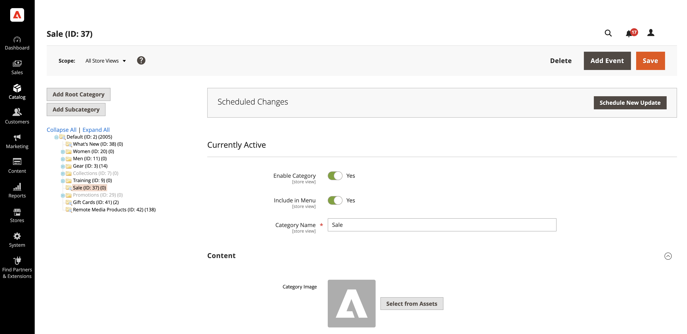

# Use AEM Assets

<!--In ACAP-844, this topic was linked to from the Commerce Admin products images and videos when the Assets integration is enabled. If the URL to the topic changes, be sure to add a redirect.-->

## Update an asset

After you edit an asset in AEM Assets, send the updates to Commerce by approving and reprocessing the asset. Only approved assets are sent to your Commerce instance. Reprocessing the asset ensures that any final changes or metadata updates are captured before the asset is sent to Adobe Commerce.

For details, see the following AEM Assets documentation.

- [Reprocessing digital assets](https://experienceleague.adobe.com/en/docs/experience-manager-cloud-service/content/assets/manage/reprocessing)

- [Approve an asset](https://experienceleague.adobe.com/en/docs/experience-manager-cloud-service/content/assets/dynamicmedia/dynamic-media-open-apis/approve-assets)

## Add assets to categories content

You can add assets into your catalog categories content once you have enabled and configured the AEM Assets integration:

1. On the _Admin_ sidebar, navigate to **[!UICONTROL Catalog]** > **[!UICONTROL Categories]**.

1. Expand the  in the **[!UICONTROL Content]** section.

   {width="600" zoomable="yes"}

1. To display a **[!UICONTROL Category Image]** at the top of the page, click **[!UICONTROL Select from Assets]** to use an image from your AEM Assets folder.

1. Click **[!UICONTROL Save]** and continue.

   For more information to create a category, see [Complete the category content](../catalog/category-create.md#step-3-complete-the-category-content).
