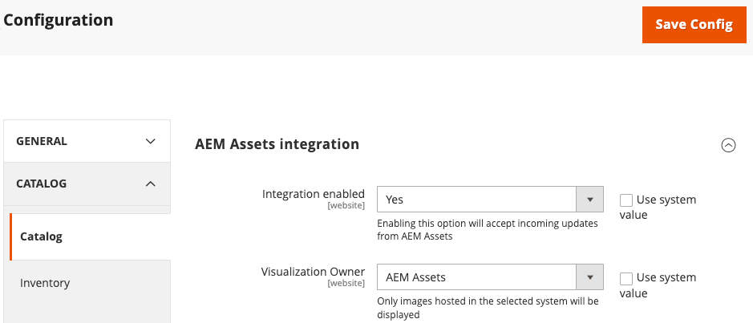

# Set up the synchronization service

The Asset Rules Engine Service (ARES) is a multi-tenant service that integrates AEM Assets with Adobe Commerce. This service synchronizes assets between Adobe Commerce and Experience Manager. The ARES service automatically matches assets in AEM to products in Adobe Commerce based on SKU or other key attributes. It also ensures that the latest product assets and variations are always available on the ecommerce site.

To set up the service, you need to register your tenant ID using the ARES GraphQL API and select the matching rule for synchronizing assets.

## Choose a matching strategy

The AEM Assets Integration for Commerce supports two matching strategies for synchronizing assets between Adobe Commerce and AEM Assets.

- **MatchBySku**-This is the default matching rule that matches assets based on the Stock Keeping Unit (SKU) of the product. The SKU is a unique identifier for each product, and this rule ensures that images and other assets are correctly associated with their corresponding products by matching the SKU in the asset metadata with the SKU in the Commerce catalog.

- **ExternalMatcher**–This matching rule is for more complex scenarios or specific business requirements that require custom matching logic. To use this rule, you must have custom code implemented in Adobe Developer App Builder that defines how assets are matched with products.

For initial onboarding, use the `MatchBySku` strategy. If needed, you can change the matching strategy later.

## Register a tenant

>[!BEGINSHADEBOX]

**Prerequisite**

- [AEM Assets project has been configured with Commerce metadata required for mapping assets](aem-assets-configure-aem.md).

- [Install and configure the Experience Manager Assets Integration in Adobe Commerce](aem-assets-configure-commerce.md).

>[!ENDSHADEBOX]

## Gather credentials

You need the following credentials to authenticate and connect your Commerce project environment and AEM Assets project environment with Commerce SaaS services.

| Required Data | Source | Where to find it|
| ---------- | ------ | ------------- |
| API Key from Magento account | Commerce | Provide the public API key for the Commerce environment you are using, Staging or Production. You can find the API keys for the Production and Staging environments on the [Commerce Service Connector Setup](aem-assets-configure-commerce.md#configure-the-commerce-services-connector) page in the Admin, or on the [!UICONTROL My Account] page in the [!UICONTROL API Portal] section.|
| Commerce SaaS Project Identifier <ul><li>`magento-environment-Id`</li><li>`Project ID`</li></ul> | Commerce Admin | These values identify the Commerce environment and SaaS data space and project to connect to. Values come from the [Commerce Services Connector SaaS Identifier configuration].(aem-assets-configure-commerce.md#configure-the-commerce-services-connector). |
|AEM `programId`<br>`environmentId` | [AEM Assets Authoring environment](https://experienceleague.adobe.com/en/docs/experience-manager-cloud-service/content/sites/authoring/quick-start) | Open the AEM Sites page, and select **[!UICONTROL Assets]**.  Copy the project and environment IDs from the URL: `https://author-p[Program ID]-e[EnvironmentID].adobeaemcloud.com/`|
| baseURL | Commerce storefront | The [base URL](../stores-purchase/store-urls.md) for your Commerce storefront.|
| OAuth credentials for API access | Commerce Admin | You can find these credentials in the Commerce [configuration settings for the Assets integration](aem-assets-configure-commerce.md#experience-manager-assets-integration-for-adobe-commerce-10-release).|

## Register tenant

Complete tenant registration by submitting a request to the Assets Rule Engine Service to add authentication credentials and tenant IDs. The request includes credentials and project identifiers required to establish the connections between the service, the Commerce project, and the Experience Manager Assets project.

Send the request using a GraphQL client or cURL.

>[!BEGINTABS]

>[!TAB GraphQL Request]

Use a GraphQL client to send a POST request to the API endpoint `https://commerce.adobe.io/assets-integration/graphql`

**Required headers**

Specify the following HTTP headers for the request:

- `x-api-key`: API Key from your Magento account
- `magento-environment-Id`: SaaS identifier
- `x-gw-signature`: JWT Token associated with the MAGEID

**Request:**

**Syntax**

```graphql
mutation registerTenant($tenantInput: TenantInput!) {
   registerTenant(tenantInput: $tenantInput) {
      tenantId
      userErrors {
         message
         path
      }
    }
}
```

**Example usage**

Register a tenant and select the `matchBySku` rule to map assets between Adobe Commerce and the AEM Assets project.

**Request:**

```graphql
   {
      "tenantInput": {
         "enabled": true,
         "projectId": "8231afb6-90cd-65e8-84ba-d9abac0f94e6",
         "aem": {
               "programId": "11111",
               "environmentId": "222222"
         },
         "commerce": {
               "baseUrl": "***",
               "credentials": {
                  "consumerKey": "***",
                  "consumerSecret": "***",
                  "accessToken": "***",
                  "accessTokenSecret": "***"
               }
         },
         "rule": {
            "type": "matchBySKU"
            "matchBySkuRule": {
               "metadataField": "commerce:skus"
            }
         }
      }
   }
```

**Response**

```graphql
{
    "data": {
        "registerTenant": {
            "tenantId": "b65d5da7-2756-46a1-9ff1-14fb5d925fee",
            "userErrors": []
        }
    }
}
```

>[!TAB cURL request]

```json
curl --request POST \
  --url https://commerce.adobe.io/assets-integration/graphql \
  --header 'Content-Type: application/json' \
  --header 'Magento-Environment-Id: ****' \
  --header 'x-api-key: ****' \
  --header 'x-gw-signature: *****' \
  --data '{"query":"mutation registerTenant($tenantInput: TenantInput!) {\n\tregisterTenant(tenantInput: $tenantInput) {\n\t\ttenantId\n\t\tuserErrors {\n\t\t\tmessage\n\t\t\tpath\n\t\t}\n\t}\n}\n","operationName":"registerTenant","variables":{"tenantInput":{"enabled":true,"threshold":100,"projectId":"5d6faa03-e200-4623-9008-da144e4eefd8","aem":{"programId":"***","environmentId":"***"},"commerce":{"version":"2.4.6-p2","extensionVersion":"0.0.1","baseUrl":"***","credentials":{"consumerKey":"***","consumerSecret":"***","accessToken":"***","accessTokenSecret":"***"}},"rule":{"type":"matchBySKU","matchBySkuRule":{"metadataField":"commerce:skus"}}}}}'
```

>[!ENDTABS]

### Input Fields

#### AemInput

Identifies the AEM Assets instance where you will store the Commerce Assets. You can get this information from the Cloud Manager My Programs view, or from the content authoring URL.

| Field | Data Type | Description |
| ----- | --------- | ----------- |
|`programId` | String! | Unique identifier for your project within AEM Cloud Service |
|`environmentId`| String! | Id for the project environment you are using, such as Production, Staging, or Development |

#### CommerceInput

Provides the OAuth authentication credentials for API access to the Commerce Catalog. You can find these credentials in the Commerce [configuration settings for the Assets integration](aem-assets-configure-commerce.md#experience-manager-assets-integration-for-adobe-commerce-10-release).

| Field | Data Type | Description |
| ----- | --------- | ----------- |
| `baseUrl` | String | The [base URL](../stores-purchase/store-urls.md) for your Commerce storefront.|
| `credentials` | [CommerceCredentialsInput](#commercecredentialsinput)! | Specifies the credentials to access the Commerce instance.|
| `extensionVersion` | String | Optional. The version of the AEM Assets Integration for Commerce extension installed on the Commerce instance.|
| `version` | String | Optional. The version of the Commerce application installed on the Commerce instance.|

#### CommerceCredentialsInput

Provides the OAuth credentials for API access to the Commerce Catalog. You can find these credentials in the Commerce [configuration settings for the Assets integration](aem-assets-configure-commerce.md#experience-manager-assets-integration-for-adobe-commerce-10-release).

| Field | Data Type | Description |
| ----- | --------- | ----------- |
| `accessToken` | String! | The access token generated for the Assets integration. |
| `accessTokenSecret` | String! |The access token secret generated for the Assets integration.|
| `consumerKey` | String! | The consumer key generated for the Assets integration. |
| `consumerSecret` | String! | The consumer secret generated for the Assets integration.|

#### ExternalMatcherInput

| Field | Data Type | Description |
| ----- | --------- | ----------- |
| assetToProductUrl | String! | <!--Add field description--> |
| productToAssetUrl | String! | <!--Add field description--> |
| credentials | [ExternalMatcherCredentialsInput](#externalmatchercredentials)! | Credentials for accessing the App builder project for the AEM Assets integration for Commerce. |

#### ExternalMatcherCredentials

| Field | Data Type | Description |
| ----- | --------- | ----------- |
|`oauthServerUrl` | String! |    |
|`clientId` | String! |      |
|`clientSecret` | String! |    |
|`imsOrgId` | String! | The IMS organization where AEM Assets and Adobe Commerce are provisioned. |

#### MatchBySkuRuleInput

| Field | Data Type | Description |
| ----- | --------- | ----------- |
| metadataField | String! | Specify the assets metadata field to use for matching. Use `commerce:skus` |

#### RuleInput

Specifies the matching rule to use for synchronizing assets between Adobe Commerce and AEM Assets.

| Field | Data Type | Description |
| ----- | --------- | ----------- |
| externalMatcher | [ExternalMatcherInput](#externalmatcherinput) | Selects the externalMatcher rule for asset matching and specifies data required to use it. |
| MatchBySkuRule | [MatchBySkuRuleInput](#matchbyskuruleinput) | Selects the MatchBySkuRule for asset matching and specifies the data required to use it.|

#### RuleTypeInput

| Field | Data Type | Description |
| ----- | --------- | ----------- |
| RuleType | enum | Specifies a list of asset matching rules available for the AEM Assets Integration for Commerce. Available values are `matchBySKU` or `externalMatcher`. |

#### TenantInput

| Field | Data Type | Description |
| ----- | --------- | ----------- |
|`aem` | [AemInput!](#aeminput) | Identifies the AEM Assets instance within the AEM Cloud Service where you will store the Commerce Assets. |
|`commerce` | [CommerceInput!](#commerceinput) | Provides Commerce project information and credentials for API access |
|`enabled`| Boolean! | Enable or disable the assets sync between Adobe Commerce and AEM Assets.|
|`projectId` | String! | The SaaS Project Id from the [Commerce Services Connector SaaS Identifier configuration](aem-assets-configure-commerce.md#configure-the-commerce-services-connector). |
|`rule` | [RuleInput!](#ruleinput)| Specifies the matching rule to use for synchronizing assets between Adobe Commerce and AEM Assets. Specify either `[matchBySkuRule](#matchbyskuruleinput)` or `[externalMatcher](#externalmatcherinput)`. |

### Output Fields

| Field | Data Type | Description |
| ----- | --------- | ----------- |
| data | [registerTenant] | Returns the tenant registration information and any error messages from the server. |

#### RegisterTenantResponse

| Field | Data Type | Description |
| ----- | --------- | ----------- |
| tenantId | String! | Returns the tenant Id that was registered. This Id ensures that data for the AEM Assets Integration for Commerce is stored and retrieved from the SaaS data space associated with the Commerce environment. |
| userErrors | [[userError!]!](#usererror)  | Returns any error messages generated by the request. |

#### UserError

| Error | Description |
|:------|:------------|
|`IMS Org ID not associated to this Commerce`| This error occurs if the environment Id specified in the `Magento-Environment-Id` header is not assigned to the IMS account, or the IMS account was not connected when the [Commerce Services Connector](aem-assets-configure-commerce.md#configure-the-commerce-services-connector) was configured for the Commerce instance.|
|`Client ID is invalid` | The `x-api-key` header is incorrect.|
|`Client ID is missing` | The `x-api-key` header was not provided.|
|`JWT is required` | The `x-gw-signature` header was not provided.|
|`JWT is invalid` | The `x-gw-signature` header was not provided. |
|`Tenant already exists` | A tenant with the given `mageID` (taken from the JWT token) and `saasId` (provided by the `Magento-Environment-Id` header) was already registered.|
|`Unexpected error when connecting with AEM Assets`| This error occurs due to invalid or non-existent `programId` or `environmentId` values.|
|`Unable to connect with AEM Assets` | There are two possible reasons for this error:<br>1. The AEM asset account is associated with a different IMS organization Id than the one provided for Adobe Commerce.<br>2. The `commerce:isCommerce` metadata does not exist in AEM assets, indicating that there are no approved assets to send from AEM Assets to the Commerce instance.|
|`Unexpected error when connecting with Commerce`|This error occurs when an invalid commerce `baseURL` is provided.|
|`Unable to connect with Commerce, unauthorized`|Invalid commerce credentials were provided, resulting in unauthorized access.|
|`Invalid rule. The value must be matchBySKU or externalMatcher`|The `Rule` field contains an incorrect value. Valid values are defined by the [RuleTypeInput](#ruletypeinput) enum.|


## Enable the Experience Manager Assets integration

After you register the tenant, the last step of the onboarding process is enabling the Experience Manager Assets Integration for Commerce extension in the Admin.

1. Enable the extension.

   1. Go to **Stores** > Settings > **Configuration** > **Catalog**.

   1. Open the Catalog configuration by selecting **[!UICONTROL Catalog]**.

   1. Expand **[!UICONTROL AEM Assets integration]**.

   1. Set **[!UICONTROL Integration enabled]** to `yes`.

      {width="600" zoomable="yes"}
