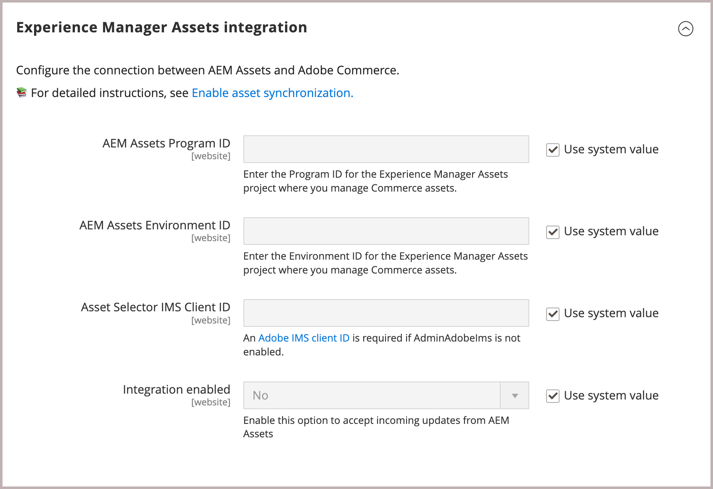
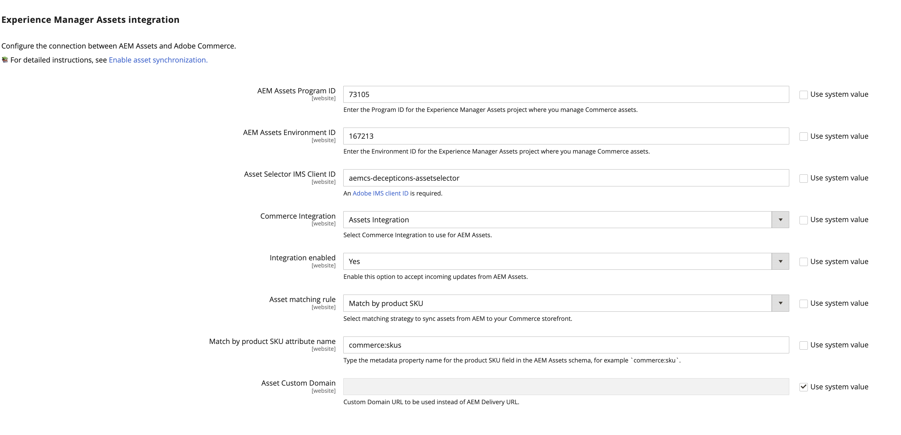

# Configure the integration

Configure the integration by connecting Commerce to the AEM Assets instance and selecting the matching strategy for asset synchronization.

After identifying the AEM Assets project, select the matching rule for synchronizing assets between Adobe Commerce and AEM Assets.

- **[!UICONTROL Match by product SKU]**—Default rule that matches the SKU in the asset metadata with the [Commerce product SKU](https://experienceleague.adobe.com/en/docs/commerce-operations/implementation-playbook/glossary#sku) to ensure that assets are associated with the correct products.

- **[!UICONTROL Custom match]**—Matching rule for more complex scenarios or specific business requirements that require custom matching logic. Implementing custom matching requires developing custom code in Adobe Developer App Builder to define how assets are matched with products. More details coming soon...

For the initial setup, use the default *Match by product sku* rule.

## Prerequisites

- [Install AEM Assets package](aem-assets-configure-aem.md)

- [Install Adobe Commerce packages](aem-assets-configure-commerce.md) to add the extension and generate the required credentials and connections to use the extension.

- Create a support ticket to request enablement for the AEM Assets for Commerce Integration. In the ticket, include the **[!UICONTROL Program ID]**, **[!UICONTROL Environment ID]** and **[!UICONTROL IMS Org ID]** for the AEM Assets Authoring environment that you want to connect to Commerce.

- Provide the **[!UICONTROL Asset Selector IMS Client ID]**. See [ImsAuthProps](https://experienceleague.adobe.com/en/docs/experience-manager-cloud-service/content/assets/manage/asset-selector/asset-selector-integration/integrate-asset-selector-adobe-app) in the *AEM Assets Selector* documentation.

## Configure the connection

1. Get the [AEM Assets Authoring Environment](https://experienceleague.adobe.com/en/docs/experience-manager-cloud-service/content/sites/authoring/quick-start) project and environment ID.

   1. Open the AEM Sites console and select **[!UICONTROL Assets]**.

   1. Copy and save the project and environment IDs from the URL: `https://author-p[Program ID]-e[EnvironmentID].adobeaemcloud.com/`
1. From the Commerce Admin, open the AEM Assets Integration configuration.

   1. Go to **[!UICONTROL Store]** > Configuration > **[!UICONTROL ADOBE SERVICES]** > **[!UICONTROL AEM Assets Integration]**.

      {width="600" zoomable="yes"}

1. Enter the AEM Assets environment **[!UICONTROL Program ID]** and **[!UICONTROL Environment ID]**.

   Edit the configuration values by removing the selection from *[!UICONTROL Use system value]*.

1. Enter the **[!UICONTROL Asset Selector IMS Client ID]**.

   The [Asset Selector IMS Client ID](https://experienceleague.adobe.com/en/docs/experience-manager-cloud-service/content/assets/manage/asset-selector/asset-selector-integration/integrate-asset-selector-adobe-app#ims-auth-props) is required by the [!UICONTROL Assets Selector], an AEM Assets feature that allows users to embed visual assets directly into Commerce product pages.

1. Select the [[!UICONTROL Commerce integration]](aem-assets-configure-commerce.md#add-the-integration-to-the-commerce-environment) for authenticating requests between Commerce and the asset matching service.

1. Set **[!UICONTROL Integration enabled]** to `Yes` to allow Commerce to accept incoming updates from AEM Assets.

   After enabling the integration, additional configuration options are available to specify asset matching criteria.

1. Define the matching rule for asset synchronization.

   1. Select **[!UICONTROL Match by product SKU]**, or **[!UICONTROL Custom match (Requires App Builder)]**.

   1. Add the [AEM Assets metadata field name](aem-assets-configure-aem.md#configure-metadata) defined for Commerce product SKUs in the **[!UICONTROL Match by product SKU attribute name]** field, `commerce:skus` for example.

1. Select **[!UICONTROL Save Config]** to apply updates and initiate asset synchronization.

   The configuration update triggers the initial synchronization process, allowing Commerce to accept incoming updates from AEM Assets. The time required for synchronization depends on the volume of assets and specific configurations. The integration leverages automated processes to minimize the time required for synchronization.

### Configure the Custom Domain URL

If a merchant sets a [Custom Domain Name](https://experienceleague.adobe.com/en/docs/experience-manager-cloud-service/content/implementing/using-cloud-manager/custom-domain-names/add-custom-domain-name){target=_blank} in their AEM dashboard, it is necessary to add this **Custom Domain URL** in Commerce, so the AEM Assets integration can use it.

1. Navigate to **[!UICONTROL Store]** > Configuration > **[!UICONTROL ADOBE SERVICES]** > **[!UICONTROL AEM Assets Integration]**.

      {width="600" zoomable="yes"}

1. Add the **Custom Domain URL** to the **[!UICONTROL Asset Custom Domain]** field.

1. Click **[!UICONTROL Save Config]** to apply updates and initiate asset synchronization.

## Next step

[Use AEM Assets with Commerce](aem-assets-manage.md)
