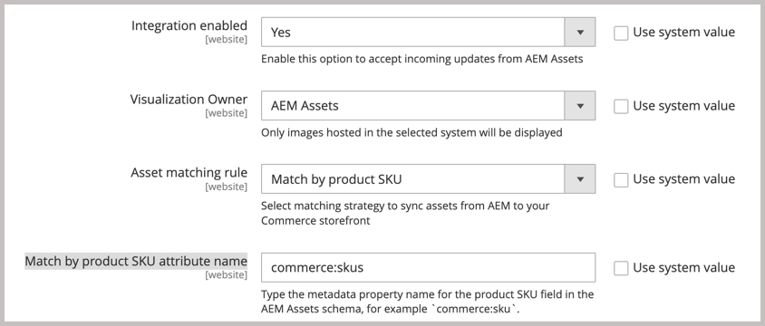

# Enable asset synchronization

During the enablement process, you register the tenant ID for the project using the program and environment ID for your AEM authoring environment. These IDs identify the AEM Assets project that you are connecting to, and provide the credentials to enable communication between the Commerce and AEM Assets environments.

After identifying the AEM assets project, you select the matching rule for synchronizing assets between Adobe Commerce and AEM Assets.

- **[!UICONTROL Match by product SKU]**—Default rule that matches the SKU in the asset metadata with the [Commerce product SKU](https://experienceleague.adobe.com/en/docs/commerce-operations/operational-playbook/glossary#sku) to ensure that assets are associated with the correct products.

- **[!UICONTROL Custom match]**—Matching rule for more complex scenarios or specific business requirements that require custom matching logic. Implementing custom matching requires developing custom code in Adobe Developer App Builder to define how assets are matched with products. More details coming soon...

For initial onboarding, use the default *Match by product sku* rule.

## Prerequisites

- [Configure AEM Experience Manager Assets to manage Commerce assets](#aem-assets-configure-aem)
- [Install and configure the AEM Assets Integration for Commerce](#aem-assets-configure-commerce.md) to add the extension and generate the required credentials and connections to use the extension.

## Configure the connection

1. Get the [AEM Assets Authoring Environment](https://experienceleague.adobe.com/en/docs/experience-manager-cloud-service/content/sites/authoring/quick-start) project and environment ID.

   1. Open the AEM Sites console and select **[!UICONTROL Assets]**.

   1. Copy and save the project and environment IDs from the URL: `https://author-p[Program ID]-e[EnvironmentID].adobeaemcloud.com/`|

1. From the Commerce Admin, open the AEM Assets Integration configuration.

   1. Go to **[!UICONTROL Store]** > Configuration > **[!UICONTROL CATALOG]** > **[!UICONTROL Catalog]**.

   1. Expand **[!UICONTROL Experience Manager Assets integration]**.

      {width="600" zoomable="yes"}

1. Enter the AEM Assets environment **[!UICONTROL Program ID]** and **[!UICONTROL Environment ID]**.

1. Select the [[!UICONTROL Commerce integration]](aem-assets-configure-commerce.md#add-the-integration-to-the-commerce-environment)** for authenticating requests between Commerce and the asset matching service.

1. Allow Commerce to accept incoming updates from AEM Assets by setting **[!UICONTROL Enable integration]** to `Yes`.

   After enabling the integration, configure the asset matching rule.

   {width="600" zoomable="yes"}

1. Define the matching rule for asset synchronization.

   1. Select **[!UICONTROL Match by product SKU]**.

   1. Add the [AEM Assets metadata field name](aem-assets-configure-aem.md#configure-metadata) defined for Commerce product SKUs in the **[!UICONTROL Match by product SKU attribute name]** field, `commerce:skus` for example.
      
     {width="600" zoomable="yes"}

1. Select **[!UICONTROL Save Config]** to apply updates and initiate asset synchronization
