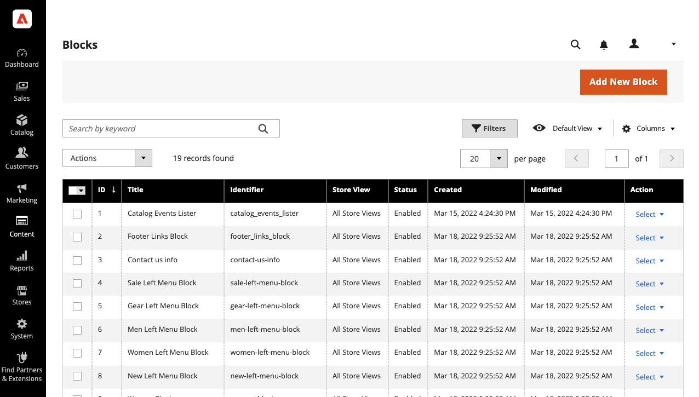
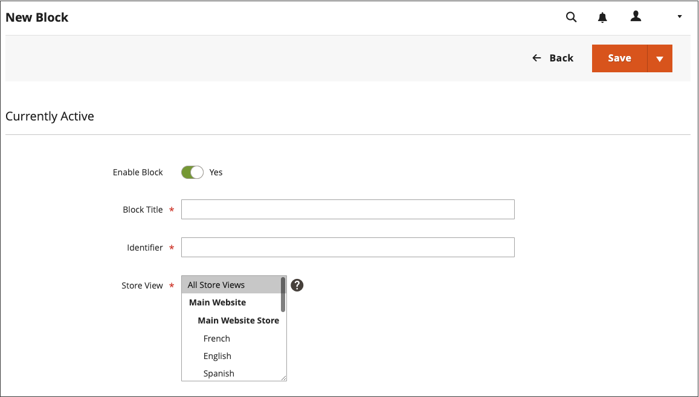
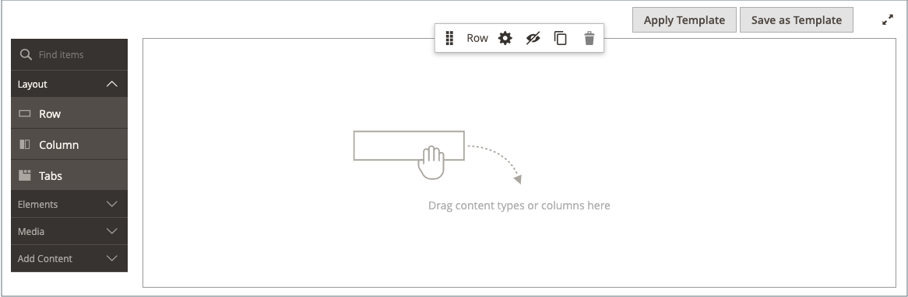
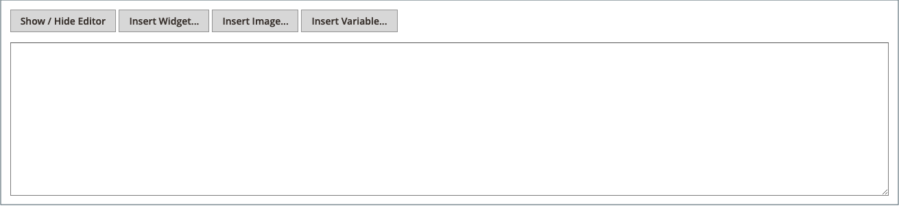
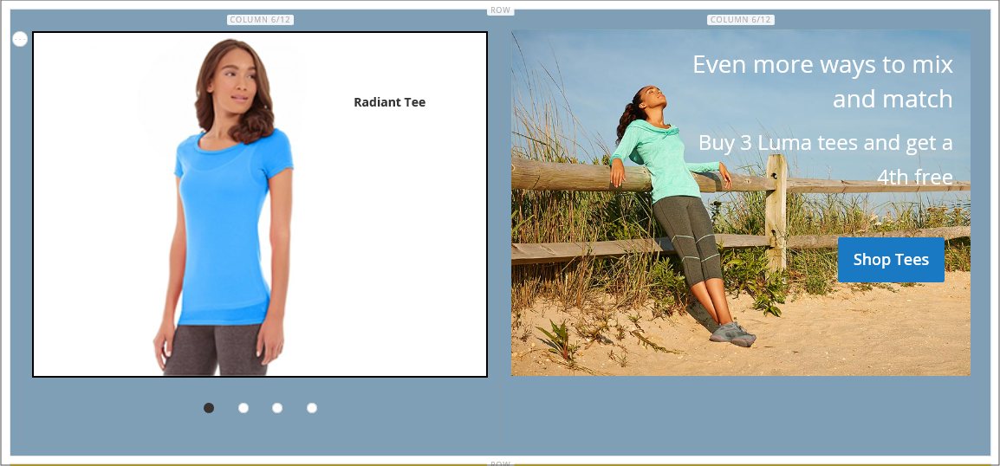
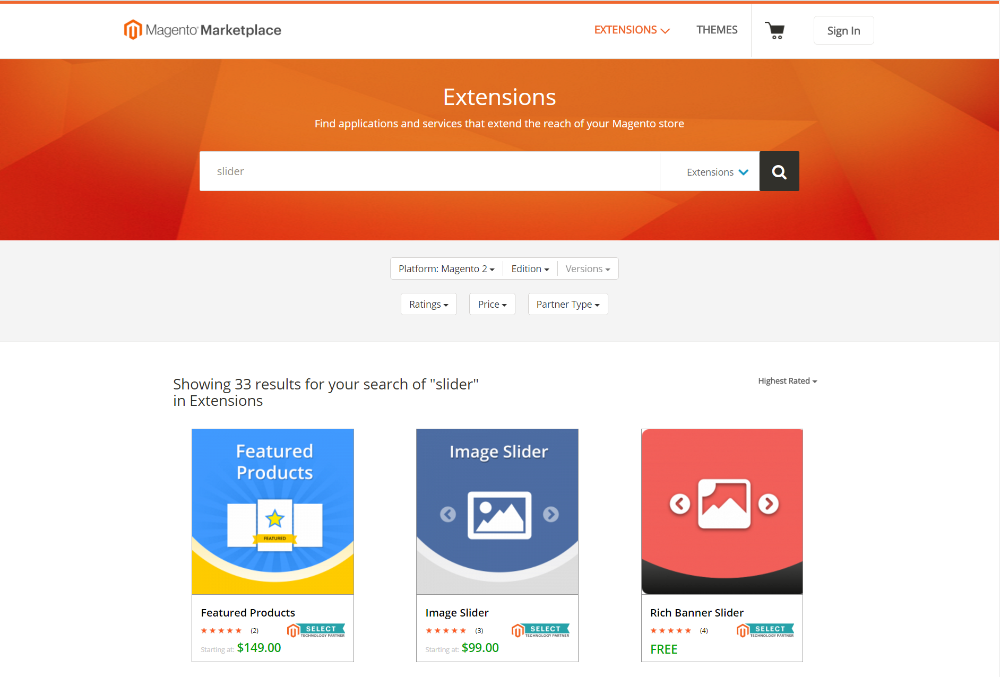

# Add Blocks

Custom blocks of content can be created, and then added to any page, group of pages, or even to another block. For example, you might place an image slider in a block, and then place the block on the home page. The Blocks workspace uses the same [basic controls](pages-workspace.md) as the _Pages_ workspace to help you find available blocks and perform routine maintenance. When the block is complete, you can use the [Widget](widget-static-block.md) tool to place it on specific pages in your store.

<!-- zoom -->

## Create a block

1. On the _Admin_ sidebar, go to **[!UICONTROL Content]** > _[!UICONTROL Elements]_ > **[!UICONTROL Blocks]**.

1. In the upper-right corner, click **Add New Block**.

   <!-- zoom -->
   _Block detail information_

1. If you want to change the default-enabled status of the new block, set **Enable Block** to `No`.

1. Assign a **Block Title** for internal reference.

1. Assign a unique **Identifier** for the block.

   Use all lowercase characters with underscores instead of spaces.

1. Select each **[!UICONTROL Store View]** where you want the block to be available.

1. Add the content for the block using the displayed content tool set:

   - If [Page Builder](../page-builder/introduction.md) is enabled, the content [workspace](../page-builder/workspace.md) includes the Page Builder tools.

      <!-- zoom -->

      >[!NOTE]
      >
      >For information about adding blocks with Page Builder, see [Tutorial 2: Blocks](../page-builder/2-blocks.md).

   - Use the [editor](editor.md) to format text, create links, and add tables, images, video, and audio.

      If you prefer to work with HTML code, click **Show / Hide Editor**.

      <!-- zoom -->

1. When complete, click the **[!UICONTROL Save]** arrow and choose **[!UICONTROL Save & Close]**.

   The new block appears at the bottom of the list in the Blocks grid.

1. Use the [Widget](widget-static-block.md) tool to place the completed block on a specific page in your store.

## Delete a block

There are two ways to remove created block. You can remove it from _Blocks_ grid, or from the edit block page.

### Method 1: Remove a block from the Blocks grid

1. On the _Admin_ sidebar, go to **[!UICONTROL Content]** > _[!UICONTROL Elements]_ > **[!UICONTROL Blocks]**.
1. Locate the blocks using filters above the grid and select the checkbox for one or more blocks to be deleted.
1. In the upper-left corner of the list, set **[!UICONTROL Actions]** to `Delete`.
1. To confirm the action, click **[!UICONTROL OK]**.

### Method 2: Remove a block from the edit page

1. On the _Admin_ sidebar, go to **[!UICONTROL Content]** > _[!UICONTROL Elements]_ > **[!UICONTROL Blocks]**.
1. Find the block to be deleted.
1. In the _Actions_ column for the block, click **[!UICONTROL Select]** and choose **[!UICONTROL Edit]**.
1. In the menu bar, click **[!UICONTROL Delete Block]**.
1. To confirm the action, click **[!UICONTROL OK]**.

## Save menu

| Command | Description |
|----------|----------- |
| [!UICONTROL Save] | Save the current block and continue working. |
| [!UICONTROL Save & Duplicate] | Save and close the current block, and open a new duplicate copy. |
| [!UICONTROL Save & Close] | Save and close the current block, and return to the Blocks grid. |

{style="table-layout:auto"}

## Add a lightbox or slider

- It is easy to add a [slider](../page-builder/slider.md) to your store with [[!DNL Page Builder]](../page-builder/introduction.md). The slider can be set to play automatically, or controlled manually with navigation buttons.

   <!-- zoom -->

   There is also a wide assortment of jQuery-based image lightboxes available on [[!DNL Commerce Marketplace]][1], and some are free.

- You can also download an extension from [!DNL Commerce Marketplace]. For additional help, see the documentation provided by the extension developer.

   <!-- zoom -->

[1]: https://marketplace.magento.com/extensions.html?q=lightbox
