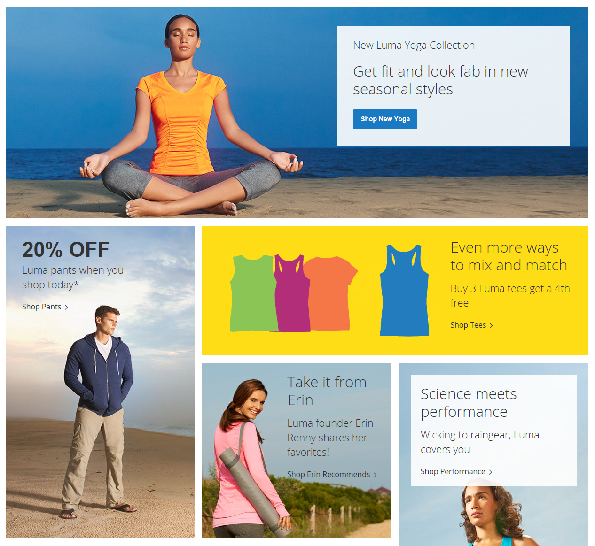

# Content blocks

A _block_ is a modular unit of content that can be positioned most anywhere on the page. Content blocks are sometimes referred to as _static blocks_, or _CMS blocks_. They can be used to display fixed information such as text, images, and embedded video, and dynamic information that is provided by a widget or originates in a database or other source. Most elements on the home page are blocks that can be easily managed.

You can create custom blocks of content without writing any code, and assign them to appear in a specific place in the page layout. Blocks can be positioned using the [widget](widget-static-block.md) tool or by composing a [layout update](layout-updates.md) in XML and saving it on the server. For more information about using layout updates, see the [Layout][1] information in the _Frontend Developer Guide_.

{width="600" zoomable="yes"}

## Static and dynamic blocks demo

Learn about static and [dynamic blocks](dynamic-blocks.md) by watching this video:

>[!VIDEO](https://video.tv.adobe.com/v/343783?quality=12&learn=on)

[1]: https://developer.adobe.com/commerce/frontend-core/guide/layouts/
