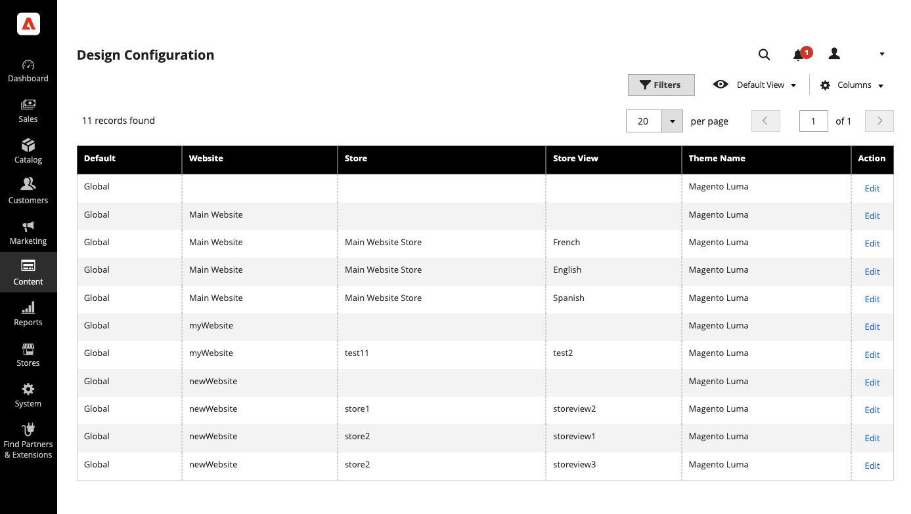
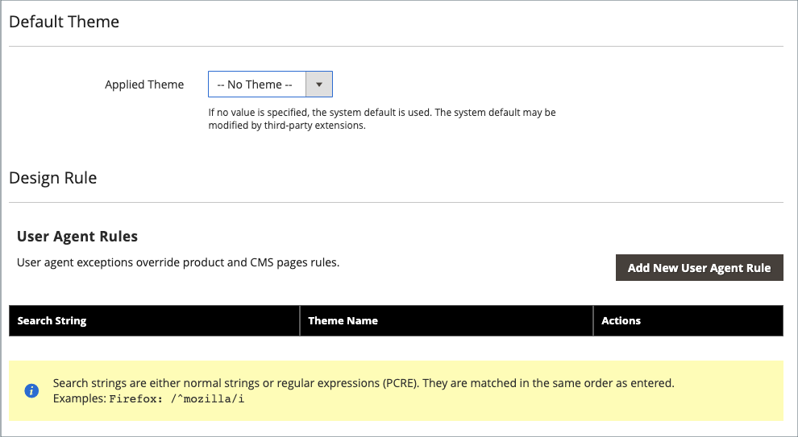
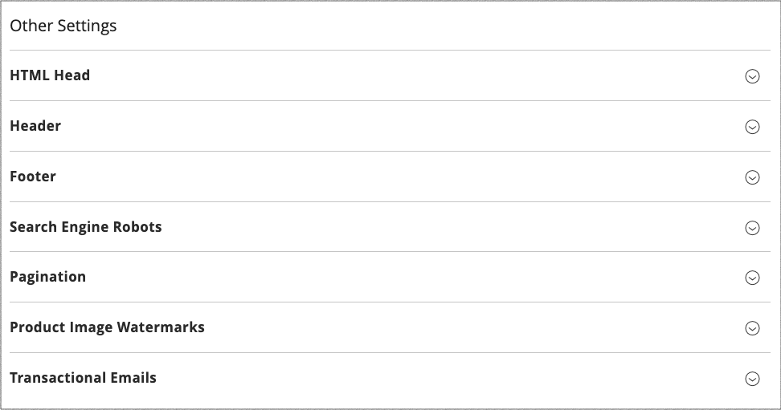

# Design configuration

The Design configuration makes it easy to edit design-related rules and configuration settings by displaying the settings on a single page.

{width="700" zoomable="yes"}

## Change the design configuration

1. On the _Admin_ sidebar, go to **[!UICONTROL Content]** > _[!UICONTROL Design]_ > **[!UICONTROL Configuration]**.

1. Find the store view that you want to configure and click **[!UICONTROL Edit]** in the _[!UICONTROL Action]_ column.

   The page displays the current design settings for the store view.

1. To change the default theme, set **[!UICONTROL Applied Theme]** to the theme that you want to apply to the view.

   If no theme is specified, the system default theme is used. Some third-party extensions modify the system default theme.

1. If the theme is to be used for only a specific device, set the **[!UICONTROL User Agent Rules]**.

   {width="400" zoomable="yes"}

   For each device type where you want to specify a theme:

   - Click **[!UICONTROL Add New User Agent Rule]**.

   - For **[!UICONTROL Search String]**, enter the browser ID for the specific device.

      A search string can be either a normal expression or Perl Compatible Regular Expression (PCRE) (see [User Agent](https://en.wikipedia.org/wiki/User_agent) for more information). The following search string identifies Firefox:

            /^mozilla/i

   - For **[!UICONTROL Theme Name]**, choose the theme to be used for the specified device.

   >[!NOTE]
   >
   >You can add as many rules for the devices you want to designate. The search strings are matched in the order that they are entered.

1. Under _[!UICONTROL Other Settings]_, expand each section and follow the instructions in the linked topics to edit the settings as needed.

   - [[!UICONTROL Pagination]](../catalog/navigation-product-listings.md#pagination-controls)
   - [[!UICONTROL HTML Head]](page-setup.md#html-head)
   - [[!UICONTROL Header]](page-setup.md#header)
   - [[!UICONTROL Footer]](page-setup.md#footer)
   - [[!UICONTROL Search Engine Robots]](../merchandising-promotions/seo-overview.md#search-engine-robots)
   - [[!UICONTROL Product Image Watermarks]](../catalog/product-image.md#watermarks)
   - [[!UICONTROL Transactional Emails]](../systems/email-templates.md#configure-email-templates)

   {width="500" zoomable="yes"}

1. When complete, click **[!UICONTROL Save Configuration]**.
