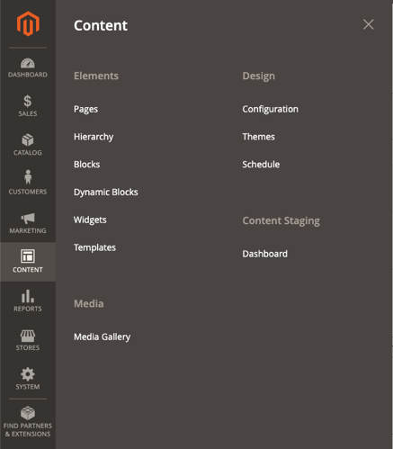

# Content Menu

The term _content marketing_ refers to the art of promoting your products or services by providing valuable information to your customers at no charge. The quality of your content helps distinguish your store from others, increases your visibility to search engines, and provides support to your customers. This soft-sell approach is often more effective than advertising, builds credibility and trust, and can turn your store into a destination. Content is still king.

Your content should reflect the branding of your store, and be delivered with your distinctive visual presentation and voice to convey your message. Use pictures to tell a story. Educate, inspire, and entertain. Keep in mind that with quality content, sometimes less is more.

<!-- zoom -->
_Content menu_

>[!NOTE]
>
>When the new [Media Gallery](media-gallery.md) is enabled, the _Media_ section appears with a single option to access the Media Gallery. You can set the **Enable Old Media Gallery** option to `No` by going to **Stores** > _Settings_ > **Configuration** and choosing **Advanced** > **System** in the left panel.

## Display the Content menu

On the _Admin_ sidebar, choose **Content**.

## Elements

- Create [pages](pages.md) with text, images, blocks, variables, and widgets, that can be incorporated into the navigation of your store and can be linked to other pages.
-  (Adobe Commerce only) Organize your pages into a [hierarchy](page-hierarchy.md) with navigation.
- Create [blocks](blocks.md) of content without writing any code. Blocks can contain text, images, and even video, and can be assigned to any part of the page layout.
-  (Adobe Commerce only) Create [dynamic blocks](dynamic-blocks.md) to incorporate rich, interactive content that is driven by logic from [price rules](https://docs.magento.com/user-guide/marketing/promotions.html) and [customer segments](https://docs.magento.com/user-guide/marketing/customer-segments.html).
- Create [widgets](widgets.md) to display dynamic data and add blocks, links, and interactive elements most anywhere in your store.
- Create [templates](../page-builder/templates.md) from your Page Builder content to save time and effort when creating new content (or replacing older content).

>[!NOTE]
>
>The _Banners_ option in this menu was deprecated in 2.3.1 and is now removed. Its functionality is replaced by Dynamic Blocks.

## Design

Manage the visual presentation of your store:

- Set the [Design configuration](configuration.md) to maintain different settings for each website, store, and view in your Commerce installation.

- Use [themes](themes.md), which are collections of layout files, template files, translation files, and skins, to determine the visual presentation of your store.

- Use the [schedule](schedule.md) to plan theme changes in advance for a season or promotion.

## Content Staging

{{ee-feature}}

[Content Staging](content-staging.md) gives your business team the ability to easily create, preview, and schedule a wide range of content updates directly from the Admin of your store.
