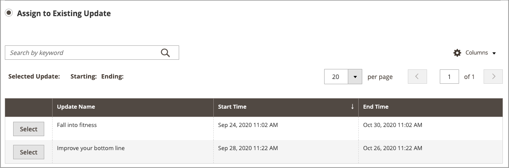
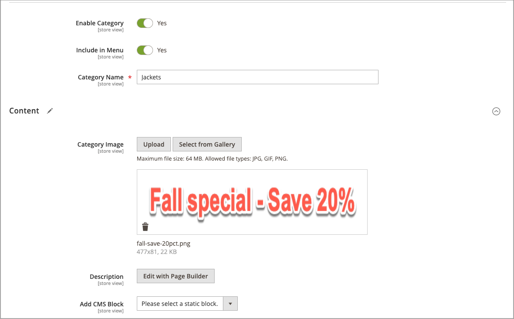
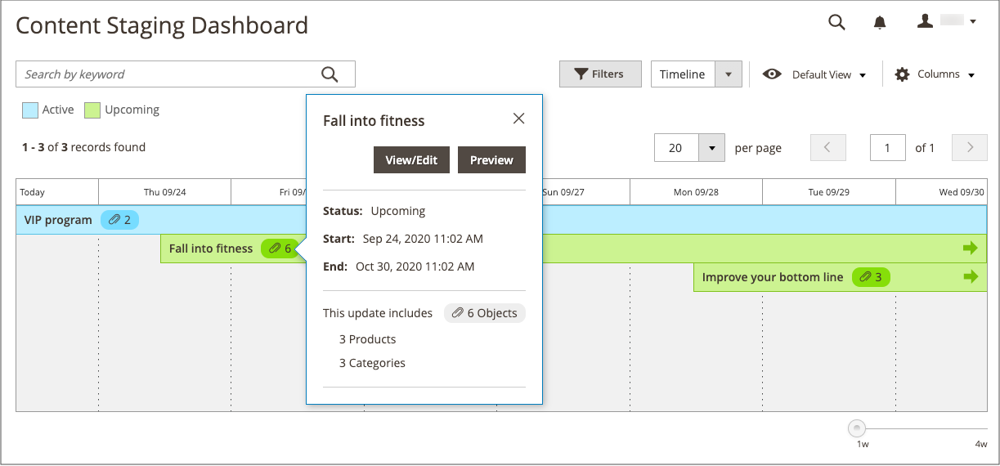
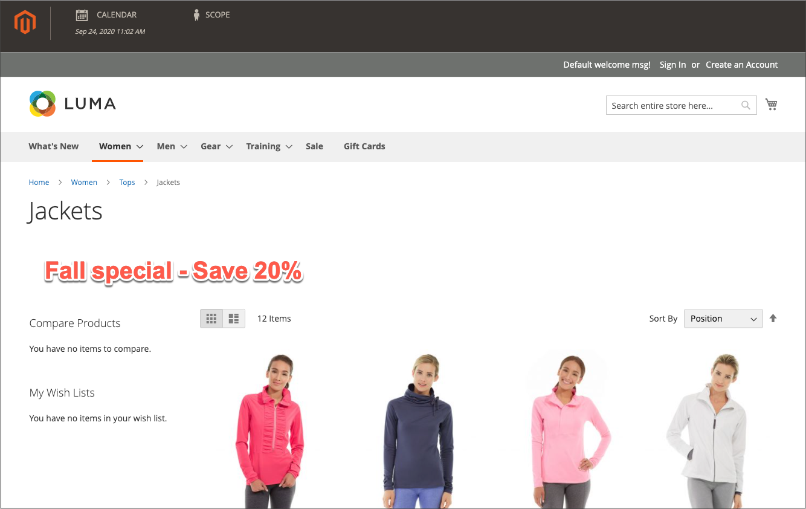

# Add an Item to a Campaign

{{ee-feature}}

The following example adds a promotional image to the category page for the duration of the campaign. You can also do the same for a product page or CMS page.

## Add the campaign item for a category

1. On the _Admin_ sidebar, go to **[!UICONTROL Catalog]** > **[!UICONTROL Categories]**.

1. Locate the category you want use in the campaign and open it in edit mode.

1. Click **[!UICONTROL Schedule New Update]**.

1. Select **[!UICONTROL Assign to Existing Campaign]**.

1. In the list, select the campaign to be modified.

   {width="600" zoomable="yes"}

1. Expand  **[!UICONTROL Content]**.

1. For **[!UICONTROL Category Image]**, click **[!UICONTROL Upload]** and select the image to be displayed on the category page during the campaign.

   {width="600" zoomable="yes"}

1. When complete, click **[!UICONTROL Save]**.

## Validate the item

1. On the _Admin_ sidebar, go to  **[!UICONTROL Content]** > _[!UICONTROL Content Staging]_ > **[!UICONTROL Dashboard]**.

1. Find the campaign in the displayed list or timeline and open it to access the details:

   - For a list display, click **[!UICONTROL Select]** and then **[!UICONTROL View/Edit]** in the _[!UICONTROL Action]_ column.
   - For a timeline display, click once to display the summary and then click **[!UICONTROL View/Edit]**.

   {width="600" zoomable="yes"}

1. Expand  **[!UICONTROL Categories]** to view the list of assigned categories.

1. Return to the dashboard, click the campaign again, and then click **[!UICONTROL Preview]** to review the pages for the category when the campaign is active.

   {width="600" zoomable="yes"}
