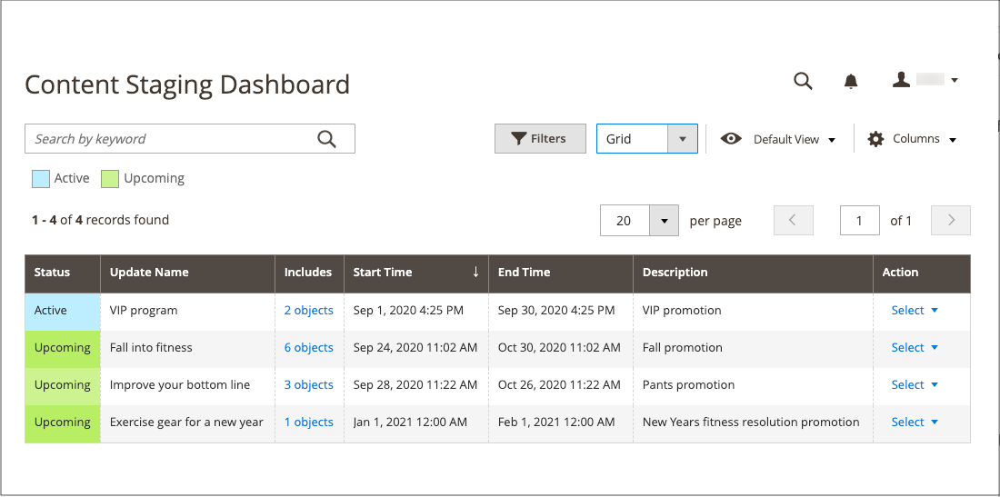
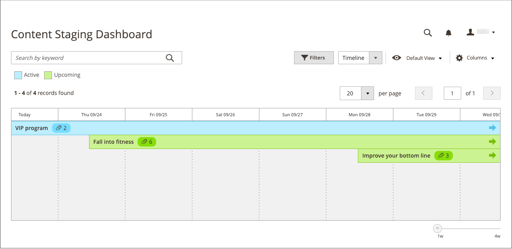
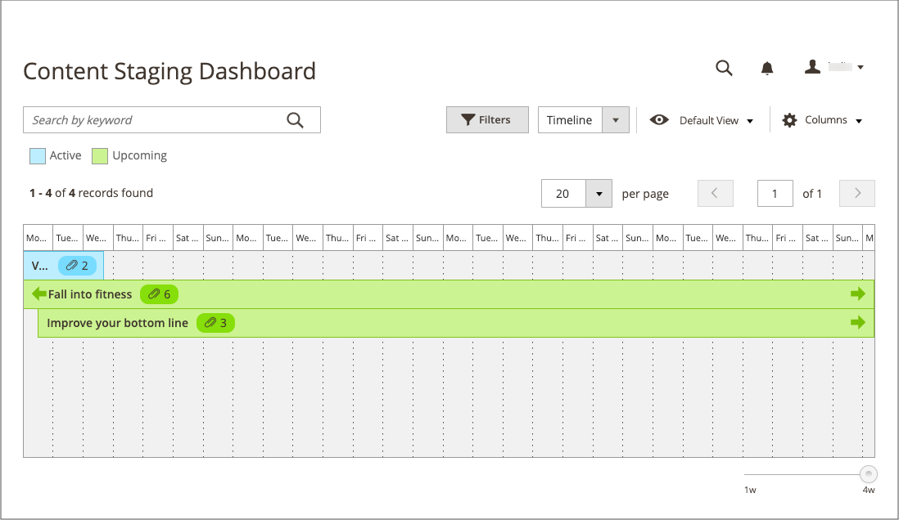
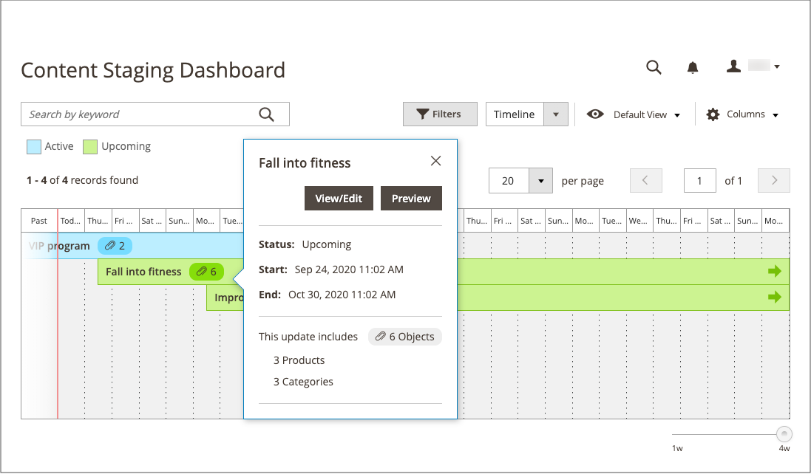
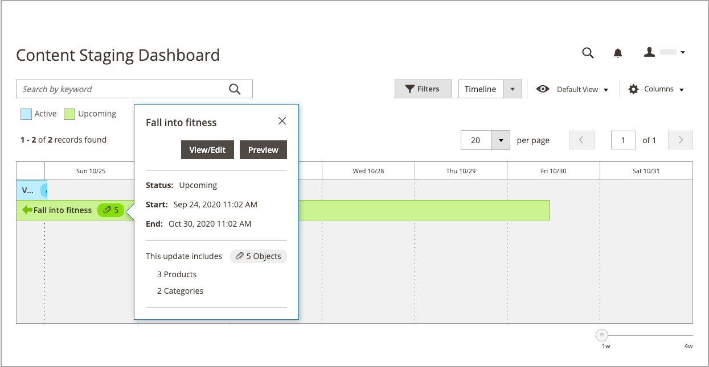
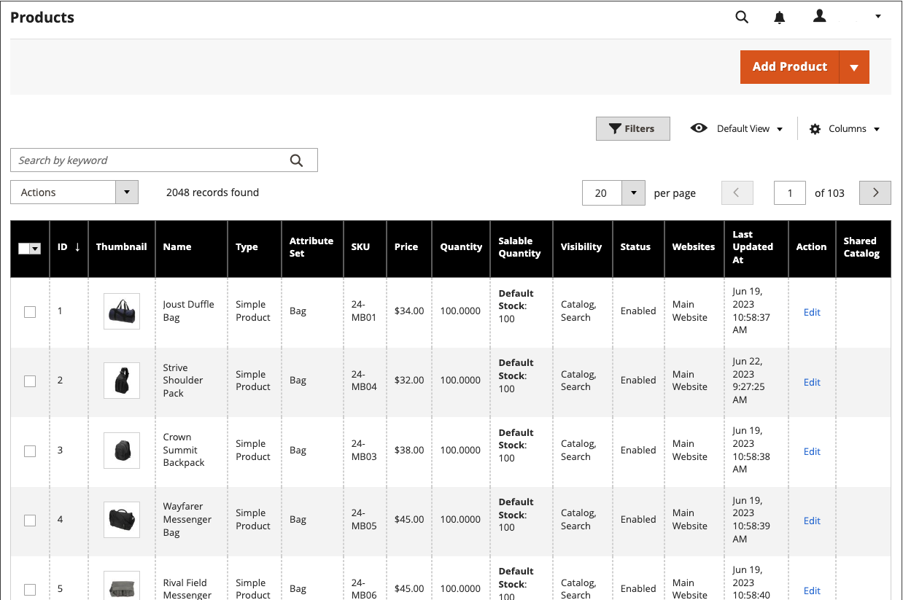

# Content Staging Dashboard

{{ee-feature}}

The [!UICONTROL Content Staging] Dashboard provides an overview of all active and upcoming campaigns. The format of the dashboard can be changed from a grid to a timeline. You can also use filters to find campaigns, customize the column layout, and save different views of the grid. For more information about the workspace controls, see [Admin Workspace](https://docs.magento.com/user-guide/stores/admin-workspace.html).

<!-- zoom -->

## View the staging dashboard

1. On the _Admin_ sidebar, go to  **[!UICONTROL Content]** > _[!UICONTROL Content Staging]_ > **[!UICONTROL Dashboard]**.

1. To change the format of the dashboard, set the **[!UICONTROL View As]** control to `list`, `Grid`, or `Timeline`.

   <!-- zoom -->

   When the timeline is displayed, the slider in the lower-right corner can be used to adjust the view from one to four weeks. Each column represents one day.

1. If the timeline is displayed, drag the slider to the `4w` position on the far right to view a longer span of time.

   <!-- zoom -->

1. Click any item on the page to display general information about the campaign.

   - To open the campaign, click **[!UICONTROL View/Edit]**.

   - To see how the campaign will look to customers in the store on that day, click **[!UICONTROL Preview]**.

   <!-- zoom -->

## Staging dashboard column descriptions

|Column|Description|
|--- |--- |
|[!UICONTROL Status]|Campaign's status. `Active` or `Upcoming`.|
|[!UICONTROL Update Name]|The name of the campaign.|
|[!UICONTROL Includes]|Defines how many objects are included in the campaign.|
|[!UICONTROL Start Time]|The date when the campaign starts.|
|[!UICONTROL End Time]|The date when the campaign ends.|
|[!UICONTROL Description]|Additional description of each campaign.|
|[!UICONTROL Action]|The actions that can be applied to an individual record include: **[!UICONTROL View/Edit]** - Opens the campaign in edit mode. **[!UICONTROL Preview]** - Displays the campaign in preview mode.|

{style="table-layout:auto"}

## Edit a Campaign

Existing campaign objects can be edited from the staging dashboard, with the exception of price rule campaigns that do not have end dates.

>[!NOTE]
>
>If a campaign that includes a price rule is initially created without an end date, the campaign cannot be edited later to include an end date. In such a case, it is necessary to create a duplicate campaign and enter the end date that is needed.

<!-- zoom -->

The campaign in this example includes two categories and three individual products.

Follow the steps below to edit any of the objects in this campaign.

1. On the _Admin_ sidebar, go to  **[!UICONTROL Content]** > _[!UICONTROL Content Staging]_ > **[!UICONTROL Dashboard]**.

1. Find the campaign in the displayed list or timeline and open it to access the details:

   - For a list display, click **[!UICONTROL Select]** and then **[!UICONTROL View/Edit]** in the _[!UICONTROL Action]_ column.
   - For a timeline display, click once to display the summary and then click **[!UICONTROL View/Edit]**.

1. Update any of the settings in the _[!UICONTROL General]_ section as needed.

1. Expand  any section that contains an item to be edited.

   <!-- zoom -->

1. Click **[!UICONTROL Save]**.
