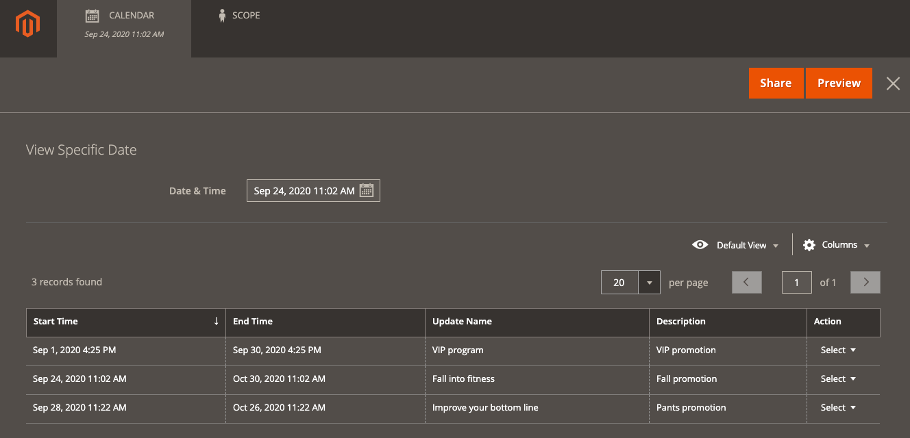
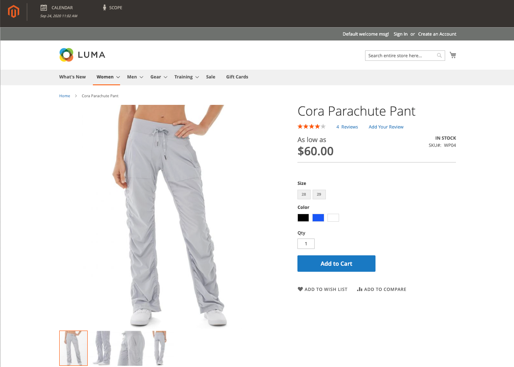
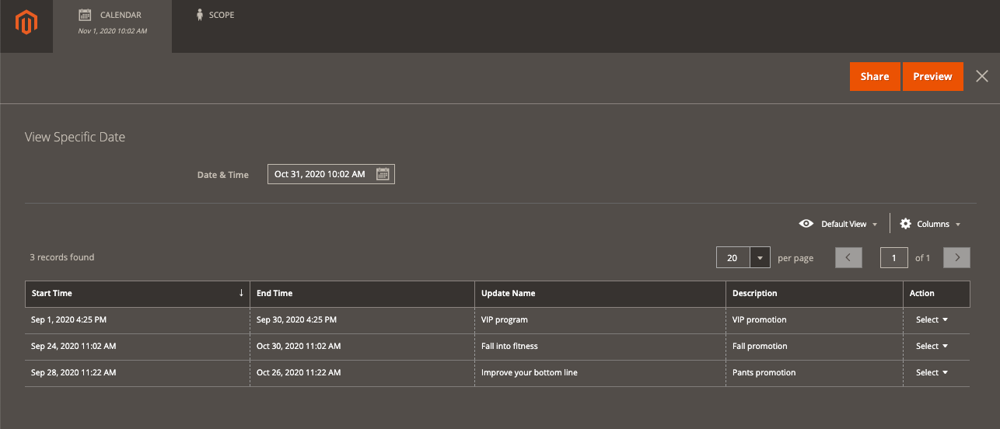

# Preview a Campaign

{{ee-feature}}

Any day or period of time during a campaign can be previewed and shared with others.

<!-- zoom -->

1. Use one of these methods to open a preview window:

   - _From the Content Staging Dashboard_

      - On the _Admin_ sidebar, go to  **Content** > _Content Staging_ > **Dashboard**.
      - Click any item on the page to display summary information about the campaign, and then click **Preview**.

   - _From any page with scheduled changes_

      - Open any page with a _Scheduled Changes_ box at the top.
      - Click **Preview**.

   The preview opens in a new browser tab and shows how the product will appear during the scheduled campaign.

   <!-- zoom -->

1. In the upper-left corner of the preview window, click **Calendar**.

   The calendar detail shows other campaigns that are scheduled for the same day. Each record in the list is a separate campaign.

   <!-- zoom -->

1. Preview a specific day or time:

   - Click the **Date & Time** calendar ().

   - Choose a different date and/or time.

   - Click **Preview**.

1. Change the scope of the preview for a different store view:

   - In the header of the preview page, click **Scope**.

   - Choose the website, store, or store view that you want to preview.

>[!NOTE]
>
>Previews always start from the **default** store view which emulates the customer's experience of navigating through the campaign. Single-stage campaigns may include changes that affect multiple store views and websites. Ensure that these views/websites display the campaign properly.

1. Share a link to the preview:

   - Click **Share** and copy the link to the clipboard.

   - Paste the link into the body of an email message.

      >[!NOTE]
      >
      >An Admin user account is required to see a shared preview. If you have permissions to [create a new Admin user account](https://docs.magento.com/user-guide/system/permissions-users-all.html), you must create the account for a new user before the sharing.

1. To return to the campaign calendar, click **Calendar** in the header of the Preview page.
