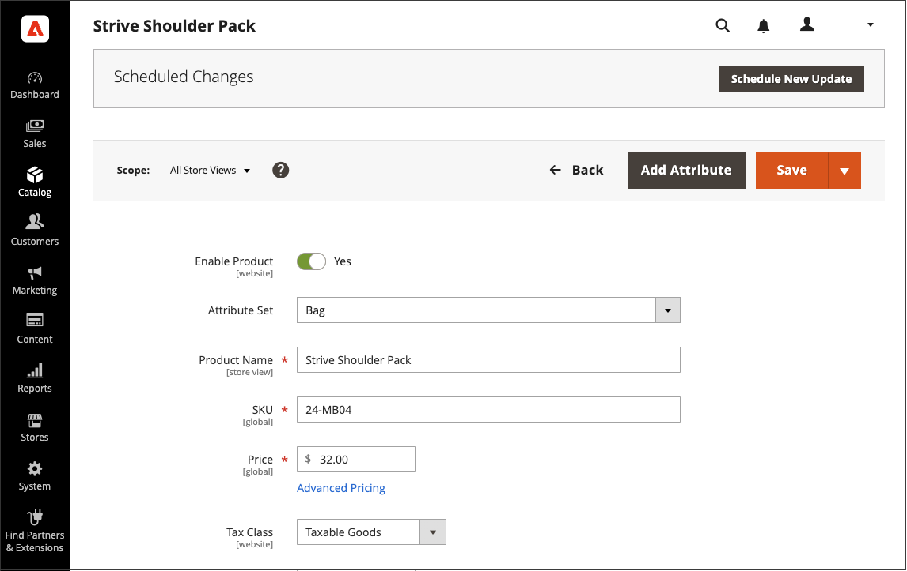
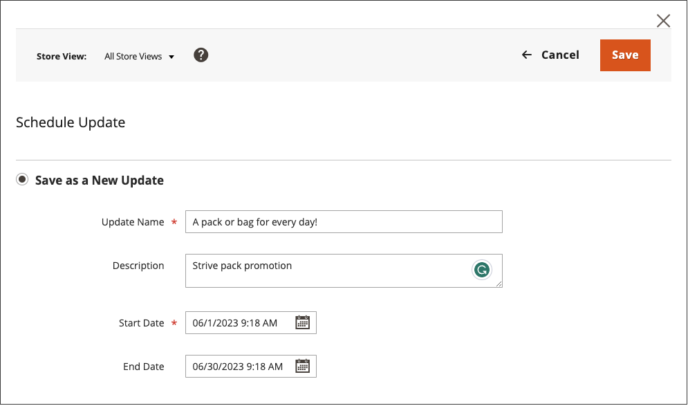
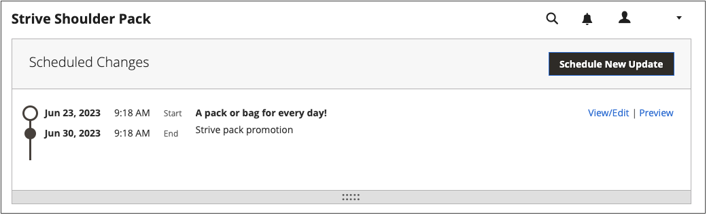

# Schedule a content update

{{ee-feature}}

The following example shows how to schedule a temporary price change for a product. It includes scheduling and previewing changes, and viewing scheduled updates on the calendar. Although this example includes only a single change, a campaign might include multiple changes to products, price rules, CMS pages, and other entities that are scheduled to take place at the same time. Follow a similar method to specify the from/to dates for the [!UICONTROL Set Product As New] attribute.

>[!NOTE]
>You must create a scheduled update to specify a Start (and End) date for [!UICONTROL Set Product As New]. For [!UICONTROL Special Price] and [!UICONTROL Design Change], the from/to date fields are removed from Adobe Commerce and available in Magento Open Source only. 
>
>All scheduled updates are applied consecutively, which means that any entity can have only one scheduled update at one time. Any scheduled update is applied to all store views within its time frame. As a result, an entity cannot have a different scheduled update for different store views at the same time. All entity attribute values within all store views, which are not affected by the current scheduled update, are taken from the default values, and not from the previous scheduled update.

## Schedule an update to a product

1. From the _[!UICONTROL Products]_ grid, open a product in edit mode.

1. In the _[!UICONTROL Scheduled Changes]_ box at the top of the page, click **[!UICONTROL Schedule New Update]**.

   {width="600" zoomable="yes"}

1. With the **[!UICONTROL Save as a New Update]** option selected, Set the basic parameters for the update:

   - For **[!UICONTROL Update Name]**, enter a name for the new content staging campaign.

   - Enter a brief **[!UICONTROL Description]** of the update and how it is to be used.

   - Use the Calendar () tool to choose the **Start Date** and **End Date** for the campaign.

      To create an open-ended campaign, do not specify an end date (leave blank). For this example, the campaign is scheduled to begin at the stroke of midnight for the new year, January 1, 2021 at 12:00 AM PST.

      
      For a price rule campaign that was created without an end date, an end date cannot be added later. In such a case, it is necessary to create a campaign and set the start date to the date you want the old campaign to end and the new one to start. On that start date, the old campaign ends and the new campaign begin as defined.

      {width="600" zoomable="yes"}

      >[!NOTE]
      >
      >Campaign start date and end date must be defined by using the **_default_** Admin time zone, which is converted from the local time zone of each website. For example, when you have multiple websites in different time zones, but you want to start a campaign based on a US (default) time zone, you must schedule a separate update for each local time zone. In this case, set **[!UICONTROL Start Date]** and **[!UICONTROL End Date]** as converted from each local website time zone to the default Admin time zone.

1. Scroll down to _[!UICONTROL Price]_ and click **[!UICONTROL Advanced Pricing]**.

1. Enter a **[!UICONTROL Special Price]** for the product during the scheduled campaign and click **[!UICONTROL Done]**.

1. When complete, click **[!UICONTROL Save]**.

   The scheduled change appears at the top of the product page, with the start and end dates of the campaign.

   {width="600" zoomable="yes"}

## Edit the scheduled change

1. In the _Scheduled Changes_ box at the top of the page, click **[!UICONTROL View/Edit]**.

1. Make any changes necessary to the scheduled update.

1. Click **[!UICONTROL Save]**.

## Preview the scheduled change

In the _Scheduled Changes_ box at the top of the page, click **[!UICONTROL Preview]**.

The preview opens a new browser tab, and shows how the product appears during the scheduled campaign.

>[!NOTE]
>
>A staging preview for a scheduled update always starts from the **default** store view, which emulates the customer's experience of navigating through the staging update campaign.

For more information about using the preview content tools to change the date and scope of the preview, see [Previewing a Campaign](content-staging-preview.md). You can also share a link to the store preview with your colleagues.
