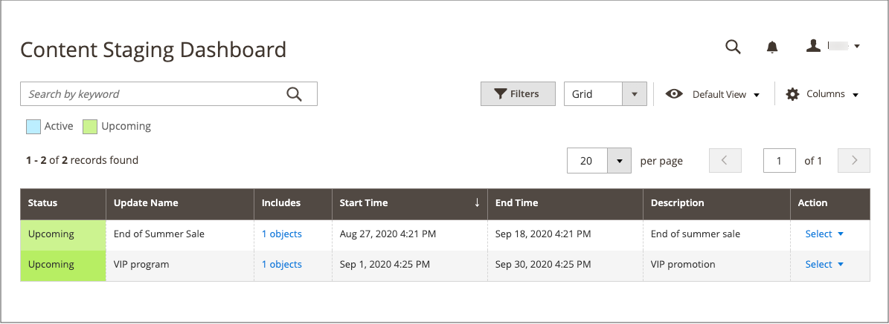

# Content staging

{{ee-feature}}

Content staging gives your business team the ability to easily create, preview, and schedule a wide range of content updates for your store directly from the _Admin_. For example, rather than thinking in terms of a static page, consider a page to be a collection of different elements that can be turned _on_ or _off_ based on a schedule. You can use content staging to create a page that changes automatically throughout the year on a schedule.

The term _campaign_ refers to the record of a scheduled change, or a collection of changes that are managed from the Staging Dashboard. The changes can be viewed on a calendar or timeline. The terms _scheduled change_ and _scheduled update_ are interchangeable and refer to a single change.

When you schedule a content change for a specific time period, the content reverts to the previous version when the scheduled change expires. You can create multiple versions of the same baseline content to be used for future updates. You can also step back through the timeline to view previous versions of the content. To save a draft version, simply assign a date on the timeline that is so far into the future that it never goes into production.

## Content staging objects and campaigns

Fields related to the Start Date and End Date have been removed from Adobe Commerce and cannot be modified directly on the cart price rule, catalog price rule, product, category, and CMS page. You must create a scheduled update for these activations.

All scheduled updates are applied consecutively, which means that any entity can have only one scheduled update at one time. Any scheduled update is applied to all store views within its time frame. As a result, an entity cannot have a different scheduled update for different store views at the same time. All entity attribute values within all store views, which are not affected by the current scheduled update, are taken from the default values, and not from the previous scheduled update.

When a new scheduled update is created for any of the following objects, a corresponding campaign is created as a placeholder, and the _[!UICONTROL Scheduled Changes]_ box appears across the top of the page. The placeholder campaign has a start date, but not an end date. You can schedule updates to the content as part of a campaign, and then preview and share the changes by date, time, or store view. After a new campaign is created for one object, you can assign it as a scheduled update for other objects.

- [Products](../catalog/product-scheduled-changes.md)
- [Categories](../catalog/category-scheduled-changes.md)
- [Catalog Price Rules](../merchandising-promotions/price-rule-catalog-scheduled-changes.md)
- [Cart Price Rules](../merchandising-promotions/price-rule-cart-scheduled-changes.md)
- [CMS Pages](pages-workspace.md#scheduled-changes)
- [CMS Blocks](blocks.md)

## Content staging workflow

1. **Create the baseline content**
 
   The baseline is the content of an asset without a campaign and includes everything below the _[!UICONTROL Scheduled Changes]_ section at the top of the page. The baseline content is always used, unless there is an active campaign with changes scheduled for that place on the timeline.

1. **Create the first campaign**

   Create your first campaign with the start and end dates as needed. To make the campaign open-ended, leave the end date blank. When the first campaign ends, the original baseline content is restored.

   Campaign Start Date and End Date must be defined by using the **_default_** Admin time zone, which is converted from the local time zone of each website. Consider an example where you have multiple websites in different time zones, but you want to start a campaign based on a US time zone. In this case, you must schedule a separate update for each local time zone, and set **[!UICONTROL Start Date]** and **[!UICONTROL End Date]** in converted from each local website time zone to the default Admin time zone.

1. **Add a second campaign**

   Create the second campaign, with the start and end dates as needed. The second campaign can be assigned to an entirely different time period. When creating multiple campaigns for the same asset, the campaigns cannot overlap. You can create as many campaigns as needed.

   Multiple assets can be assigned to an existing campaign that has not started yet. For example, two different product prices can be updated in the scope of the same campaign with a future start date.

   >[!NOTE]
   >
   >If a campaign is linked to more than one entity, the campaign can be edited only from the [Content Staging Dashboard](content-staging-dashboard.md).

1. **Restore the baseline content**

   If all campaigns have end dates, the baseline content is restored whenever all active campaigns end.

   >[!NOTE]
   >
   >If an active campaign is initially created without an end date, the campaign cannot be edited later to include an end date. In such a case, it is necessary to create a duplicate campaign and enter the end date that is needed.

>[!NOTE]
>
>While a staging update is active for an entity, editing the entity is editing the current active staging update. It does not affect the baseline content, which is restored when the staging update ends.

## [!UICONTROL Content Staging] dashboard

The [!UICONTROL Content Staging] [dashboard](content-staging-dashboard.md) provides visibility into all planned site changes and updates. Any day, range of dates, or time period of a campaign can be previewed, and shared with others.

{width="600" zoomable="yes"}

## Content staging demo

To learn about content staging, watch this video:

>[!VIDEO](https://video.tv.adobe.com/v/343784?quality=12&learn=on)

## Troubleshooting resources

For help with troubleshooting content staging issues, see the following [!DNL Commerce] Support Knowledge Base articles:

- [Error 404 on all pages due to content staging issue](https://experienceleague.adobe.com/docs/commerce-knowledge-base/kb/troubleshooting/site-down-or-unresponsive/error-404-on-all-pages-due-to-content-staging-issue.html)
- [Scheduled Content Staging updates not displayed with stale Fastly cache](https://experienceleague.adobe.com/docs/commerce-knowledge-base/kb/troubleshooting/miscellaneous/scheduled-content-staging-updates-not-displayed-with-stale-fastly-cache.html)
- [Can I schedule Content Staging updates for prices in a shared catalog?](https://experienceleague.adobe.com/docs/commerce-knowledge-base/kb/faq/can-i-schedule-content-staging-updates-for-prices-in-a-shared-catalog.html)
