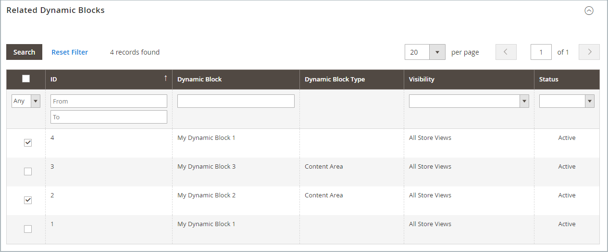
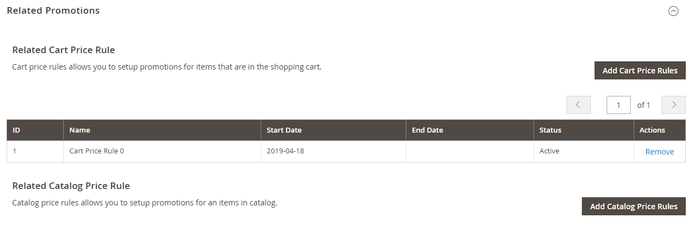
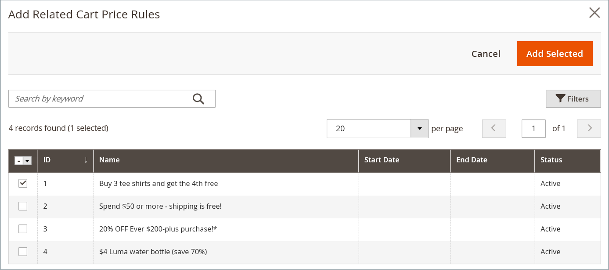

# Dynamic Blocks in Cart Price Rules Powered by Real-Time CDP Audiences

{{ee-feature}}

Any [dynamic block](dynamic-blocks.md) that you create can be associated with a promotion. To make the association, you must first create both the dynamic block and the [cart price rule](../merchandising-promotions/customer-segment-rtcdp-cart-price-rule.md). The association can be made while working on a cart price rule or when working on a dynamic block.

>[!IMPORTANT]
>
>After you create this association, the dynamic block is displayed **only** when the rule fires. If the promotion is targeted to segment A, the block is displayed to segment A. If the promotion is not active, the block is not displayed.

## Associate a dynamic block with a cart price rule

1. On the _Admin_ sidebar, go to **[!UICONTROL Marketing]** > _[!UICONTROL Promotions]_ and choose one of the following:

   - **[!UICONTROL Catalog Price Rules]**
   - **[!UICONTROL Cart Price Rules]**

1. In the grid, find the rule that you want to associate with the dynamic block and open in edit mode.

1. Scroll down and expand  **[!UICONTROL Related Dynamic Blocks]**.

1. In the first column, set the filter to `Any` and click **[!UICONTROL Reset Filter]**.

   The grid now lists all available dynamic blocks.

1. Select the checkbox of each dynamic block that you want to associate with the rule.

   <!-- zoom -->

1. When complete, click **[!UICONTROL Save]**.

## Associate a cart price rule with a dynamic block

1. On the _Admin_ sidebar, go to **[!UICONTROL Content]** > _[!UICONTROL Elements]_ > **[!UICONTROL Dynamic Blocks]**.

1. Find the dynamic block in the grid and open in edit mode.

1. Scroll down and expand **[!UICONTROL Related Promotions]**.

   Any currently associated price rules appear in the grid.

1. Add a new associated rule or remove a current association.

   - To associate a shopping cart promotion, click **[!UICONTROL Add Cart Price Rules]**.

   - To associate a product-related promotion, click **[!UICONTROL Add Catalog Price Rules]**.

      <!-- zoom -->

1. In the grid, select the checkbox of each rule that you want to associate with the dynamic block.

1. Click **[!UICONTROL Add Selected]**.

   <!-- zoom -->

1. When complete, click **[!UICONTROL Save]**.
