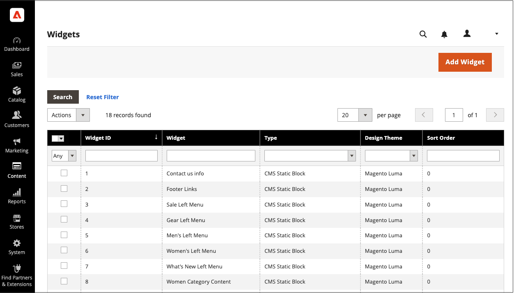
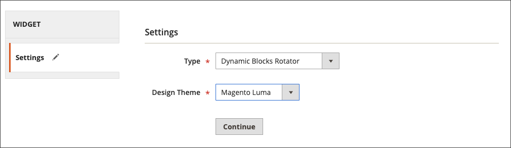
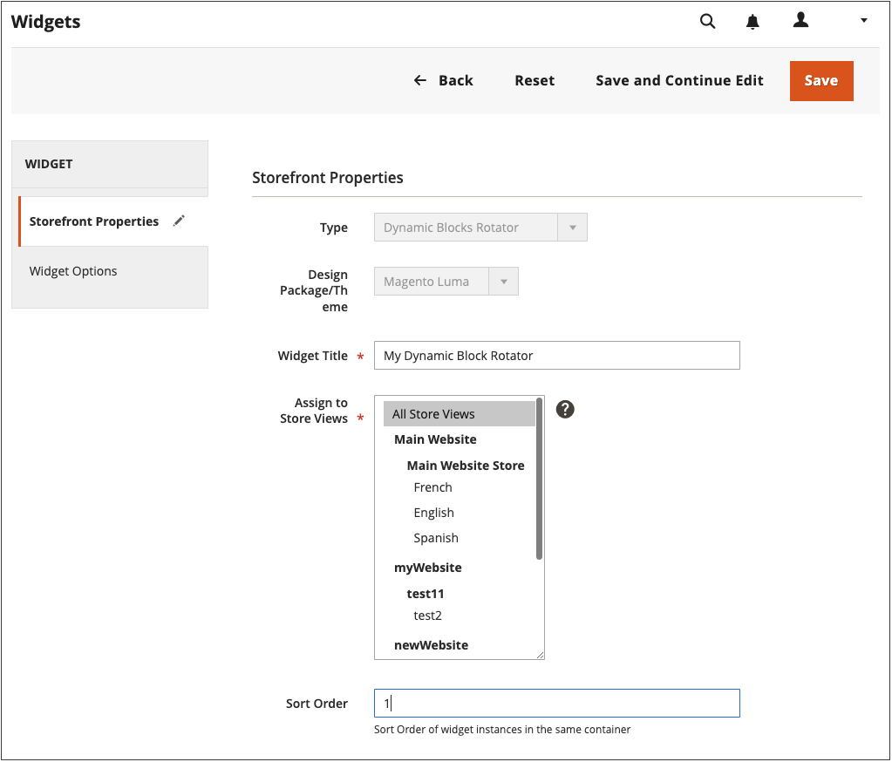
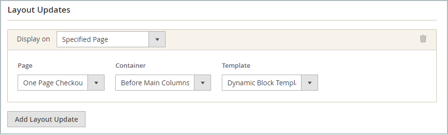
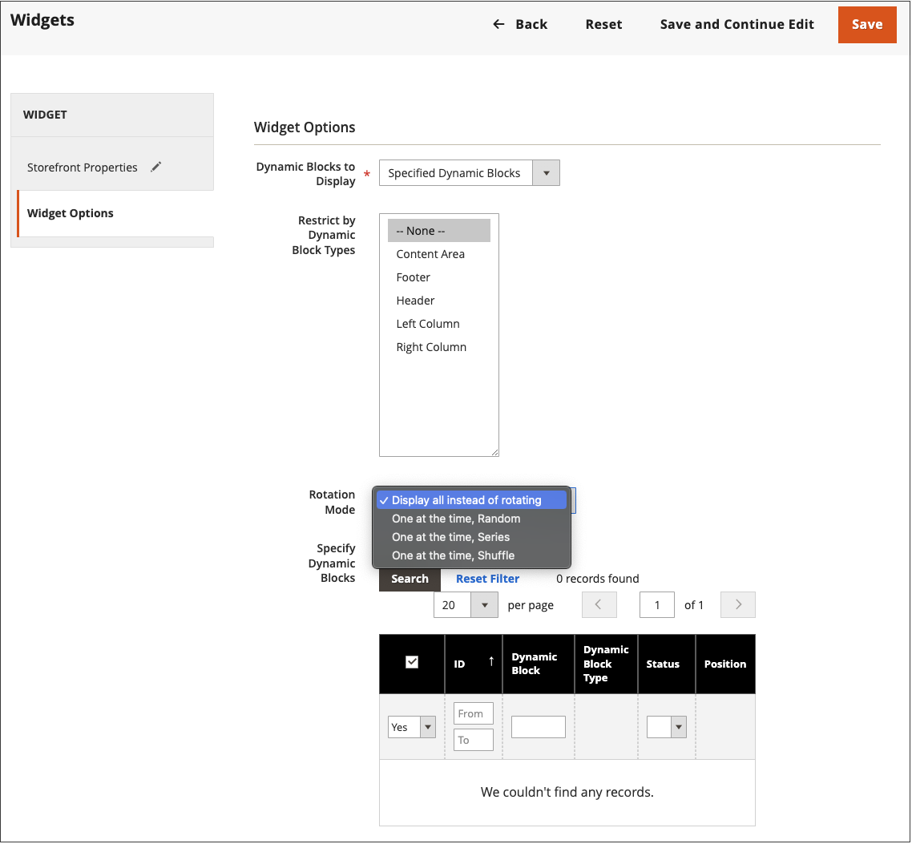

# Add a Rotating Dynamic Block

{{ee-feature}}

To present a slide show of interactive content, you can add multiple [dynamic blocks](dynamic-blocks.md) to a rotator. The [widget](widgets.md) tool is used to place the rotator at a specific place on a either a single page, or on multiple pages throughout your store.

<!-- zoom -->

## Step 1: Create individual dynamic blocks

To [create the dynamic blocks](dynamic-blocks.md) that you want to place in the rotator, follow these instructions:

## Step 2: Add a dynamic block rotator widget

1. On the _Admin_ sidebar, go to **[!UICONTROL Content]** > _[!UICONTROL Elements]_ > **[!UICONTROL Widgets]**.

1. In the upper-right corner, click **[!UICONTROL Add Widget]**.

1. Under _Settings_, set **[!UICONTROL Type]** to `Dynamic Blocks Rotator`.

1. Choose the current **[!UICONTROL Design Theme]** of the store.

   This setting identifies the current package or [theme](themes.md) that determines the page layout of the store.

1. Click **[!UICONTROL Continue]**.

   <!-- zoom -->

## Step 3: Complete the options

1. Under _Storefront Properties_, set the options:

   - Enter a **[!UICONTROL Title]** for the rotator.

   - In the **[!UICONTROL Assign to Store Views]** list, select the [store views](../getting-started/websites-stores-views.md) where the rotator is available.

   - (Optional) Enter a **[!UICONTROL Sort Order]** number to determine the position of the rotator in the target container. It is relative to other widgets that might be assigned to the same container.

   <!-- zoom -->

1. Under _Layout Options_, click **[!UICONTROL Add Layout Update]** and do the following:

   - Set **[!UICONTROL Display on]** to the page, or type of page, where the rotator is to appear.

      - `Categories` - Displays the rotator on either [anchor](../catalog/navigation-layered.md) or non-anchor category pages. Options: Anchor Categories / Non-Anchor Categories
      - `Products` - Displays the rotator on either a specific type of product page, or on all product pages. Options: All Product Types / [Simple Product](../catalog/product-create-simple.md) /  [Virtual Product](../catalog/product-create-virtual.md) / [Bundle Product](../catalog/product-create-bundle.md) / [Downloadable Product](../catalog/product-create-downloadable.md) / [Gift Card](../catalog/product-gift-card-create.md) / [Configurable Product](../catalog/product-create-configurable.md) / [Grouped Product](../catalog/product-create-grouped.md)
      - `Generic Pages` - Displays the rotator on all pages, a specific page, or only on pages with a certain layout. Options: `All Pages` / `Specified Page` / `Page Layouts`

      In the example, the rotator is to be placed on a `Specified Page`.

   - Select the specific **[!UICONTROL Page]** where the rotator is to appear.

   - Set **[!UICONTROL Container]** to the part of the [page layout](page-layout.md#standard-page-layouts) where the rotator is to appear.

      If other widgets are assigned to the same container, they appear in sequence according to the sort order.

   - Accept `Dynamic Block Template` as the default **[!UICONTROL Template]**.

      This setting determines the template that is used to format the rotator, based on whether the rotator is to stand alone, or be placed inside existing text.

      <!-- zoom -->

   - Click **[!UICONTROL Save and Continue Edit]**.

1. In the left panel, choose **[!UICONTROL Widget Options]**.

1. For the **[!UICONTROL Dynamic Blocks to Display]**, accept `Specified Dynamic Blocks`.

   This setting determines the type of dynamic blocks are included in the rotator.

   - `Specified Dynamic Blocks` - Includes only specific dynamic blocks.
   - `Cart Price Rule Related` - Includes only dynamic blocks that are associated with a cart price rule.
   - `Catalog Price Rule Related` - Includes only dynamic blocks that are associated a with catalog price rule.

1. To **[!UICONTROL Restrict the Dynamic Block Types]** that can be used with the widget, select `Content Area`.

   This setting limits the banner to a specific part of the page layout.

   - `Content Area` - Places the dynamic block in the main content area of the page.
   - `Footer` - Places the dynamic block in the page footer.
   - `Header` - Places the dynamic block in the page header.
   - `Left Column` - Places the dynamic block in the left column of the page layout, if available.
   - `Right Column` - Places the dynamic block in the right column of the page layout, if available.

1. Set **[!UICONTROL Rotation Mode]** to one of the following:

   - `Display all instead of rotating` - Displays a stack of dynamic blocks, where all are visible.
   - `One at a time, Random` - Displays the specified dynamic blocks in a random order. When the page is refreshed, a different (and random) dynamic block appears.
   - `One at the time, Series` - Displays the specified dynamic blocks in the sequence that they were added. When the page is refreshed, the next dynamic block in the sequence appears.
   - `One at the time, Shuffle` - Displays one dynamic block at a time in a shuffled order. This option is similar to the `One at a time, Random` option, except that the same dynamic block is not repeated.

   <!-- zoom -->

1. In the **[!UICONTROL Specify Dynamic Blocks]** grid, select the checkbox of each dynamic block that you want to include in the rotator.

1. When complete, click **[!UICONTROL Save]**.
