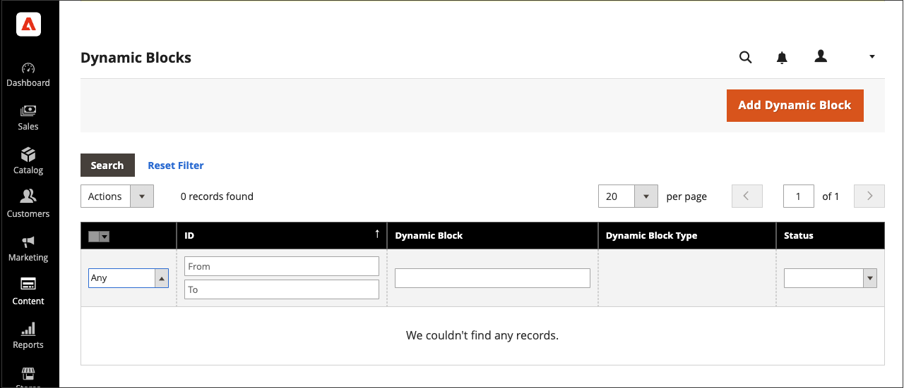
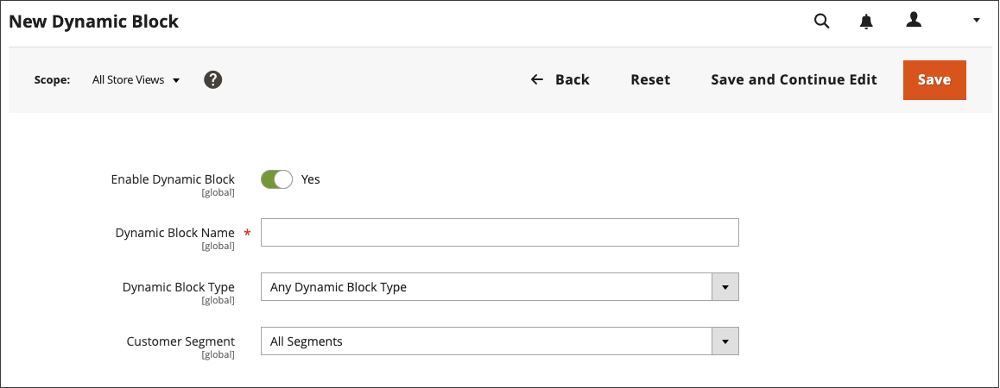

# Dynamic Blocks

{{ee-feature}}

Create rich, interactive content that is driven by logic from [price rules](https://docs.magento.com/user-guide/marketing/promotions.html) and [customer segments](https://docs.magento.com/user-guide/marketing/customer-segments.html). Existing [dynamic blocks](../page-builder/dynamic-block.md) can be added directly to the Page Builder [stage](../page-builder/workspace.md). For a detailed, step-by-step example for using dynamic blocks, see [Tutorial 2: Blocks](../page-builder/2-blocks.md).

>[!NOTE]
>
>The _Banner_ option in the [Content menu](content-menu.md) was deprecated in 2.3.1 and removed in 2.4.0. Its functionality is replaced by Dynamic Blocks.

<!-- zoom -->

## Step 1: Create a dynamic block

1. On the _Admin_ sidebar, go to **Content** > _Elements_ > **Dynamic Blocks**.

   <!-- zoom -->

1. In the upper-right corner, click **Add Dynamic Block**.

   <!-- zoom -->

1. If applicable, set **Store View** to a specific store view where the dynamic block is to appear.

1. To activate the dynamic block, set **Enable Dynamic Block** to `Yes`.

1. For internal reference, enter a descriptive **Dynamic Block Name**.

1. Set **Dynamic Block Type** to the area of the page where you want the dynamic block to appear and click **Done**.

   <!-- zoom -->

1. In the **Customer Segment** list, select the checkbox of each segment that you want to see the dynamic block and click **Done** to save the setting.

   <!-- zoom -->

   >[!NOTE]
   >
   >- If no Segment is created, the Dynamic Block will be visible to everyone.
   >- If the Customer does not belong to any Segments and the Dynamic Block is created for All Segments, the contents of Dynamic Block will still be displayed.
   >- If all Customer Segments that were assigned to Dynamic Block are deleted, its contents will be visible to everyone.

## Step 2: Complete the content

Use the Page Builder [workspace](../page-builder/workspace.md) to complete the content.

<!-- zoom -->

## Step 3: Choose a related promotion

1. Scroll down and expand  **Related Promotions**.

1. Click the type of promotion to associate with the dynamic block:

   - **Add Cart Price Rules** (see [Cart Price Rules](https://docs.magento.com/user-guide/marketing/price-rules-cart.html))

   - **Add Catalog Price Rules** (see [Catalog Price Rules](https://docs.magento.com/user-guide/marketing/price-rules-catalog.html))

1. In the list of available rules, select the checkbox of each rule that you want to use and click **Add Selected**.

1. When the dynamic block is complete, click **Save**.

## Step 4: Add the dynamic block to a page

1. Open the page where you want the dynamic block to appear.

1. Use the [Add Dynamic Block](../page-builder/dynamic-block.md) content type to add the dynamic block to the stage.

## Field and tool descriptions

|Field|Description|
|--- |--- |
|Store View|Specifies the store view(s) where the dynamic block is to be available.|
|Enable Dynamic Block|Activates or deactivates the dynamic block. Options: Yes / No|
|Dynamic Block Name|A descriptive name that identifies the dynamic block in the Admin.|
|Dynamic Block Type|Identifies the place in the [standard page layout](layout-updates.md) where the dynamic block is placed. Options:  **Content Area** - Places the dynamic block in the main [content area](layout-updates.md) of the page.  **Footer** - Places the dynamic block in the page [footer](page-setup.md#footer).  **Header** - Places the dynamic block in the page [header](page-setup.md#header).  **Left Column** - Places the dynamic block in the [left sidebar](page-layout.md#standard-page-layouts) of a two-or three-column layout.  **Right Column** - Places the dynamic block in the [right sidebar](page-layout.md#standard-page-layouts) of a two- or three-column layout.|
|Customer Segment|Associates a customer segment with the dynamic block to determine which customers can see it.|

{style="table-layout:auto"}

### Contents

|Field|Description|
|--- |--- |
|[Layout](../page-builder/layout.md)|Add rows, columns, or tabs to the stage.|
|[Elements](../page-builder/elements.md)|Add text, headings, buttons, dividers, and HTML code to any layout container on the stage.|
|[Media](../page-builder/media.md)|Add images, video, banners, sliders, and Google Maps to any existing layout container on the stage.|
|[Add Content](../page-builder/add-content.md)|Add existing blocks, dynamic blocks, and products to the stage.|

{style="table-layout:auto"}

### Related Promotions

|Field|Description|
|--- |--- |
|Related Cart Price Rule|**Add Cart Price Rules** - Associate an existing [cart price rule](https://docs.magento.com/user-guide/marketing/price-rules-cart.html) with the dynamic block as a promotion.|
|Related Catalog Price Rule|**Add Catalog Price Rules** - Associate an existing [catalog price rule](https://docs.magento.com/user-guide/marketing/price-rules-catalog.html) with the dynamic block as a promotion.|

{style="table-layout:auto"}
