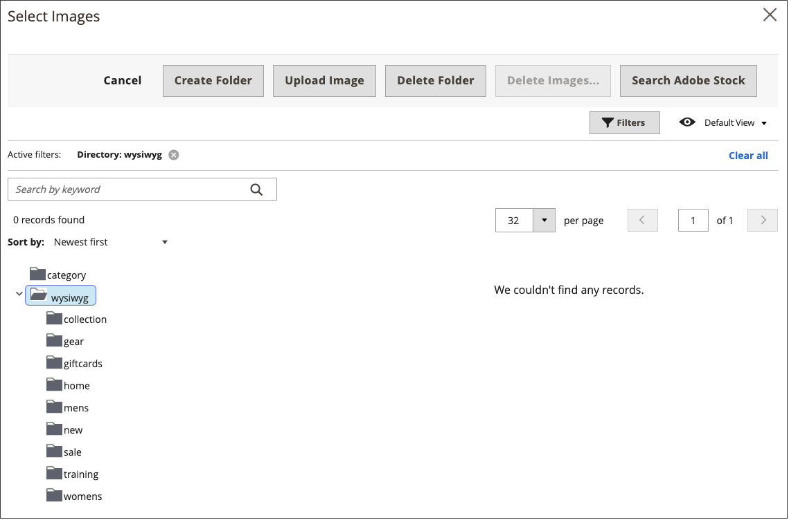

# Insert an Image in the Editor

From the editor, you can insert an image that has been uploaded to [Media Storage](media-storage.md), link to an image that resides on another server, or use the Adobe Stock Integration to search for and use Adobe Stock assets.

<!-- zoom -->

1. Open a page, block, or dynamic block in edit mode.

1. Go to the _Content_ section and click any element that supports the editor.

1. Position your cursor where you want the image to appear.

1. On the editor toolbar, click the _Insert Image_ icon.

   <!-- zoom -->

   This opens the _Insert/edit image_ dialog.

1. For **Source**, click the _Search_ icon and use the method that matches the location of the image asset that you want to use:

   <!-- zoom -->

   - **Upload a new image**: Use this method to upload a new image file.

      - Select the folder in the tree where you want to add the new image file.

      - Click **Choose Files**.

      - Locate and choose the image to add it to the gallery.

      - Click the thumbnail of the new file and click **Add Selected**.

   - **Select an existing asset**: Use this method to select an existing image asset from the media storage/gallery.

      - Use the tree to navigate to the image.

      - Click the thumbnail and click **Add Selected**.

         <!-- zoom -->

   - **Search and select an Adobe Stock image**: Use this method to find an image from Adobe Stock.

      >[!NOTE]
      >
      >This requires an [Adobe Stock integration](adobe-stock.md) configured for your Admin.

      - Click **Search Adobe Stock** and search for an image.

      - Save the preview or licensed image to the gallery.

         See [Using Adobe Stock Images](adobe-stock-manage.md) for more information about working with [Adobe Stock][adobe-stock] assets.

      - Select the asset thumbnail in the gallery and click **Add Selected**.

1. For **Image Description**, enter a brief description of the image.

1. Enter the with and height **Dimensions**, in pixels, for rendering the image on the page.

   Keep the **Constrain proportions** checkbox selected to automatically maintain the aspect ratio for the image.

1. Click **Insert** to complete the process.

[adobe-stock]: https://stock.adobe.com
