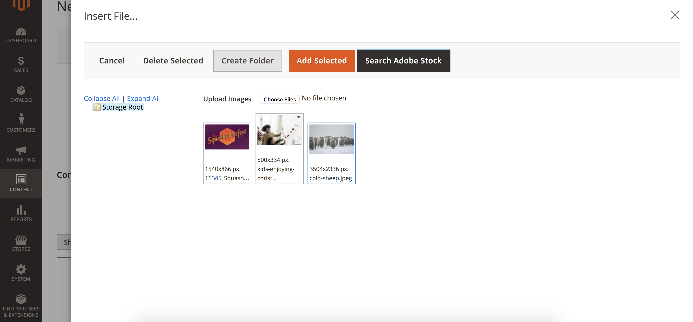
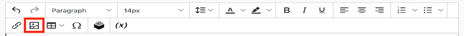
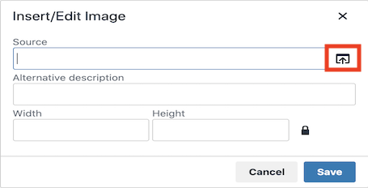

# Insert an image in the editor

From the editor, you can insert an image using three source types:

- Add an image that has been uploaded to the [media storage](media-storage.md)
- Link to an image that resides on another server
- Use the Adobe Stock integration to search for and use Adobe Stock assets

{width="650" zoomable="yes"}

1. Open a page, block, or dynamic block in edit mode.

1. Go to the _[!UICONTROL Content]_ section and click any element that supports the editor.

1. Position your cursor where you want the image to appear.

1. On the editor toolbar, click the _Insert Image_ icon.

   {width="700" zoomable="yes"}

   This action opens the _[!UICONTROL Insert/edit image]_ dialog.

1. For **Source**, click the _Search_ icon and use the method that matches the location of the image asset that you want to use:

   {width="250" zoomable="yes"}

   - **Upload a new image**: Use this method to upload a new image file.

      - Select the folder in the tree where you want to add the new image file.

      - Click **[!UICONTROL Choose Files]**.

      - Locate and choose the image file.

      - Click the thumbnail of the new file and click **[!UICONTROL Add Selected]**.

   - **Select an existing asset**: Use this method to select an existing image asset from the media storage/gallery.

      - Use the tree to navigate to the image.

      - Click the thumbnail and click **[!UICONTROL Add Selected]**.

   - **Search and select an Adobe Stock image**: Use this method to find an image from Adobe Stock.

      >[!NOTE]
      >
      >This method requires an [Adobe Stock integration](adobe-stock.md) configured for your Admin.

      - Click **[!UICONTROL Search Adobe Stock]** and search for an image.

      - Save the preview or licensed image to the gallery.

         See [Using Adobe Stock Images](adobe-stock-manage.md) for more information about working with [Adobe Stock](https://stock.adobe.com) assets.

      - Select the asset thumbnail in the gallery and click **[!UICONTROL Add Selected]**.

1. For **[!UICONTROL Image Description]**, enter a brief description of the image.

1. Enter the width and height **[!UICONTROL Dimensions]**, in pixels, for rendering the image on the page.

   Keep the **[!UICONTROL Constrain proportions]** checkbox selected to automatically maintain the aspect ratio for the image.

1. Click **[!UICONTROL Insert]** to complete the process.
