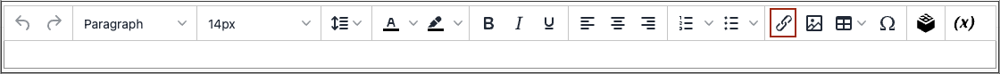

# Insert a Link in the Editor

An easy way to insert a link is to use the _Link_ button in the [editor](editor.md) toolbar. It doesn’t require any knowledge of HTML and the result is the same.

1. Select the text where you want to create the link.

1. Click _Insert/edit link_ icon in the editor toolbar.

   <!-- zoom -->

   This action opens the _[!UICONTROL Insert link]_ dialog.

   <!-- zoom -->

1. For **[!UICONTROL Url]**, enter one of the following:

   - The URL key of a page in your store.

   - The full URL of an external page to be linked.

1. If needed, modify the **[!UICONTROL Text to display]**.

   This defaults to the text you selected for the link. You can change it in the text box.

1. For **[!UICONTROL Title]**, enter the tooltip text to appear when someone hovers over the link.

1. Set **[!UICONTROL Target]** to one of the following:

   - `Open link in the same window`

   - `Open in a new window`

1. To create the link, click **[!UICONTROL OK]**.
