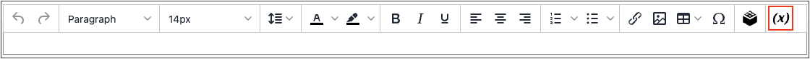
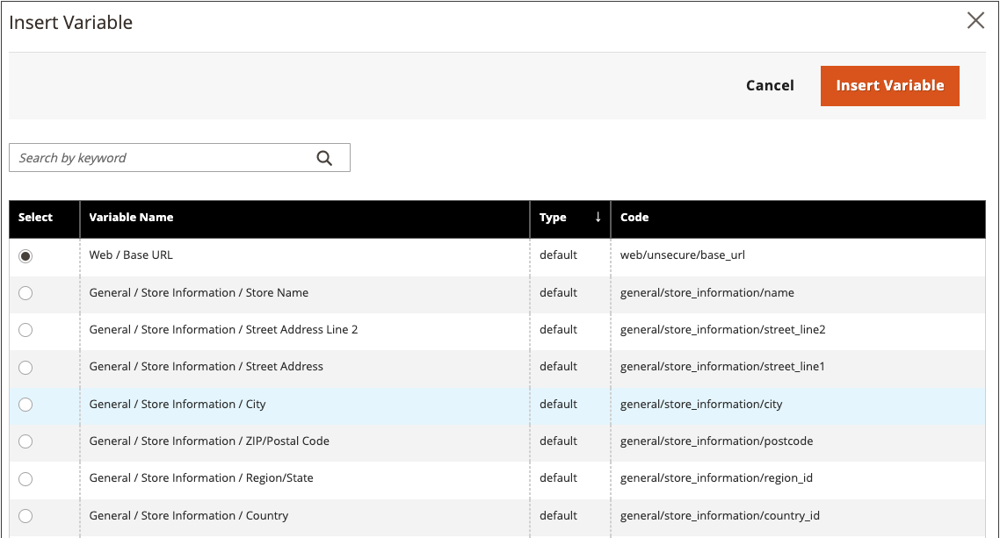

# Insert a variable in the editor

Your store includes many predefined [variables](../systems/variables-predefined.md) that can be incorporated into page content and other communications. In addition, you can include your own [custom variables](../systems/variables-custom.md) that are specific to your needs.

1. Open a page, block, or dynamic block in edit mode.

1. Go to the _[!UICONTROL Content]_ section and click any element that supports the editor.

1. Position the cursor where you want the variable to appear and click the _Insert Variable_ icon.

   {width="700" zoomable="yes"}

   If you do not have [!UICONTROL Page Builder] enabled and prefer to work with the HTML code, click **[!UICONTROL Show / Hide Editor]**. Position the insertion point in the text where you want the variable to appear. Then, click **[!UICONTROL Insert Variable]**.

1. In the list of available variables, choose the one you want and click **[!UICONTROL Insert Variable]**.

   {width="600" zoomable="yes"}

1. When your content edits are complete, click **[!UICONTROL Save]**.
