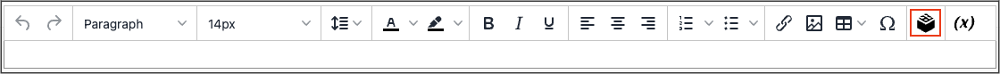

# Insert a Widget in the Editor

The [Widget](widget-create.md) tool can be used to add a variety of content elements to the page, including links to any content page or node, product, or category. Links can be positioned on the page in a block format, or incorporated directly into the content. You can use the Widget tool to create links to the following types of content:

- [Content Pages](pages.md)
- [Catalog Categories](https://docs.magento.com/user-guide/catalog/categories.html)
- [Catalog Products](https://docs.magento.com/user-guide/catalog/product-create.html)

By default, links inherit their style from the style sheet of the theme.

{{$include /help/_includes/directives-caution.md}}

1. Open a page, block, or dynamic block in edit mode.

1. Go to the _Content_ section and click any element that supports the editor.

1. In the panel on the left, choose **Content**. Then, use either of the following methods:

1. Position the cursor where you want the widget to appear and click the _Insert Widget_ icon.

   <!-- zoom -->

   If you do not have Page Builder enabled and prefer to work with the code, click **Show / Hide Editor**. Position the insertion point in the text where you want the widget to appear. Then, click **Insert Widget**.

1. Choose the **Widget Type**.

   For more information about these options, see [Widget Types](widgets.md#widget-types). The following steps use an example for inserting a link to a product.

1. To use the product name, leave the **Anchor Custom Text** field empty.

1. Enter a **Anchor Custom Title** for best SEO practice.

   This title is not visible on the page.

1. Set **Template** to one of the following:

   - To incorporate the link into text, select `Product Link Inline Template`.

   - To place the link on a separate line, select `Product Link Block Template`.

1. Click **Select Product** and do the following:

   - In the tree, navigate to the category you want.

   - In the list, choose the linked product.

1. Click **Insert Widget** to place the link on the page.

   If you are working with HTML code, a [markup tag](https://docs.magento.com/user-guide/marketing/markup-tags-links.htmls) for the link appears at the top of the page, enclosed in double curly braces. If needed, use _Cut and Paste_ to position the markup tag in the code where you want the link to appear.

1. When your content edits are complete, click **Save**.
