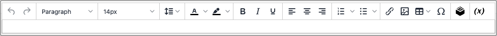
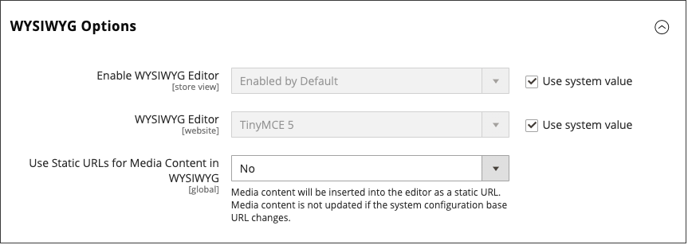

# WYSIWYG Editor

The editor gives you the ability to enter and format while working in a _What You See Is What You Get_ (WYSIWYG) view of the content. If you prefer to work directly with the underlying HTML code, you can easily change modes. The editor can be used to create content for [pages](pages.md), [blocks](blocks.md), and [product descriptions](../catalog/product-content.md). When working on product details, access the editor by clicking **[!UICONTROL Show / Hide Editor]**.

{width="700" zoomable="yes"}

The following topics provide detailed information about using the editor:

- [Inserting a Link](editor-insert-link.md)
- [Inserting an Image](editor-insert-image.md)
- [Inserting a Widget](editor-widget.md)
- [Inserting a Variable](editor-insert-variable.md)

## Configure the Editor

The WYSIWYG editor is enabled by default, and can be used to edit content on CMS pages and blocks, and in products and categories. From the configuration, you can activate or deactivate the editor, and elect to use static, rather than [dynamic](../catalog/catalog-urls.md#dynamic-url), URLs for media content in product and category descriptions.

{width="600" zoomable="yes"}

For a detailed description of all WYSIWYG options, see [Content Management](../configuration-reference/general/content-management.md) in the _Configuration Reference_.

1. On the _Admin_ sidebar, go to **[!UICONTROL Stores]** > _[!UICONTROL Settings]_ > **[!UICONTROL Configuration]**.

1. In the left panel under _[!UICONTROL General]_, choose **[!UICONTROL Content Management]**.

1. Expand  **[!UICONTROL WYSIWYG Options]**.

1. Set **[!UICONTROL Enable WYSIWYG Editor]** to your preference.

   The editor is enabled by default.

1. Set **[!UICONTROL Static URLs for Media Content in WYSIWYG]** to your preference for all [media content](../catalog/catalog-urls.md#static-url) that is entered with the WYSIWYG editor.

1. When complete, click **[!UICONTROL Save Config]**.
