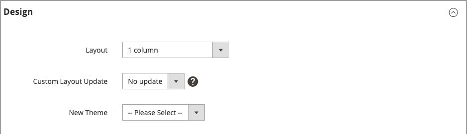

# Place a Block Using Layout Updates

[Layout updates](layout-updates.md) make it possible to customize the layout of a page. Layout updates offer more flexibility than a [widget](widgets.md), but require access to the server and a basic knowledge of XML.

The following steps show how to use a layout update to place a block on a page. For specific examples and help with syntax, see [Common layout customization tasks][4] in the _Frontend Developer Guide_.

## Step 1: Create the block

1. Create the [block](block-add.md) that you want to place.

1. Take note of the `block_id`, because you must reference it in the layout update instructions.

## Step 2: Compose the layout update in XML

1. Compose the layout instructions in XML to [Reference a CMS Block][3].

1. Save the [layout instructions][2] on the server in the layout folder where XML files are saved for the theme.

   For example:

   `<theme_dir>/<Namespace>_<Module>/layout`

   The [layout handle][4] is the filename that begins with `cms_page_view_selectable_`, followed by the URL key of the CMS page, the layout update option, and the `xml` file suffix. In the following example, `customer-service` is the URL key of the page, and `ChatTool` is the option that you select to apply the layout update to the page.

   `cms_page_view_selectable_`<`customer-service`>`_`<`ChatTool`>`.xml`

   | Element | Description |
   |----------------------- | ----------- |
   |CMS Page Identifier|The URL key of the page with any forward slash (`/`) replaced by an underscore (`_`).|
   |Layout Update Name|The option that appears in the _Custom Layout Update_ list.|

## Step 3: Reference the layout update from the page

1. On the _Admin_ sidebar, go to **[!UICONTROL Content]** > _[!UICONTROL Elements]_ > **[!UICONTROL Pages]**.

1. Find the page where you want to place the block and open it in edit mode.

1. Scroll down and expand  the **[!UICONTROL Design]** section.

1. To display all available layout updates that are associated with the page, click **Custom Layout Update** arrow.

   <!-- zoom -->

1. Select the layout update that you want to apply to the page.

## Step 4: Save and refresh cache

1. When complete, click **[!UICONTROL Save & Close]**.

1. In the message at the top of the workspace, click **[!UICONTROL Cache Management]** and refresh each invalid cache.

[1]: https://developer.adobe.com/commerce/frontend-core/guide/layouts/
[2]: https://developer.adobe.com/commerce/frontend-core/guide/layouts/xml-instructions/
[3]: https://developer.adobe.com/commerce/frontend-core/guide/layouts/xml-manage/
[4]: https://developer.adobe.com/commerce/frontend-core/guide/layouts/
