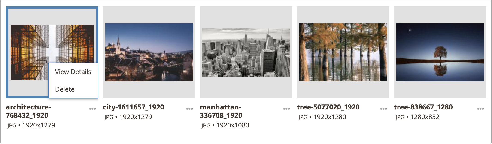
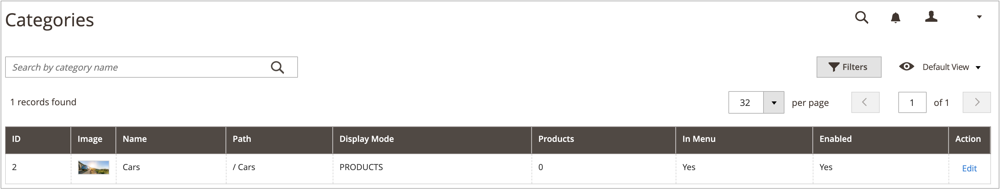
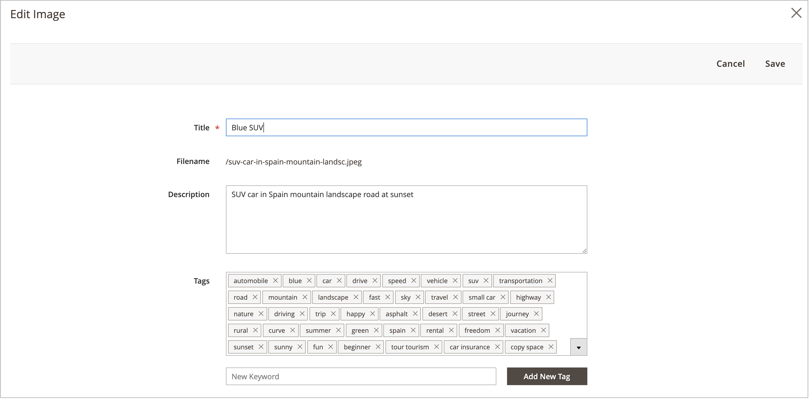
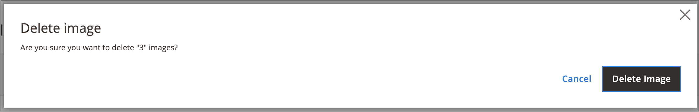
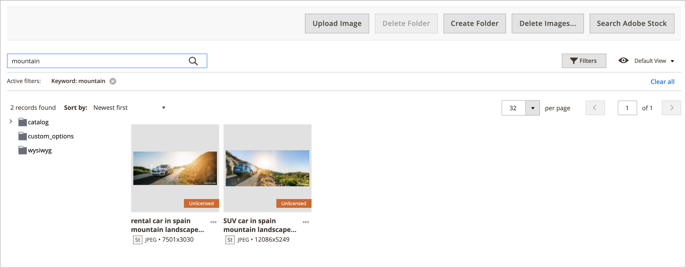
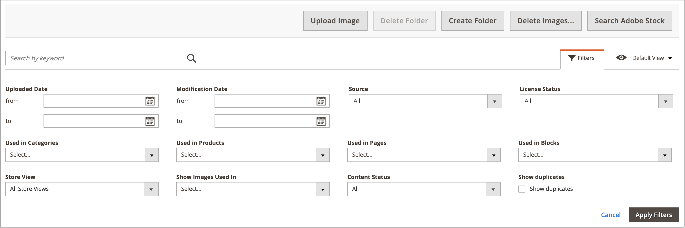
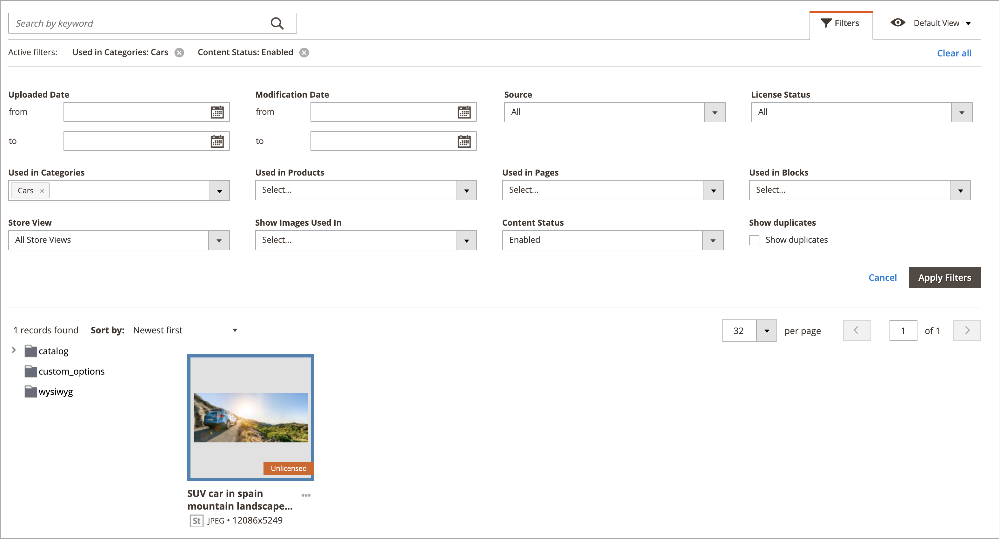

# Media Gallery asset management

The new [Media Gallery](media-gallery.md) provides tools for managing uploaded media files, and assets that you acquire through an [Adobe Stock integration](adobe-stock.md). If you have saved an Adobe Stock [image preview](adobe-stock-save-preview.md), you can also [license](adobe-stock-license-image.md) the image in the new Media Gallery.

## Upload an asset

1. On the _Admin_ sidebar, go to **[!UICONTROL Content]** > _[!UICONTROL Media]_ > **[!UICONTROL Media Gallery]**.

1. Click **[!UICONTROL Upload Image]**.

1. Select the file to be uploaded.

   The selected asset is automatically uploaded to the selected folder (or to the storage root if no folder is selected).

## View asset details

1. On the _Admin_ sidebar, go to **[!UICONTROL Content]** > _[!UICONTROL Media]_ > **[!UICONTROL Media Gallery]**.

1. Click the three dots below the asset ({width="10" zoomable="no"}), then click **[!UICONTROL View Details]**.

    {width="600" zoomable="yes"}

    The asset details are displayed on a slide panel. They include the information where the asset is being used:

   - **[!UICONTROL Categories]**
   - **[!UICONTROL Products]**
   - **[!UICONTROL Pages]**
   - **[!UICONTROL Blocks]**

    {width="600" zoomable="yes"}

    To see the details, click the **[!UICONTROL Used In]** links . The grid in the following example shows all categories where a specific asset is used.

    {width="600" zoomable="yes"}

    It is also possible to delete the asset from the _View Details_ section.

## Edit an asset

1. On the _Admin_ sidebar, go to **[!UICONTROL Content]** > _[!UICONTROL Media]_ > **[!UICONTROL Media Gallery]**.

1. Click the three dots below the asset ({width="10" zoomable="no"}), then click **[!UICONTROL Edit]**.

    {width="600" zoomable="yes"}

1. If needed, change one of the following metadata values:

   - **[!UICONTROL Title]**
   - **[!UICONTROL Description]**
   - **[!UICONTROL Tags/Keywords]**

   This data is saved to the data base and to the file metadata itself. Currently, XMP and IPTC formats are supported.

   You can download the image with the updated metadata.

## Use an asset

Assets can be used extensively throughout the Admin, such as [add or edit a page](page-add.md), [create or edit a category](../catalog/category-create.md), or [insert images from the Content Editor](editor-insert-image.md).

1. Access the new Media Gallery from an area that allows you to use media assets.

1. Select the asset and click **[!UICONTROL Add Selected]**.

{{$include /help/_includes/image-optimization-animated-gif-note.md}}

## Delete assets

1. On the _Admin_ sidebar, go to **[!UICONTROL Content]** > _[!UICONTROL Media]_ > **[!UICONTROL Media Gallery]**.

1. Click **[!UICONTROL Delete Images...]** and select the checkbox for each asset that you want to delete.

1. In the confirmation dialog, click **[!UICONTROL Delete Image]**.

    {width="500" zoomable="yes"}

## Search for assets

1. On the _Admin_ sidebar, go to **[!UICONTROL Content]** > _[!UICONTROL Media]_ > **[!UICONTROL Media Gallery]**.

1. Use the **[!UICONTROL Search by keywords]** input to perform image search by keywords/tags.

    The search in the following example finds assets that contain a specific tag (`mountain`).

    {width="600" zoomable="yes"}

>[!NOTE]
>
>To learn how you can update image tags, see the _[Edit an asset](#edit-an-asset)_ section.

## Filter assets

>[!NOTE]
>
>The _Used in_ functionality requires that [!UICONTROL Media Gallery Image Optimization] is enabled in the [configuration settings](media-gallery-image-optimization.md).

1. On the _Admin_ sidebar, go to **[!UICONTROL Content]** > _[!UICONTROL Media]_ > **[!UICONTROL Media Gallery]**.

1. Click the **[!UICONTROL Filters]** tab.

    {width="600" zoomable="yes"}

1. Set the filtering options.

   You can filter the assets according to usage by the entities:

   - **[!UICONTROL Used in Categories]**
   - **[!UICONTROL Used in Products]**
   - **[!UICONTROL Used in Pages]**
   - **[!UICONTROL Used in Blocks]**

   You can also filter the assets by **[!UICONTROL Store View]**, **[!UICONTROL License Status]**, and **[!UICONTROL Content Status]**. Set a date rage for **[!UICONTROL Uploaded Date]** and/or **[!UICONTROL Modification Date]** to filter assets according to file dates.

1. Click **[!UICONTROL Apply Filters]** to see the results.

   The filtering in the following example finds assets that are used in a specific category (`cars`) and are enabled.

    {width="600" zoomable="yes"}

## Find image duplicates

1. Click the **[!UICONTROL Filters]** tab and select the **[!UICONTROL Show duplicates]** checkbox.

1. To see the results, click **[!UICONTROL Apply Filters]**.
