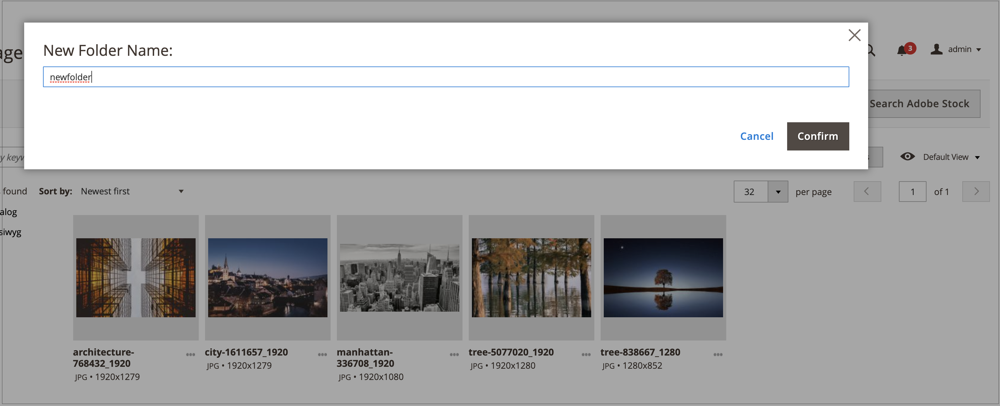
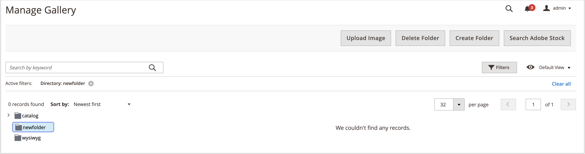
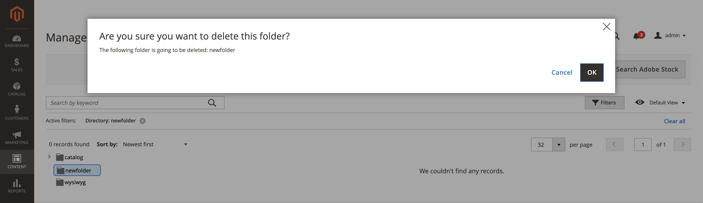

# Media Gallery Folder Management

Use folders to organize images in the new [Media Gallery](media-gallery.md). As the number of media assets increases, folders make it easier to locate and manage existing assets in your media gallery.

## Create a folder

1. On the _Admin_ sidebar, go to **[!UICONTROL Content]** > _[!UICONTROL Media]_ > **[!UICONTROL Media Gallery]**.

1. Click **[!UICONTROL Create Folder]**.

    If you want to create a subfolder, select the parent folder before clicking **[!UICONTROL Create Folder]**.

1. Enter the new folder name and click **[!UICONTROL Confirm]**.

    <!-- zoom -->

## Delete a folder

>[!WARNING]
>
>Deleting a folder causes the removal of all the images within that folder.

1. On the _Admin_ sidebar, go to **[!UICONTROL Content]** > _[!UICONTROL Media]_ > **[!UICONTROL Media Gallery]**.

1. Select the folder to be deleted.

    <!-- zoom -->

1. Click **[!UICONTROL Delete Folder]**.

1. To confirm the folder deletion, click **[!UICONTROL OK]**.

    <!-- zoom -->
