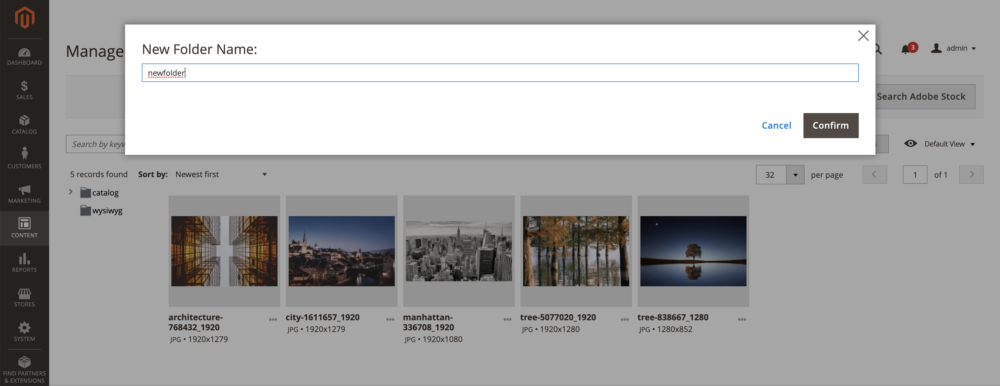
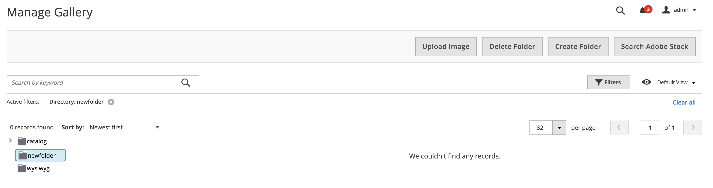

# Media Gallery folder management

Use folders to organize images in the new [Media Gallery](media-gallery.md). As the number of media assets increases, folders make it easier to locate and manage existing assets in your media gallery.

## Create a folder

You can only create a folder in the `pub/media/wysywig`, `pub/media/catalog/category`, or other folders added by modules.

1. On the _Admin_ sidebar, go to **[!UICONTROL Content]** > _[!UICONTROL Media]_ > **[!UICONTROL Media Gallery]**.

1. Click **[!UICONTROL Create Folder]**.

    If you want to create a subfolder, select the parent folder before clicking **[!UICONTROL Create Folder]**.

1. Enter the new folder name and click **[!UICONTROL Confirm]**.

    {width="600" zoomable="yes"}

## Delete a folder

>[!WARNING]
>
>Deleting a folder causes the removal of all the images within that folder. You can only delete a folder in the `pub/media/wysywig` and `pub/media/catalog/category` folders.

1. On the _Admin_ sidebar, go to **[!UICONTROL Content]** > _[!UICONTROL Media]_ > **[!UICONTROL Media Gallery]**.

1. Select the folder to be deleted.

    {width="600" zoomable="yes"}

1. Click **[!UICONTROL Delete Folder]**.

1. To confirm the folder deletion, click **[!UICONTROL OK]**.
