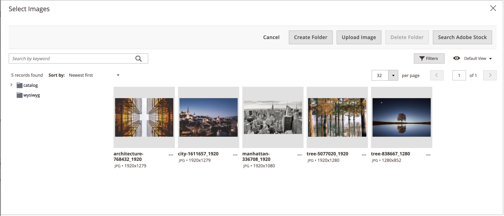
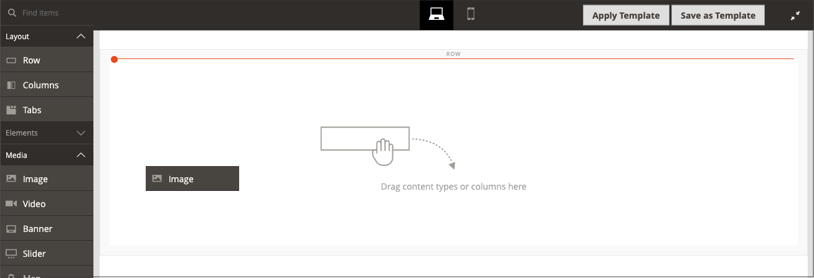

# The [!DNL Media Gallery]

With Adobe Commerce or Magento Open Source 2.4, merchants can use the new _enhanced_ [!DNL Media Gallery] to organize and manage their media files on the server. This new [!DNL Media Gallery] contains the same functionalities as the existing media storage, but includes an improved user interface and a closer integration with [Adobe Stock][adobe-stock].

<!-- zoom -->

>[!NOTE]
>
>Product images added to the [_[!UICONTROL Images and Videos]_ product section](https://docs.magento.com/user-guide/catalog/product-image-upload.html) are not managed by the [!DNL Media Gallery]. Only images used in the _[!UICONTROL Content]_ product section fields are displayed and filtered in the new [!DNL Media Gallery].

## Enable the new [!DNL Media Gallery]

1. On the _Admin_ sidebar, go to **[!UICONTROL Stores]** > _[!UICONTROL Settings]_ > **[!UICONTROL Configuration]**.

1. In the left panel, expand **[!UICONTROL Advanced]** and choose **[!UICONTROL System]**.

1. Expand  **[!UICONTROL Media Gallery]**.

   ![Advanced configuration - [!DNL Media Gallery]](./assets/system-media-gallery.png)<!-- zoom -->

1. Set **[!UICONTROL Enable Old Media Gallery]** to `No`.

1. Click **[!UICONTROL Save Config]**.

1. When prompted, click the **[!UICONTROL Cache Management]** link in the system message and refresh the invalid cache.

   The [[!UICONTROL Content] menu][content-menu] now displays the new _[!UICONTROL Media Gallery]_ option.

>[!NOTE]
>
>Full functionality for new [!DNL Media Gallery] requires `media.gallery.synchronization` and `media.content.synchronization` queue consumers to be started for initial synchronization. See [Manage message queues](https://devdocs.magento.com/guides/v2.4/config-guide/mq/manage-message-queues.html) in our developer documentation for more details.

## Access the new [!DNL Media Gallery]

The new [!DNL Media Gallery] is accessible from the Content menu or when you [add or edit a page][add-page]. You can also access it when you [create or edit a category][create-category], or when you [insert images using the Content Editor][editor-insert-image].

To access the new [!UICONTROL Media Gallery] through the [!UICONTROL Content] menu:

- On the _Admin_ sidebar, go to **[!UICONTROL Content]** > _[!UICONTROL Media]_ > **[!UICONTROL Media Gallery]**.

To access the new Media Gallery when you are adding or editing a page:

1. On the _Admin_ sidebar, go to **[!UICONTROL Content]** > _[!UICONTROL Elements]_ > **[!UICONTROL Pages]**.

1. Click **[!UICONTROL Add a New Page]**.

   If you want to edit an existing page, you can use the _[!UICONTROL Action]_ column to click **[!UICONTROL Select]** and choose **[!UICONTROL Edit]**.

1. Expand  the **[!UICONTROL Content]** section and do the following:

   - If you have [Page Builder enabled](../page-builder/setup.md), expand the **[!UICONTROL Media]** panel and drag an **[!UICONTROL Image]** placeholder to the target container. Then click **[!UICONTROL Select from Gallery]**.

      <!-- zoom -->

   - If you have the [WYSIWYG editor enabled][editor-config], click **[!UICONTROL Show/Hide Editor]** and then click **[!UICONTROL Insert Image]**.

## Media Gallery demo

Watch this video to learn about the Media Gallery:

>[!VIDEO](https://video.tv.adobe.com/v/343784?quality=12&learn=on)

[adobe-stock]: https://stock.adobe.com
[content-menu]: content-menu.md
[add-page]: page-add.md
[create-category]: https://docs.magento.com/user-guide/catalog/category-create.html
[editor-insert-image]: editor-insert-image.md
[editor-config]: editor.md#configure-the-editor
